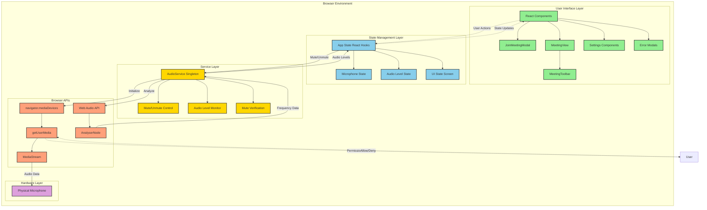
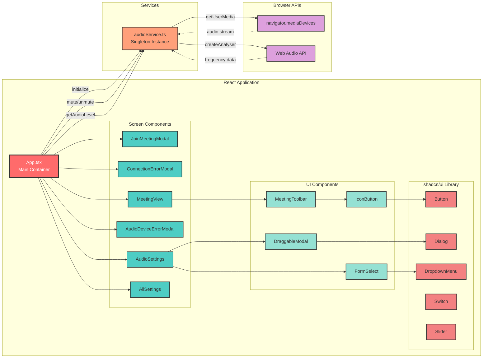
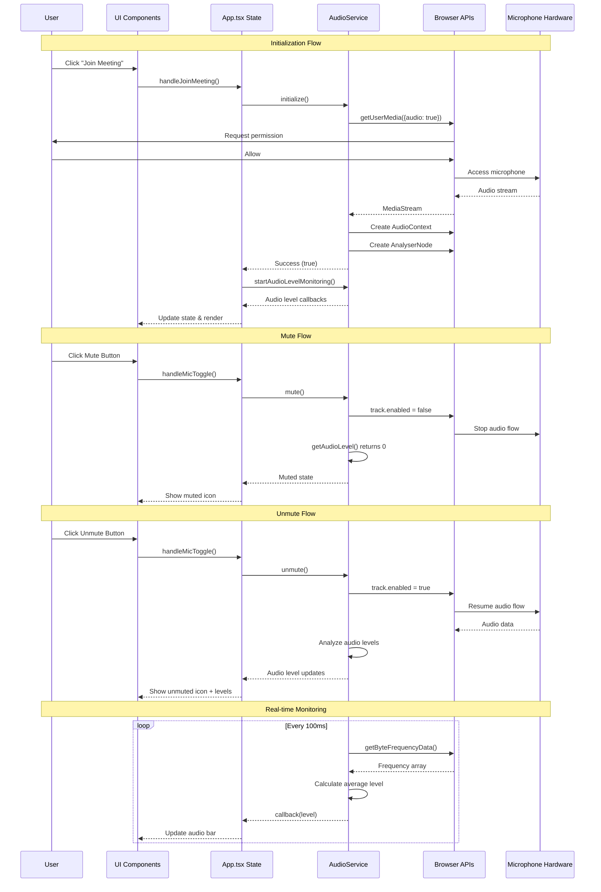
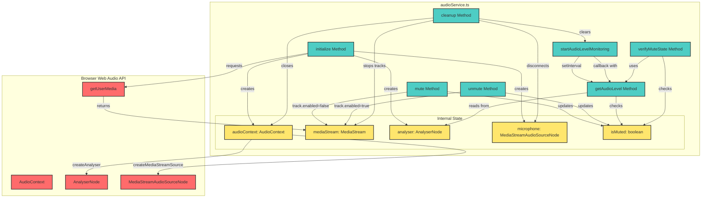
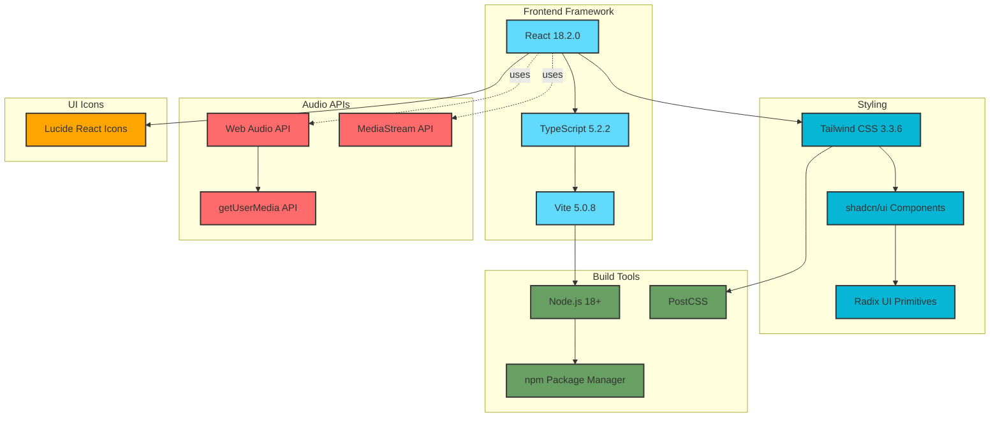
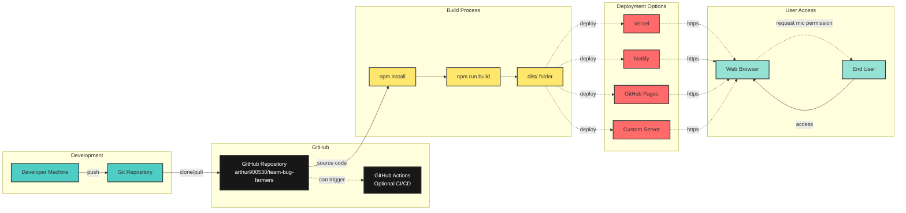
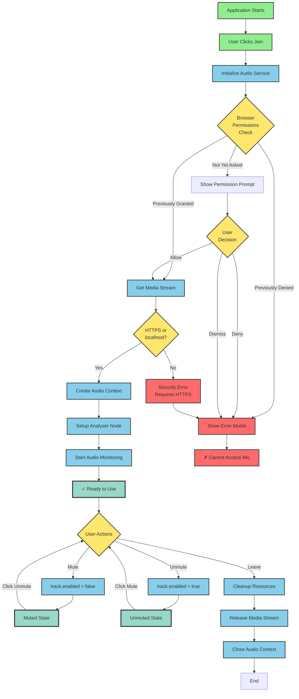

# System Architecture Diagram

## High-Level Architecture



---

## Detailed Component Architecture



---

## Data Flow Architecture



---

## Audio Service Internal Architecture



---

## State Management Flow

```mermaid
stateDiagram-v2
    [*] --> NotInitialized: App Start
    
    NotInitialized --> Initializing: User clicks Join
    Initializing --> PermissionRequested: getUserMedia() called
    
    PermissionRequested --> PermissionGranted: User allows
    PermissionRequested --> PermissionDenied: User denies
    
    PermissionDenied --> AudioDeviceError: Show error modal
    AudioDeviceError --> [*]: User closes app
    
    PermissionGranted --> UnmutedActive: Initialize success
    UnmutedActive --> Monitoring: Start audio monitoring
    
    state Monitoring {
        [*] --> UnmutedLive
        UnmutedLive --> MutedVerified: User clicks mute
        MutedVerified --> UnmutedLive: User clicks unmute
        
        MutedVerified --> MutedUnverified: Audio detected while muted
        MutedUnverified --> MutedVerified: Audio stops
        
        state UnmutedLive {
            [*] --> Silent
            Silent --> Speaking: Audio level > 5%
            Speaking --> Silent: Audio level < 5%
        }
        
        state MutedVerified {
            note right of MutedVerified
                track.enabled = false
                Audio level = 0%
                Green checkmark shown
            end note
        }
        
        state MutedUnverified {
            note right of MutedUnverified
                Conflict detected!
                Warning banner shown
            end note
        }
    }
    
    Monitoring --> Cleanup: User leaves meeting
    Cleanup --> [*]: Resources released
```

---

## Technology Stack



---

## File Structure

```mermaid
graph TD
    Root[team-bug-farmers/]
    
    Root --> Src[src/]
    Root --> Assets[assets/]
    Root --> Public[public/]
    Root --> Config[Config Files]
    
    Src --> AppTsx[App.tsx]
    Src --> MainTsx[main.tsx]
    Src --> Components[components/]
    Src --> Services[services/]
    Src --> Styles[styles/]
    
    Components --> Meeting[meeting/]
    Components --> Settings[settings/]
    Components --> Common[common/]
    Components --> UI[ui/]
    Components --> Figma[figma/]
    
    Services --> AudioService[audioService.ts]
    Services --> ServiceReadme[README.md]
    
    Meeting --> Toolbar[MeetingToolbar.tsx]
    Settings --> AudioSet[AudioSettingsSection.tsx]
    Settings --> VideoSet[VideoSettingsSection.tsx]
    Settings --> GenSet[GeneralSettingsSection.tsx]
    Settings --> ScreenSet[ScreenShareSettingsSection.tsx]
    
    Common --> DragModal[DraggableModal.tsx]
    Common --> IconBtn[IconButton.tsx]
    Common --> FormSel[FormSelect.tsx]
    Common --> WinCtrl[WindowControls.tsx]
    
    UI --> Button[button.tsx]
    UI --> Dialog[dialog.tsx]
    UI --> Dropdown[dropdown-menu.tsx]
    UI --> Switch[switch.tsx]
    UI --> More[... 30+ components]
    
    Styles --> GlobalCSS[globals.css]
    
    Config --> Package[package.json]
    Config --> Vite[vite.config.ts]
    Config --> TSConfig[tsconfig.json]
    Config --> Tailwind[tailwind.config.js]
    Config --> PostCSS[postcss.config.js]
    Config --> GitIgnore[.gitignore]
    
    Assets --> Mockups[mockups/]
    Assets --> UserStory1[user_story1/]
    Assets --> UserStory2[user_story_2/]
    Assets --> UserStory3[user_story_3/]
    
    classDef folder fill:#FFA07A,stroke:#333,stroke-width:2px
    classDef file fill:#98D8C8,stroke:#333,stroke-width:2px
    classDef important fill:#FF6B6B,stroke:#333,stroke-width:3px,color:#fff
    
    class Root,Src,Components,Services,Styles,Meeting,Settings,Common,UI,Assets,Config,Public folder
    class AppTsx,AudioService important
    class MainTsx,Toolbar,AudioSet,VideoSet,GenSet,ScreenSet,DragModal,IconBtn,FormSel,WinCtrl,Button,Dialog,Dropdown,Switch,More,GlobalCSS,ServiceReadme file
    class Package,Vite,TSConfig,Tailwind,PostCSS,GitIgnore file
```



---

## Deployment Architecture



---

## Security & Permissions Flow



---

## Key Architecture Principles

### 1. **Separation of Concerns**
- UI components handle presentation only
- AudioService handles all audio logic
- App.tsx manages application state
- Browser APIs abstracted through service layer

### 2. **Single Responsibility**
- Each component has one clear purpose
- AudioService is the only interface to Web Audio API
- State management centralized in App.tsx

### 3. **Dependency Flow**
```
UI Components → App State → Audio Service → Browser APIs → Hardware
```

### 4. **Error Handling**
- Permission denied → Show error modal
- Device unavailable → Show device error
- Initialization failed → Graceful degradation

### 5. **Resource Management**
- Cleanup on component unmount
- Stop audio monitoring when not needed
- Release media streams properly
- Close audio contexts

### 6. **Real-time Updates**
- Audio levels monitored every 100ms
- React state updates trigger UI re-renders
- Visual feedback for all audio changes

---

## Browser Compatibility

| Feature | Chrome | Firefox | Safari | Edge |
|---------|--------|---------|--------|------|
| getUserMedia | ✅ 53+ | ✅ 36+ | ✅ 11+ | ✅ 79+ |
| Web Audio API | ✅ 35+ | ✅ 25+ | ✅ 14.1+ | ✅ 79+ |
| MediaStream | ✅ 53+ | ✅ 36+ | ✅ 11+ | ✅ 79+ |
| HTTPS Required | ✅ Yes | ✅ Yes | ✅ Yes | ✅ Yes |

**Note:** localhost is allowed without HTTPS for development.

