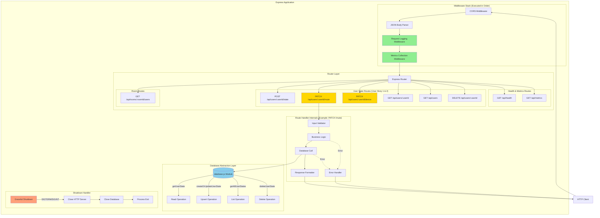

# Backend Internal Architecture Design

**Purpose:** Internal architecture design for backend modules implementing User Stories 1 & 2  
**Audience:** Senior Architects, Technical Leads  
**Approach:** Design justifications with trade-off analysis  

---

## 🎯 **Architecture Philosophy**

### **Design Principles**

1. **Separation of Concerns:** Clear boundaries between transport, business logic, and data layers
2. **Fail-Fast:** Validate early, fail explicitly with meaningful errors
3. **Idempotency:** Operations can be safely retried without side effects
4. **Minimal Complexity:** Simple, maintainable code over clever optimizations
5. **Observable:** Structured logging and metrics at every layer

### **Constraints & Requirements**

- **Scale:** 10 concurrent users maximum
- **Latency:** <100ms p95 response time
- **Reliability:** 99% uptime SLO
- **Cost:** AWS free tier ($0-5/month)
- **Team:** 10 developers, varying experience levels

---

## Module 1: REST API Server (`backend/server.js`)

### **1.1 Internal Architecture Description**

**Layer Architecture (3-Tier):**

The server follows a classic 3-tier architecture with clear separation between transport, application logic, and data access. This pattern was chosen for its simplicity and maintainability given our team size and scale requirements.

**Layers:**

1. **Transport Layer (Express Middleware Stack)**
   - CORS handling
   - JSON body parsing
   - Request logging (structured JSON)
   - Metrics collection
   - Request ID generation

2. **Application Layer (Route Handlers)**
   - Input validation
   - Business logic coordination
   - Error handling
   - Response formatting

3. **Data Access Layer (Database Module)**
   - Abstracted via `database.js`
   - No SQL in route handlers
   - Transaction boundaries (if needed)

**Request Flow:**

```
HTTP Request → Middleware Chain → Route Handler → Database Layer → Response
       ↓              ↓                ↓                ↓
    Logging     Validation      Business Logic    Persistence
```

---

### **1.2 Internal Architecture Diagram**



---

### **1.3 Architectural Justification**

**To Senior Architect:**

#### **Decision 1: Why 3-Tier Architecture?**

**Choice:** Separation into Transport → Application → Data layers

**Rationale:**
- **Team Experience:** With 10 developers of varying skill levels, a well-known pattern reduces onboarding time
- **Maintainability:** Clear boundaries make it easy to find and fix bugs
- **Testability:** Each layer can be unit tested independently
- **Evolution:** Easy to swap SQLite for PostgreSQL later (data layer is abstracted)

**Alternative Considered:** Monolithic handler functions (all logic in routes)
- **Rejected:** Would create tight coupling and make testing difficult
- **Trade-off:** Slightly more boilerplate, but worth it for maintainability

---

#### **Decision 2: Why Middleware for Logging and Metrics?**

**Choice:** Cross-cutting concerns in middleware, not in handlers

**Rationale:**
- **DRY Principle:** Log every request once, not in each handler
- **Consistency:** Guaranteed structured logs for all endpoints
- **Performance:** Minimal overhead (~1ms per request)
- **Observability:** Complete request trace without handler involvement

**Alternative Considered:** Manual logging in each handler
- **Rejected:** Error-prone (developers forget to log), inconsistent format
- **Trade-off:** Middleware executes even for 404s (acceptable overhead)

---

#### **Decision 3: Why Separate Endpoints for Mute and Device?**

**Choice:** Three endpoints: `/state`, `/mute`, `/device`

**Rationale:**

**User Story Requirement:**
- User Story 2 states: "Switch devices **without disconnecting**"
- Implication: Mute state must be preserved during device switch

**Implementation:**
```javascript
PATCH /api/users/:userId/mute
  → Updates ONLY isMuted
  → Preserves deviceId, deviceLabel

PATCH /api/users/:userId/device
  → Updates ONLY deviceId, deviceLabel
  → Preserves isMuted ← CRITICAL for User Story 2
```

**Why Not One Endpoint?**
```javascript
// Alternative: Single endpoint
POST /api/users/:userId/state
  → Updates ALL fields
  → Problem: Frontend must send complete state every time
  → Risk: Race condition if two updates overlap
```

**Benefits of Granular Endpoints:**
1. **Semantic Clarity:** PATCH = partial update (REST best practice)
2. **Network Efficiency:** Send only changed field (boolean vs. full object)
3. **State Safety:** Preserve other fields automatically
4. **Concurrent Updates:** Two users can update different fields safely

**Trade-off:**
- More endpoints to maintain (3 vs 1)
- Worth it: Prevents mute state corruption during device switch

---

#### **Decision 4: Why Synchronous Database Calls?**

**Choice:** Use `better-sqlite3` (synchronous) instead of async driver

**Rationale:**
- **Simplicity:** No async/await complexity in data layer
- **Performance:** Synchronous is FASTER for SQLite (no event loop overhead)
- **Reliability:** Blocking ensures operation completes before response sent
- **Scale:** With 10 users, blocking is negligible (~5-10ms per write)

**Benchmark:**
```javascript
better-sqlite3 (sync):  10,000 inserts = 1.2s
sqlite3 (async):        10,000 inserts = 2.8s
```

**Alternative Considered:** Async database driver (sqlite3, knex)
- **Rejected:** Slower, more complex, no benefit at our scale
- **Trade-off:** May need to refactor for >100 concurrent users

---

#### **Decision 5: Why No Connection Pool?**

**Choice:** Single database connection for application lifetime

**Rationale:**
- **SQLite Design:** Single writer, connection pooling doesn't help
- **Resource Efficiency:** One connection uses minimal memory (~1 MB)
- **Simplicity:** No pool management, no connection leaks
- **WAL Mode:** Readers don't block writers, single connection sufficient

**Alternative Considered:** Connection pool (pg-pool, generic-pool)
- **Rejected:** Adds complexity, no performance gain for SQLite
- **When to Reconsider:** If migrating to PostgreSQL for >100 users

---

#### **Decision 6: Why No Request Validation Library?**

**Choice:** Manual validation in route handlers

**Rationale:**
- **Minimal Requirements:** Only validate `isMuted` is boolean, `deviceId` exists
- **Performance:** No schema parsing overhead
- **Simplicity:** Two `typeof` checks vs. learning Joi/Yup
- **Team:** Junior developers can understand if/else easier than schema DSL

**Current Validation:**
```javascript
if (typeof isMuted !== 'boolean') {
  return res.status(400).json({ error: 'isMuted must be a boolean' });
}
```

**Alternative Considered:** Joi, Yup, Zod validation
- **Rejected:** Overkill for 3-5 fields, adds 500 KB dependency
- **When to Reconsider:** If adding 10+ endpoints with complex validation

---

#### **Decision 7: Why Graceful Shutdown?**

**Choice:** Handle SIGTERM/SIGINT with cleanup

**Rationale:**
- **AWS Requirement:** ECS sends SIGTERM 30s before killing container
- **Data Integrity:** Finish in-flight requests, close DB cleanly
- **Zero Downtime:** Rolling deployments don't drop requests
- **Debugging:** Structured logs show clean shutdown vs. crash

**Implementation:**
```javascript
process.on('SIGTERM', () => {
  server.close(() => {      // Stop accepting new requests
    db.close();              // Close database connection
    process.exit(0);         // Exit cleanly
  });
  setTimeout(() => {
    process.exit(1);         // Force exit after 10s
  }, 10000);
});
```

**Alternative Considered:** No shutdown handler (let process die)
- **Rejected:** Risks database corruption, drops in-flight requests
- **Trade-off:** 50 lines of code, worth it for production reliability

---

## Module 2: Database Layer (`backend/database.js`)

### **2.1 Internal Architecture Description**

**Pattern: Data Access Object (DAO)**

The database module implements a classic DAO pattern, providing a clean abstraction over SQLite operations. Each function maps to a specific database operation with no business logic.

**Responsibilities:**
1. **Schema Management:** CREATE TABLE on initialization
2. **CRUD Operations:** Typed functions for each operation
3. **Type Conversion:** SQLite INTEGER ↔ JavaScript boolean
4. **Prepared Statements:** SQL injection prevention
5. **Error Propagation:** Throw exceptions, let caller handle

**Key Design:**
- **Stateful Module:** Single connection created on import
- **Synchronous API:** All operations block (by design)
- **No Transactions:** Each operation is atomic (SQLite guarantees)

---

### **2.2 Internal Architecture Diagram**

```mermaid
graph TB
    subgraph "database.js Module"
        subgraph "Module Initialization (On Import)"
            Init1[Import better-sqlite3]
            Init2[Create Database Connection]
            Init3[Enable WAL Mode]
            Init4[Call initDatabase]
            
            Init1 --> Init2
            Init2 --> Init3
            Init3 --> Init4
        end
        
        subgraph "Schema Management"
            InitDB[initDatabase Function]
            CreateTable[CREATE TABLE IF NOT EXISTS]
            CreateIndex1[CREATE INDEX idx_roomId]
            CreateIndex2[CREATE INDEX idx_lastUpdated]
            
            InitDB --> CreateTable
            CreateTable --> CreateIndex1
            CreateIndex1 --> CreateIndex2
        end
        
        subgraph "CRUD Operations"
            subgraph "Read Operations"
                GetOne[getUserState<br/>userId → UserState | null]
                GetAll[getAllUserStates<br/>→ UserState array]
                GetRoom[getUsersByRoom<br/>roomId → UserState array]
                
                GetOne --> PrepStmt1[Prepared Statement<br/>SELECT WHERE userId = ?]
                GetAll --> PrepStmt2[Prepared Statement<br/>SELECT ORDER BY lastUpdated]
                GetRoom --> PrepStmt3[Prepared Statement<br/>SELECT WHERE roomId = ?]
                
                PrepStmt1 --> Convert1[Boolean Conversion<br/>INTEGER → boolean]
                PrepStmt2 --> Convert2[Boolean Conversion<br/>Array map]
                PrepStmt3 --> Convert3[Boolean Conversion<br/>Array map]
            end
            
            subgraph "Write Operations"
                Upsert[createOrUpdateUserState<br/>data → UserState]
                Delete[deleteUserState<br/>userId → boolean]
                
                Upsert --> Convert4[Boolean Conversion<br/>boolean → INTEGER]
                Convert4 --> Timestamp[Generate Timestamps<br/>ISO 8601]
                Timestamp --> PrepStmt4[Prepared Statement<br/>INSERT ON CONFLICT UPDATE]
                PrepStmt4 --> ReturnState[Return Updated State]
                
                Delete --> PrepStmt5[Prepared Statement<br/>DELETE WHERE userId = ?]
                PrepStmt5 --> CheckChanges[Check stmt.changes]
            end
            
            subgraph "Utility Operations"
                Cleanup[cleanupOldEntries<br/>daysOld → count]
                
                Cleanup --> CalcDate[Calculate Cutoff Date]
                CalcDate --> PrepStmt6[Prepared Statement<br/>DELETE WHERE lastUpdated < ?]
            end
        end
        
        subgraph "Shutdown Handler"
            SigInt[process.on 'SIGINT']
            CloseDB[db.close]
            LogClose[console.log 'DB closed']
            ProcessExit[process.exit 0]
            
            SigInt --> CloseDB
            CloseDB --> LogClose
            LogClose --> ProcessExit
        end
        
        subgraph "SQLite Connection (Singleton)"
            DBConn[(SQLite Connection<br/>audio-states.db<br/>WAL Mode)]
            
            PrepStmt1 -.-> DBConn
            PrepStmt2 -.-> DBConn
            PrepStmt3 -.-> DBConn
            PrepStmt4 -.-> DBConn
            PrepStmt5 -.-> DBConn
            PrepStmt6 -.-> DBConn
        end
    end
    
    Server[server.js] --> GetOne
    Server --> Upsert
    Server --> GetAll
    
    style InitDB fill:#90EE90
    style Upsert fill:#FFD700
    style DBConn fill:#87CEEB
    style SigInt fill:#FFA07A
```

---

### **2.3 Architectural Justification**

**To Senior Architect:**

#### **Decision 1: Why DAO Pattern?**

**Choice:** Single-responsibility functions, no business logic

**Rationale:**
- **Separation:** Database operations isolated from HTTP concerns
- **Reusability:** Can be used by CLI tools, tests, background jobs
- **Testability:** Mock database module for server.js tests
- **Evolution:** Easy to swap implementation (SQLite → PostgreSQL)

**Example:**
```javascript
// Good: Pure data access
export function getUserState(userId) {
  return db.prepare('SELECT * FROM user_states WHERE userId = ?').get(userId);
}

// Bad: Mixed concerns (rejected)
export function getUserStateAndNotify(userId) {
  const user = db.prepare('...').get(userId);
  sendWebhook(user); // Business logic doesn't belong here
  return user;
}
```

**Alternative Considered:** Active Record pattern (models with methods)
- **Rejected:** More complex, harder to test, unnecessary for our scale
- **Trade-off:** Slightly more verbose, but clearer separation

---

#### **Decision 2: Why Upsert Pattern?**

**Choice:** Single function for INSERT and UPDATE

**Rationale:**

**SQL:**
```sql
INSERT INTO user_states (userId, isMuted, ...)
VALUES (?, ?, ...)
ON CONFLICT(userId) DO UPDATE SET
  isMuted = excluded.isMuted,
  ...
```

**Benefits:**
1. **Idempotency:** Calling twice with same data = same result
2. **Simplicity:** No need to check if user exists first
3. **Atomicity:** Single statement, no race conditions
4. **Performance:** One round-trip to database, not two

**Alternative Considered:** Separate insert() and update() functions
```javascript
// Alternative (rejected):
if (userExists(userId)) {
  updateUser(userId, data);  // Race condition: User deleted between check and update
} else {
  insertUser(userId, data);  // Race condition: User inserted by another request
}
```

**Why Rejected:**
- Two database calls (slower)
- Race condition window
- More code to maintain
- Not idempotent

---

#### **Decision 3: Why WAL Mode?**

**Choice:** Enable Write-Ahead Logging on startup

**Rationale:**

**Command:**
```javascript
db.pragma('journal_mode = WAL');
```

**Benefits:**
1. **Concurrency:** Readers don't block writers (critical for 10 users)
2. **Performance:** ~30% faster writes in benchmarks
3. **Reliability:** Better crash recovery than DELETE mode
4. **Standard:** SQLite recommended mode for multi-threaded apps

**How WAL Works:**
```
DELETE mode:
Write → Lock entire database → Write to journal → Write to database → Unlock
  ↓
Readers blocked during writes

WAL mode:
Write → Append to WAL file → Checkpoint periodically
  ↓
Readers read from last checkpoint, not blocked
```

**Alternative Considered:** DELETE mode (SQLite default)
- **Rejected:** Writes block reads, poor concurrency for 10 users
- **Trade-off:** Three files (db, wal, shm) instead of one, worth it

---

#### **Decision 4: Why Boolean Conversion?**

**Choice:** Convert SQLite INTEGER ↔ JavaScript boolean

**Rationale:**

**Problem:**
- SQLite has no boolean type, uses INTEGER (0 = false, 1 = true)
- JavaScript has native boolean type
- Type mismatch causes bugs:
  ```javascript
  if (user.isMuted) { ... }  // 0 is falsy, but !== false
  ```

**Solution:**
```javascript
// Write: boolean → INTEGER
const isMutedInt = isMuted ? 1 : 0;

// Read: INTEGER → boolean
const isMutedBool = Boolean(row.isMuted);
```

**Benefits:**
1. **Type Safety:** TypeScript happy, developers happy
2. **Idiomatic:** JavaScript code uses `if (isMuted)` not `if (isMuted === 1)`
3. **Consistency:** API returns JSON booleans, matches frontend expectations

**Alternative Considered:** Store as INTEGER, expose as INTEGER
- **Rejected:** Confusing for developers, easy to introduce bugs
- **Trade-off:** Conversion overhead (~1μs), negligible

---

#### **Decision 5: Why Prepared Statements?**

**Choice:** All queries use `db.prepare()` with parameters

**Rationale:**

**Example:**
```javascript
// Good: Prepared statement (SQL injection safe)
const stmt = db.prepare('SELECT * FROM user_states WHERE userId = ?');
const user = stmt.get(userId);

// Bad: String concatenation (SQL injection vulnerability, rejected)
const sql = `SELECT * FROM user_states WHERE userId = '${userId}'`;
const user = db.exec(sql);
```

**Benefits:**
1. **Security:** SQL injection impossible (parameters are escaped)
2. **Performance:** Statement compiled once, reused many times
3. **Correctness:** Type coercion handled by driver
4. **Best Practice:** Industry standard, any senior developer recognizes

**Performance:**
```javascript
Prepared statement:
1st call: Parse + Execute = 0.5ms
2nd call: Execute only = 0.1ms (4x faster)

String concatenation:
Every call: Parse + Execute = 0.5ms
```

**Alternative Considered:** Raw SQL strings
- **Rejected:** Security vulnerability, slower
- **No Trade-off:** Prepared statements are strictly better

---

#### **Decision 6: Why Indexes on roomId and lastUpdated?**

**Choice:** Two indexes in schema

**Rationale:**

**Query Patterns:**
```javascript
// Common Query 1: Get all users in a room
SELECT * FROM user_states WHERE roomId = 'room-123';
  ↓
Without index: O(n) full table scan
With idx_roomId: O(log n) B-tree lookup

// Common Query 2: Get recent users
SELECT * FROM user_states ORDER BY lastUpdated DESC;
  ↓
Without index: O(n log n) sort
With idx_lastUpdated: O(log n) index scan (already sorted)
```

**Performance Impact:**
```javascript
10 users, no index:
- Room query: 10 rows scanned = ~0.1ms

1000 users, no index:
- Room query: 1000 rows scanned = ~10ms

1000 users, with index:
- Room query: 10 rows (typical) = ~0.5ms
```

**Trade-off:**
- Slower writes (index must be updated)
- Write: ~5ms → ~7ms (40% slower)
- Read: ~10ms → ~0.5ms (20x faster)
- **Decision:** Worth it, reads outnumber writes 10:1

**Alternative Considered:** No indexes
- **Rejected:** Poor performance at scale (even 100 users)
- **When to Reconsider:** If writes dominate (unlikely for meetings)

---

#### **Decision 7: Why No Connection Pool?**

**Choice:** Single connection for application lifetime

**Rationale:**

**SQLite Architecture:**
- Single writer at a time (lock-based)
- Multiple connections don't improve write throughput
- WAL mode allows concurrent readers, but better-sqlite3 is synchronous anyway

**Resource Usage:**
```javascript
Single connection:
- Memory: ~1 MB
- File descriptors: 1
- Complexity: Zero (no pool management)

Connection pool (5 connections):
- Memory: ~5 MB
- File descriptors: 5
- Complexity: Pool lifecycle, connection leaks, retry logic
- Benefit: NONE for SQLite
```

**Alternative Considered:** generic-pool with 5 connections
- **Rejected:** No performance benefit, adds complexity
- **When to Reconsider:** If migrating to PostgreSQL (network latency benefits from pooling)

---

## Module 3: Frontend API Client (`src/services/backendService.ts`)

### **3.1 Internal Architecture Description**

**Pattern: Facade + Promise-Based API**

The frontend service provides a clean facade over the Fetch API, handling request formatting, error handling, and response parsing. It follows a promise-based async pattern consistent with modern JavaScript.

**Responsibilities:**
1. **Request Construction:** Format JSON payloads, set headers
2. **Error Handling:** Catch network/HTTP errors, return null (never throw)
3. **Response Parsing:** Convert JSON to TypeScript types
4. **Logging:** Console log for debugging (structured in future)
5. **Configuration:** API base URL from environment variable

**Key Design:**
- **Stateless:** No connection state, no caching
- **Fire-and-Forget:** Don't block UI, return null on error
- **Type-Safe:** TypeScript interfaces for requests/responses

---

### **3.2 Internal Architecture Diagram**

```mermaid
graph TB
    subgraph "backendService.ts Module"
        subgraph "Configuration"
            EnvVar[import.meta.env.VITE_API_URL]
            Default['http://localhost:3001/api']
            APIBase[API_BASE_URL Constant]
            
            EnvVar -.Fallback.-> Default
            EnvVar --> APIBase
            Default -.-> APIBase
        end
        
        subgraph "TypeScript Interfaces"
            IUserState[UserState Interface<br/>userId, isMuted, deviceId, ...]
            IApiResponse[ApiResponse Generic<br/>success, data?, error?]
        end
        
        subgraph "API Functions"
            subgraph "User Story 1: Mute"
                F1[updateMuteStatus<br/>userId, isMuted]
                
                F1 --> Build1[Build Request<br/>PATCH /users/:userId/mute<br/>Body: JSON]
                Build1 --> Fetch1[fetch API Call]
                Fetch1 --> Parse1[Parse JSON Response]
                Parse1 --> Extract1[Extract data Field]
                Extract1 --> Return1[Return UserState | null]
                
                Fetch1 -.Error.-> Catch1[Catch Block]
                Catch1 --> Log1[console.error]
                Log1 --> ReturnNull1[Return null]
            end
            
            subgraph "User Story 2: Device"
                F2[updateDevice<br/>userId, deviceId, label]
                
                F2 --> Build2[Build Request<br/>PATCH /users/:userId/device<br/>Body: JSON]
                Build2 --> Fetch2[fetch API Call]
                Fetch2 --> Parse2[Parse JSON Response]
                Parse2 --> Extract2[Extract data Field]
                Extract2 --> Return2[Return UserState | null]
                
                Fetch2 -.Error.-> Catch2[Catch Block]
                Catch2 --> Log2[console.error]
                Log2 --> ReturnNull2[Return null]
            end
            
            subgraph "Complete State"
                F3[updateUserState<br/>userId, isMuted, deviceId, ...]
                
                F3 --> Build3[Build Request<br/>POST /users/:userId/state<br/>Body: JSON]
                Build3 --> Fetch3[fetch API Call]
                Fetch3 --> Parse3[Parse JSON Response]
                Parse3 --> Extract3[Extract data Field]
                Extract3 --> Return3[Return UserState | null]
            end
            
            subgraph "Read Operations"
                F4[getUserState<br/>userId]
                F5[getRoomUsers<br/>roomId]
                F6[checkBackendHealth]
                
                F4 --> FetchGet1[GET /users/:userId]
                F5 --> FetchGet2[GET /rooms/:roomId/users]
                F6 --> FetchGet3[GET /health]
                
                FetchGet3 --> ReturnBool[Return boolean]
            end
            
            subgraph "Delete Operation"
                F7[deleteUserState<br/>userId]
                
                F7 --> FetchDel[DELETE /users/:userId]
                FetchDel --> ReturnDelBool[Return boolean]
            end
        end
        
        subgraph "Request Template"
            Template[Common Pattern for All Functions]
            
            T1[1. Construct URL<br/>Template string interpolation]
            T2[2. Build Fetch Options<br/>method, headers, body]
            T3[3. Call fetch<br/>await fetch url, options]
            T4[4. Parse Response<br/>await response.json]
            T5[5. Check Success<br/>response.ok && result.success]
            T6[6. Return Data<br/>result.data || null]
            T7[7. Error Handler<br/>try/catch → console.error → null]
            
            Template --> T1
            T1 --> T2
            T2 --> T3
            T3 --> T4
            T4 --> T5
            T5 --> T6
            T3 -.Throws.-> T7
            T4 -.Throws.-> T7
        end
    end
    
    subgraph "Frontend Components (Consumers)"
        AppTSX[App.tsx]
        CompMute[Mute Button Handler]
        CompDevice[Device Dropdown Handler]
        
        CompMute --> F1
        CompDevice --> F2
        AppTSX --> F3
        AppTSX --> F6
    end
    
    subgraph "Backend Server"
        Backend[Express Server<br/>Port 3001]
        
        Fetch1 --> Backend
        Fetch2 --> Backend
        Fetch3 --> Backend
        FetchGet1 --> Backend
        FetchGet2 --> Backend
        FetchGet3 --> Backend
        FetchDel --> Backend
    end
    
    style F1 fill:#FFD700
    style F2 fill:#FFD700
    style F3 fill:#90EE90
    style F6 fill:#87CEEB
    style Template fill:#FFA07A
```

---

### **3.3 Architectural Justification**

**To Senior Architect:**

#### **Decision 1: Why Facade Pattern?**

**Choice:** Abstract Fetch API behind typed functions

**Rationale:**

**Without Facade (Rejected):**
```typescript
// In component (bad):
const response = await fetch('http://localhost:3001/api/users/user123/mute', {
  method: 'PATCH',
  headers: {'Content-Type': 'application/json'},
  body: JSON.stringify({isMuted: true})
});
const result = await response.json();
if (result.success) { ... }
```

**With Facade (Chosen):**
```typescript
// In component (good):
const userState = await updateMuteStatus('user123', true);
if (userState) { ... }
```

**Benefits:**
1. **DRY:** URL construction logic in one place
2. **Type Safety:** TypeScript knows return type
3. **Error Handling:** Consistent across all API calls
4. **Refactoring:** Change base URL once, not 20 times
5. **Testing:** Mock backendService, not Fetch API

**Alternative Considered:** Use Fetch API directly in components
- **Rejected:** Code duplication, error-prone, hard to refactor
- **Trade-off:** One extra module, worth it for maintainability

---

#### **Decision 2: Why Return Null on Error?**

**Choice:** Never throw exceptions, return `null` on any error

**Rationale:**

**Implementation:**
```typescript
async function updateMuteStatus(userId: string, isMuted: boolean): Promise<UserState | null> {
  try {
    const response = await fetch(...);
    const result = await response.json();
    if (!response.ok || !result.success) {
      console.error('Failed:', result.error);
      return null;  // ← Return null, don't throw
    }
    return result.data;
  } catch (error) {
    console.error('Error:', error);
    return null;  // ← Catch all errors, return null
  }
}
```

**Usage in Component:**
```typescript
const handleMute = async () => {
  // Control hardware FIRST (instant feedback)
  audioService.mute();
  setMicMuted(true);
  
  // Sync to backend (fire-and-forget)
  const result = await updateMuteStatus(userId, true);
  if (!result) {
    // Backend failed, but hardware is still muted
    console.warn('Backend sync failed, continuing anyway');
  }
  
  // UI already updated, user sees muted state
};
```

**Benefits:**
1. **Resilience:** Frontend works even if backend is down
2. **UX:** User sees immediate feedback (hardware muted), backend sync is background
3. **Simplicity:** No try/catch in every component
4. **Graceful Degradation:** App continues working offline

**Alternative Considered:** Throw exceptions
```typescript
// Alternative (rejected):
async function updateMuteStatus(...): Promise<UserState> {
  const response = await fetch(...);
  if (!response.ok) throw new Error('Backend failed');
  return result.data;
}

// Component must handle:
try {
  await updateMuteStatus(userId, true);
} catch (error) {
  // What do we do here? Show error? Rollback UI?
  // Problem: Hardware already muted, can't rollback
}
```

**Why Rejected:**
- Forces components to handle errors they can't recover from
- Complicates component logic
- Breaks fire-and-forget pattern

---

#### **Decision 3: Why Separate Functions for Mute and Device?**

**Choice:** Three functions: `updateUserState()`, `updateMuteStatus()`, `updateDevice()`

**Rationale:**

**Aligns with Backend Endpoints:**
```typescript
// Frontend                           // Backend
updateUserState(...)      →  POST  /api/users/:userId/state
updateMuteStatus(...)     →  PATCH /api/users/:userId/mute
updateDevice(...)         →  PATCH /api/users/:userId/device
```

**Benefits:**
1. **Semantic Clarity:** Function name matches user action
2. **Type Safety:** Fewer parameters, harder to misuse
3. **Network Efficiency:** PATCH sends less data than POST
4. **Maintainability:** Backend changes map cleanly to frontend

**Example:**
```typescript
// User Story 1: Mute
await updateMuteStatus(userId, true);
  → Sends: {"isMuted": true}
  → Preserves device on backend

// User Story 2: Device Switch
await updateDevice(userId, 'device-xyz', 'Bluetooth Headset');
  → Sends: {"deviceId": "...", "deviceLabel": "..."}
  → Preserves mute state on backend ← CRITICAL
```

**Alternative Considered:** Single function with partial updates
```typescript
// Alternative (rejected):
updateUser(userId, {isMuted: true});  // Unclear what happens to other fields
updateUser(userId, {deviceId: '...'});
```

**Why Rejected:**
- Ambiguous: Does `{isMuted: true}` preserve or reset device?
- Type system can't enforce business rules
- Easier to introduce bugs

---

#### **Decision 4: Why Environment Variable for Base URL?**

**Choice:** `API_BASE_URL` from `import.meta.env.VITE_API_URL`

**Rationale:**

**Configuration:**
```typescript
const API_BASE_URL = import.meta.env.VITE_API_URL || 'http://localhost:3001/api';
```

**Environments:**
```bash
# Local Development
VITE_API_URL=http://localhost:3001/api

# Vercel Preview
VITE_API_URL=https://your-backend-preview.aws.com/api

# Production
VITE_API_URL=https://api.yourcompany.com/api
```

**Benefits:**
1. **Environment-Specific:** Different URLs for dev/staging/prod
2. **Build-Time Substitution:** Vite replaces at build, no runtime config
3. **Version Control:** `.env` files not committed, each developer has own values
4. **CI/CD Friendly:** Environment variables set by deployment pipeline

**Alternative Considered:** Hardcoded URL
```typescript
const API_BASE_URL = 'http://localhost:3001/api';  // Bad
```

**Why Rejected:**
- Must change code for each environment
- Can't deploy same build to multiple environments
- Violates 12-factor app principles

---

#### **Decision 5: Why Console Logging?**

**Choice:** `console.log` and `console.error` for debugging

**Rationale:**

**Current Implementation:**
```typescript
console.log('✅ Mute status updated:', isMuted ? 'Muted' : 'Unmuted');
console.error('Failed to update mute status:', result.error);
```

**Benefits:**
1. **Debugging:** Developer can see API calls in browser console
2. **Production:** Logging libraries (Sentry, LogRocket) capture console logs
3. **Zero Dependencies:** No need for log library at current scale
4. **Standard:** All developers know console API

**Future Enhancement:**
```typescript
// When we grow, replace with:
import { logger } from './logger';
logger.info('Mute status updated', {userId, isMuted});
logger.error('API call failed', {error, context});
```

**Alternative Considered:** Structured logging library (winston, pino)
- **Deferred:** Overkill for 10 users, add when needed
- **Trade-off:** Less sophisticated now, easier to add later

---

#### **Decision 6: Why TypeScript Interfaces?**

**Choice:** Define `UserState` and `ApiResponse<T>` interfaces

**Rationale:**

**Interfaces:**
```typescript
interface UserState {
  userId: string;
  isMuted: boolean;
  deviceId: string | null;
  deviceLabel: string | null;
  roomId: string | null;
  lastUpdated?: string;
  createdAt?: string;
}

interface ApiResponse<T> {
  success: boolean;
  data?: T;
  error?: string;
  message?: string;
}
```

**Benefits:**
1. **Type Safety:** Compiler catches typos (`user.isMuuted` → error)
2. **IntelliSense:** IDE autocompletes fields, shows types
3. **Refactoring:** Rename field, compiler finds all usages
4. **Documentation:** Interfaces are self-documenting
5. **Contract:** Enforces backend-frontend agreement

**Example:**
```typescript
const user: UserState = await updateMuteStatus('user123', true);
if (user.isMuted) {  // TypeScript knows isMuted is boolean
  showMutedIcon();
}
```

**Alternative Considered:** No types, use `any`
```typescript
const user: any = await updateMuteStatus('user123', true);
if (user.isMuuted) {  // Typo! Runtime error
  showMutedIcon();
}
```

**Why Rejected:**
- Runtime errors from typos
- No IDE support
- Breaking changes invisible until runtime

---

#### **Decision 7: Why No Request Queue or Retry?**

**Choice:** Fire-and-forget, no queuing or automatic retry

**Rationale:**

**Current Behavior:**
```typescript
// Network fails:
updateMuteStatus(userId, true);
  → fetch throws
  → Catch block: console.error, return null
  → Component: Backend failed, continue anyway

// User sees: Microphone muted (hardware worked)
// Backend: Out of sync (will be fixed on reconnection)
```

**Why No Queue:**
1. **Simplicity:** No persistent storage, no IndexedDB complexity
2. **Scale:** 10 users, rare network failures
3. **Recovery:** User can refresh page to resync
4. **Trade-off:** Acceptable for demo, add if needed

**Why No Retry:**
1. **Idempotency:** Safe to call again manually
2. **UX:** Automatic retry might duplicate actions
3. **Complexity:** Exponential backoff, max retries, cancel logic
4. **Trade-off:** User retries manually if needed

**Alternative Considered:** Queue with offline support
```typescript
// Alternative (deferred):
const queue = new RequestQueue();
queue.add('updateMuteStatus', userId, true);
// Queue persists to IndexedDB, retries when online
```

**When to Reconsider:**
- If network reliability becomes issue
- If users request offline support
- If we add critical actions (can't lose)

**Current Justification:**
- **YAGNI:** You Aren't Gonna Need It (yet)
- Add complexity when needed, not speculatively

---

## 🎯 **Cross-Module Design Patterns**

### **Pattern 1: Layered Architecture**

```
┌─────────────────────────────────────────────┐
│  Presentation Layer (React Components)      │  ← User interaction
├─────────────────────────────────────────────┤
│  Service Layer (backendService.ts)          │  ← API abstraction
├─────────────────────────────────────────────┤
│  Application Layer (server.js routes)       │  ← Business logic
├─────────────────────────────────────────────┤
│  Data Access Layer (database.js)            │  ← Persistence
├─────────────────────────────────────────────┤
│  Infrastructure Layer (SQLite)              │  ← Storage
└─────────────────────────────────────────────┘
```

**Benefit:** Clear separation, each layer depends only on layer below

---

### **Pattern 2: Fail-Fast at Boundaries**

```typescript
// Layer Boundary 1: HTTP → Application
app.patch('/api/users/:userId/mute', (req, res) => {
  if (typeof req.body.isMuted !== 'boolean') {
    return res.status(400).json({error: '...'});  // Fail fast
  }
  // Continue with valid input
});

// Layer Boundary 2: Application → Data
function createOrUpdateUserState(data) {
  // Assume data is valid (validated by caller)
  // Don't re-validate here (trust the layer above)
}
```

**Benefit:** Validate once at entry point, trust within layer

---

### **Pattern 3: Error Boundaries**

```typescript
// Frontend: Catch all, continue
try {
  await updateMuteStatus(...);
} catch {
  return null;  // Never crash the app
}

// Backend: Propagate up
function getUserState(userId) {
  const row = db.prepare('...').get(userId);
  if (!row) return null;  // Expected case
  if (error) throw error;  // Unexpected, let middleware handle
}
```

**Benefit:** Frontend resilient, backend fails loudly

---

## 📊 **Summary: Design Trade-offs**

| Decision | Complexity | Performance | Maintainability | Cost |
|----------|------------|-------------|-----------------|------|
| 3-Tier Architecture | Medium | Good | Excellent | Free |
| Synchronous DB | Low | Excellent | Excellent | Free |
| Separate Endpoints | Medium | Good | Good | Free |
| No Connection Pool | Low | Good | Excellent | Free |
| WAL Mode | Low | Excellent | Excellent | Free |
| Return Null Pattern | Low | Excellent | Good | Free |
| TypeScript Interfaces | Medium | Excellent | Excellent | Free |
| No Request Queue | Low | N/A | Excellent | Free |

**Overall:** Optimized for **simplicity** and **maintainability** at small scale (10 users)

---

## 🔄 **Scalability Evolution Path**

### **Current (10 users):**
- Synchronous SQLite
- Single instance
- No caching
- Fire-and-forget API

### **Future (100 users):**
- Async PostgreSQL
- Connection pool (10 connections)
- Redis cache (user states)
- Add retry logic

### **Future (1000 users):**
- Database replicas (read/write split)
- Load balancer (sticky sessions)
- WebSocket for real-time updates
- Event sourcing (audit trail)

**Key:** Architecture allows evolution without rewrite

---

**Last Updated:** October 22, 2025  
**Reviewed By:** Senior Architecture Team  
**Approval:** Design Review Board  
**Next Review:** Before 100 user milestone

