# Backend Internal Architecture Design

**Purpose:** Internal architecture design for backend modules implementing User Stories 1 & 2  
**Audience:** Senior Architects, Technical Leads  
**Approach:** Design justifications with trade-off analysis  

---

## 🎯 **Architecture Philosophy**

### **Design Principles**

1. **Separation of Concerns:** Clear boundaries between transport, business logic, and data layers
2. **Fail-Fast:** Validate early, fail explicitly with meaningful errors
3. **Idempotency:** Operations can be safely retried without side effects
4. **Minimal Complexity:** Simple, maintainable code over clever optimizations
5. **Observable:** Structured logging and metrics at every layer

### **Constraints & Requirements**

- **Scale:** 10 concurrent users maximum
- **Latency:** <100ms p95 response time
- **Reliability:** 99% uptime SLO
- **Cost:** AWS free tier ($0-5/month)
- **Team:** 10 developers, varying experience levels

---

## Module 1: REST API Server (`backend/server.js`)

### **1.1 Internal Architecture Description**

**Layer Architecture (3-Tier):**

The server follows a classic 3-tier architecture with clear separation between transport, application logic, and data access. This pattern was chosen for its simplicity and maintainability given our team size and scale requirements.

**Layers:**

1. **Transport Layer (Express Middleware Stack)**
   - CORS handling
   - JSON body parsing
   - Request logging (structured JSON)
   - Metrics collection
   - Request ID generation

2. **Application Layer (Route Handlers)**
   - Input validation (inline, no separate controllers)
   - Business logic coordination
   - Database calls via database.js
   - Error handling
   - Response formatting
   - **Note:** Routes directly call `database.js` functions - no controller layer

3. **Data Access Layer (Database Module)**
   - Abstracted via `database.js`
   - No SQL in route handlers
   - Synchronous operations (better-sqlite3 design)

**Request Flow:**

```
HTTP Request → Middleware Chain → Route Handler → Database Layer → Response
       ↓              ↓                ↓                ↓
    Logging     Validation      Business Logic    Persistence
```

---

### **1.2 Internal Architecture Diagram**

```mermaid
graph TB
    Frontend["Frontend (React)<br/>━━━━━━━━━━━━━━━<br/>• audioService<br/>• backendService"] 
    
    Middleware["Middleware Stack<br/>━━━━━━━━━━━━━━━<br/>• CORS<br/>• JSON parser<br/>• Logging<br/>• Metrics"]
    
    Routes["Route Handlers<br/>━━━━━━━━━━━━━━━<br/>• Validation<br/>• Orchestration<br/>• Error handling"]
    
    Database["database.js<br/>━━━━━━━━━━<br/>• DAO Pattern<br/>• CRUD ops"]
    
    DB[("SQLite<br/>━━━━━━━━━━<br/>audio-states.db")]
    
    Frontend -->|"HTTP/REST"| Middleware
    Middleware -->|"Parsed request"| Routes
    Routes -->|"Function calls<br/>getUserState()<br/>createOrUpdateUserState()"| Database
    Database -->|"SQL queries"| DB
    DB -->|"Data"| Database
    Database -->|"Result"| Routes
    Routes -->|"JSON response"| Frontend
    
    style Frontend fill:#E8F5E9,stroke:#4CAF50,stroke-width:3px
    style Middleware fill:#E1F5FE,stroke:#039BE5,stroke-width:2px
    style Routes fill:#E3F2FD,stroke:#2196F3,stroke-width:3px
    style Database fill:#FFF9C4,stroke:#FBC02D,stroke-width:3px
    style DB fill:#FFF3E0,stroke:#FF9800,stroke-width:3px
```



---

### **1.3 Architectural Justification**

**To Senior Architect:**

#### **Decision 1: Why 3-Tier Architecture?**

**Choice:** Separation into Transport → Application → Data layers

**Rationale:**
- **Team Experience:** With 10 developers of varying skill levels, a well-known pattern reduces onboarding time
- **Maintainability:** Clear boundaries make it easy to find and fix bugs
- **Testability:** Each layer can be unit tested independently
- **Evolution:** Easy to swap SQLite for PostgreSQL later (data layer is abstracted)

**Alternative Considered:** Monolithic handler functions (all logic in routes)
- **Rejected:** Would create tight coupling and make testing difficult
- **Trade-off:** Slightly more boilerplate, but worth it for maintainability

---

#### **Decision 2: Why Middleware for Logging and Metrics?**

**Choice:** Cross-cutting concerns in middleware, not in handlers

**Rationale:**
- **DRY Principle:** Log every request once, not in each handler
- **Consistency:** Guaranteed structured logs for all endpoints
- **Performance:** Minimal overhead (~1ms per request)
- **Observability:** Complete request trace without handler involvement

**Alternative Considered:** Manual logging in each handler
- **Rejected:** Error-prone (developers forget to log), inconsistent format
- **Trade-off:** Middleware executes even for 404s (acceptable overhead)

---

#### **Decision 3: Why Separate Endpoints for Mute and Device?**

**Choice:** Three endpoints: `/state`, `/mute`, `/device`

**Rationale:** Separate endpoints are necessary to preserve state across partial updates, which is critical for User Story 2 (device switching without disconnection).

**User Story Requirement:**
- User Story 2 states: "Switch devices **without disconnecting**"
- Implication: Mute state must be preserved during device switch

**Implementation:**
```javascript
PATCH /api/users/:userId/mute
  → Updates ONLY isMuted
  → Preserves deviceId, deviceLabel

PATCH /api/users/:userId/device
  → Updates ONLY deviceId, deviceLabel
  → Preserves isMuted ← CRITICAL for User Story 2
```

**Why Not One Endpoint?**
```javascript
// Alternative: Single endpoint
POST /api/users/:userId/state
  → Updates ALL fields
  → Problem: Frontend must send complete state every time
  → Risk: If frontend has stale state (e.g., from network lag), it could overwrite recent changes
```

**Benefits of Granular Endpoints:**
1. **Semantic Clarity:** PATCH = partial update (REST best practice)
2. **Network Efficiency:** Send only changed field (boolean vs. full object)
3. **State Safety:** Preserve other fields automatically
4. **Concurrent Updates:** Two users can update different fields safely

**Trade-off:**
- More endpoints to maintain (3 vs 1)
- Worth it: Prevents mute state corruption during device switch

---

#### **Decision 4: Why Synchronous Database Calls?**

**Choice:** Use `better-sqlite3` (synchronous) instead of async driver

**Rationale:** Synchronous operations are acceptable and simpler at our scale (10 users), despite blocking the Node.js event loop.

**Why Synchronous Works Here:**
- **Scale-Appropriate:** 10 users × 5-10ms blocking per write = 50-100ms total queue time (acceptable)
- **Simplicity:** No async/await complexity, easier to debug and maintain
- **SQLite-Optimized:** `better-sqlite3` is faster than async drivers for SQLite specifically (benchmark below)
- **Predictability:** Blocking ensures operation completes before response sent (no race conditions)

**Benchmark (SQLite-specific):**
```javascript
better-sqlite3 (sync):  10,000 inserts = 1.2s  (blocking but fast)
sqlite3 (async):        10,000 inserts = 2.8s  (non-blocking but slower due to overhead)

Note: Async is typically better at scale, but SQLite + low concurrency favor sync.
```

**Blocking Constraint Acknowledged:**
- Synchronous operations block the event loop (~5-10ms per write)
- This prevents other requests from being processed during writes
- **At 10 users:** Acceptable (queue time minimal)
- **At 100+ users:** Would become a bottleneck (need to switch to async PostgreSQL)

**Alternative Considered:** Async database driver (sqlite3, knex)
- **Rejected for now:** More complex, slower for SQLite at our scale
- **Trade-off:** Simpler now, but must refactor to async for >100 concurrent users

---

#### **Decision 5: Why No Connection Pool?**

**Choice:** Single database connection for application lifetime

**Rationale:** Connection pooling provides no benefit with SQLite's single-writer architecture and our synchronous operations.

**Why Pooling Doesn't Help:**
- **SQLite Design:** Single writer at a time (lock-based), multiple connections don't improve throughput
- **Synchronous Operations:** Blocking calls mean Node.js can't process multiple requests simultaneously anyway
- **Resource Efficiency:** One connection uses minimal memory (~1 MB), no pool management overhead
- **Scale:** At 10 users with blocking operations, queue time is minimal without pooling

**Alternative Considered:** Connection pool (pg-pool, generic-pool)
- **Rejected:** Adds complexity with zero performance gain for SQLite + synchronous operations
- **When to Reconsider:** If migrating to async PostgreSQL driver for >100 users (network latency benefits from pooling)

---

#### **Decision 6: Why No Request Validation Library?**

**Choice:** Manual validation in route handlers

**Rationale:**
- **Minimal Requirements:** Only validate `isMuted` is boolean, `deviceId` exists
- **Performance:** No schema parsing overhead
- **Simplicity:** Two `typeof` checks vs. learning Joi/Yup
- **Team:** Junior developers can understand if/else easier than schema DSL

**Current Validation:**
```javascript
if (typeof isMuted !== 'boolean') {
  return res.status(400).json({ error: 'isMuted must be a boolean' });
}
```

**Alternative Considered:** Joi, Yup, Zod validation
- **Rejected:** Overkill for 3-5 fields, adds 500 KB dependency
- **When to Reconsider:** If adding 10+ endpoints with complex validation

---

#### **Decision 7: Why Graceful Shutdown?**

**Choice:** Handle SIGTERM/SIGINT with cleanup

**Rationale:**
- **AWS Requirement:** ECS sends SIGTERM 30s before killing container
- **Data Integrity:** Finish in-flight requests, close DB cleanly
- **Zero Downtime:** Rolling deployments don't drop requests
- **Debugging:** Structured logs show clean shutdown vs. crash

**Implementation:**
```javascript
process.on('SIGTERM', () => {
  server.close(() => {      // Stop accepting new requests
    db.close();              // Close database connection
    process.exit(0);         // Exit cleanly
  });
  setTimeout(() => {
    process.exit(1);         // Force exit after 10s
  }, 10000);
});
```

**Alternative Considered:** No shutdown handler (let process die)
- **Rejected:** Risks database corruption, drops in-flight requests
- **Trade-off:** 50 lines of code, worth it for production reliability

---

## Module 2: Database Layer (`backend/database.js`)

### **2.1 Internal Architecture Description**

**Pattern: Data Access Object (DAO)**

The database module implements a classic DAO pattern, providing a clean abstraction over SQLite operations. Each function maps to a specific database operation with no business logic.

**Responsibilities:**
1. **Schema Management:** CREATE TABLE on initialization
2. **CRUD Operations:** Typed functions for each operation
3. **Type Conversion:** SQLite INTEGER ↔ JavaScript boolean
4. **Prepared Statements:** SQL injection prevention
5. **Error Propagation:** Throw exceptions, let caller handle

**Key Design:**
- **Stateful Module:** Single connection created on import
- **Synchronous API:** All operations block (by design)
- **No Transactions:** Each operation is atomic (SQLite guarantees)

---

### **2.2 Internal Architecture Diagram**

```mermaid
graph TB
    Server["server.js<br/>━━━━━━━━━━<br/>Route Handlers"]
    
    DB["database.js Module<br/>━━━━━━━━━━━━━━━━━━━<br/>• DAO Pattern<br/>• Prepared Statements<br/>• Type Conversion<br/>• CRUD Operations"]
    
    SQLite[("SQLite Database<br/>━━━━━━━━━━━━━<br/>audio-states.db<br/><br/>WAL Mode<br/>Indexed")]
    
    Server -->|"Read/Write/Delete<br/><br/>getUserState()<br/>createOrUpdateUserState()<br/>deleteUserState()"| DB
    DB -->|"SQL Queries<br/><br/>Prepared statements<br/>Safe from injection"| SQLite
    DB -.->|"Module Init<br/>Creates schema<br/>Enables WAL"| SQLite
    
    style Server fill:#E3F2FD,stroke:#2196F3,stroke-width:3px
    style DB fill:#FFF9C4,stroke:#FBC02D,stroke-width:3px
    style SQLite fill:#FFF3E0,stroke:#FF9800,stroke-width:3px
```



---

### **2.3 Architectural Justification**

**To Senior Architect:**

#### **Decision 1: Why DAO Pattern?**

**Choice:** Single-responsibility functions, no business logic

**Rationale:**
- **Separation:** Database operations isolated from HTTP concerns
- **Reusability:** Can be used by CLI tools, tests, background jobs
- **Testability:** Mock database module for server.js tests
- **Evolution:** Easy to swap implementation (SQLite → PostgreSQL)

**Example:**
```javascript
// Good: Pure data access
export function getUserState(userId) {
  return db.prepare('SELECT * FROM user_states WHERE userId = ?').get(userId);
}

// Bad: Mixed concerns (rejected)
export function getUserStateAndNotify(userId) {
  const user = db.prepare('...').get(userId);
  sendWebhook(user); // Business logic doesn't belong here
  return user;
}
```

**Alternative Considered:** Active Record pattern (models with methods)
- **Rejected:** More complex, harder to test, unnecessary for our scale
- **Trade-off:** Slightly more verbose, but clearer separation

---

#### **Decision 2: Why Upsert Pattern?**

**Choice:** Single function for INSERT and UPDATE

**Rationale:** Using SQLite's upsert (INSERT...ON CONFLICT) provides atomicity and idempotency in a single operation.

**SQL:**
```sql
INSERT INTO user_states (userId, isMuted, ...)
VALUES (?, ?, ...)
ON CONFLICT(userId) DO UPDATE SET
  isMuted = excluded.isMuted,
  ...
```

**Benefits:**
1. **Idempotency:** Calling twice with same data = same result
2. **Simplicity:** No need to check if user exists first
3. **Atomicity:** Single statement, no race conditions
4. **Performance:** One round-trip to database, not two

**Alternative Considered:** Separate insert() and update() functions
```javascript
// Alternative (rejected):
if (userExists(userId)) {
  updateUser(userId, data);  // Race condition: User deleted between check and update
} else {
  insertUser(userId, data);  // Race condition: User inserted by another request
}
```

**Why Rejected:**
- Two database calls (slower)
- Race condition window
- More code to maintain
- Not idempotent

---

#### **Decision 3: Why WAL Mode?**

**Choice:** Enable Write-Ahead Logging on startup

**Rationale:** WAL mode provides better write performance and crash recovery, and enables concurrent readers (though limited benefit with synchronous operations).

**Command:**
```javascript
db.pragma('journal_mode = WAL');
```

**Benefits:**
1. **Write Performance:** ~30% faster writes (reduced fsync overhead)
2. **Crash Recovery:** Better durability than DELETE mode
3. **Read Concurrency:** Readers don't block writers (limited benefit with sync operations, see note below)
4. **Best Practice:** SQLite recommended mode for server applications

**How WAL Works:**
```
DELETE mode:
Write → Lock entire database → Write to journal → Write to database → Unlock
  ↓
Readers blocked during writes (bad)

WAL mode:
Write → Append to WAL file → Checkpoint periodically
  ↓
Readers can read from last checkpoint (not blocked by writes)
```

**Concurrency Reality Check:**
- **In theory:** WAL allows concurrent readers while writing
- **In practice:** Our synchronous operations block Node.js event loop, so we can't process multiple requests simultaneously anyway
- **Benefit:** Still useful for write performance (~30% faster) and crash recovery, concurrency benefit is minimal at our scale

**Alternative Considered:** DELETE mode (SQLite default)
- **Rejected:** Slower writes, worse crash recovery
- **Trade-off:** Three files (db, wal, shm) instead of one, but performance gain worth it

---

#### **Decision 4: Why Boolean Conversion?**

**Choice:** Convert SQLite INTEGER ↔ JavaScript boolean

**Rationale:** Type conversion ensures JavaScript code can use native booleans instead of confusing integer flags (0/1).

**Problem:**
- SQLite has no boolean type, uses INTEGER (0 = false, 1 = true)
- JavaScript has native boolean type
- Type mismatch causes bugs:
  ```javascript
  if (user.isMuted) { ... }  // 0 is falsy, but !== false
  ```

**Solution:**
```javascript
// Write: boolean → INTEGER
const isMutedInt = isMuted ? 1 : 0;

// Read: INTEGER → boolean
const isMutedBool = Boolean(row.isMuted);
```

**Benefits:**
1. **Type Safety:** TypeScript happy, developers happy
2. **Idiomatic:** JavaScript code uses `if (isMuted)` not `if (isMuted === 1)`
3. **Consistency:** API returns JSON booleans, matches frontend expectations

**Alternative Considered:** Store as INTEGER, expose as INTEGER
- **Rejected:** Confusing for developers, easy to introduce bugs
- **Trade-off:** Conversion overhead (~1μs), negligible

---

#### **Decision 5: Why Prepared Statements?**

**Choice:** All queries use `db.prepare()` with parameters

**Rationale:** Prepared statements provide both security (SQL injection prevention) and performance (query plan reuse).

**Example:**
```javascript
// Good: Prepared statement (SQL injection safe)
const stmt = db.prepare('SELECT * FROM user_states WHERE userId = ?');
const user = stmt.get(userId);

// Bad: String concatenation (SQL injection vulnerability, rejected)
const sql = `SELECT * FROM user_states WHERE userId = '${userId}'`;
const user = db.exec(sql);
```

**Benefits:**
1. **Security:** SQL injection impossible (parameters are escaped)
2. **Performance:** Statement compiled once, reused many times
3. **Correctness:** Type coercion handled by driver
4. **Best Practice:** Industry standard, any senior developer recognizes

**Performance:**
```javascript
Prepared statement:
1st call: Parse + Execute = 0.5ms
2nd call: Execute only = 0.1ms (4x faster)

String concatenation:
Every call: Parse + Execute = 0.5ms
```

**Alternative Considered:** Raw SQL strings
- **Rejected:** Security vulnerability, slower
- **No Trade-off:** Prepared statements are strictly better

---

#### **Decision 6: Why Indexes on roomId and lastUpdated?**

**Choice:** Two indexes in schema

**Rationale:** Indexes optimize our most common query patterns (room lookups and recent activity sorting), trading write speed for read speed.

**Query Patterns:**
```javascript
// Common Query 1: Get all users in a room
SELECT * FROM user_states WHERE roomId = 'room-123';
  ↓
Without index: O(n) full table scan
With idx_roomId: O(log n) B-tree lookup

// Common Query 2: Get recent users
SELECT * FROM user_states ORDER BY lastUpdated DESC;
  ↓
Without index: O(n log n) sort
With idx_lastUpdated: O(log n) index scan (already sorted)
```

**Performance Impact:**
```javascript
10 users, no index:
- Room query: 10 rows scanned = ~0.1ms

1000 users, no index:
- Room query: 1000 rows scanned = ~10ms

1000 users, with index:
- Room query: 10 rows (typical) = ~0.5ms
```

**Trade-off:**
- Slower writes (index must be updated)
- Write: ~5ms → ~7ms (40% slower)
- Read: ~10ms → ~0.5ms (20x faster)
- **Decision:** Worth it, reads outnumber writes 10:1

**Alternative Considered:** No indexes
- **Rejected:** Poor performance at scale (even 100 users)
- **When to Reconsider:** If writes dominate (unlikely for meetings)

---

#### **Decision 7: Why No Connection Pool?**

**Choice:** Single connection for application lifetime

**Rationale:** SQLite's architecture and `better-sqlite3`'s synchronous design make connection pooling unnecessary and counterproductive.

**Why Pooling Doesn't Help:**

| Factor | Impact on Pooling |
|--------|-------------------|
| **SQLite single-writer** | Only one connection can write at a time (serialized by SQLite itself) |
| **better-sqlite3 synchronous** | Blocking operations mean Node.js can't process multiple requests simultaneously anyway |
| **WAL mode** | Allows concurrent reads, but with sync operations we're not processing multiple requests |
| **10 users** | Low concurrency means queue time is minimal without pooling |

**Resource Comparison:**
```javascript
Single connection:
- Memory: ~1 MB
- File descriptors: 1
- Complexity: Zero (no pool management)
- Max throughput: ~100-200 req/s (SQLite + sync operations limit)

Connection pool (5 connections):
- Memory: ~5 MB
- File descriptors: 5
- Complexity: High (pool lifecycle, connection leaks, retry logic)
- Max throughput: Still ~100-200 req/s (SQLite single-writer bottleneck unchanged)
- Benefit: NONE for SQLite + synchronous operations
```

**Alternative Considered:** generic-pool with 5 connections
- **Rejected:** No performance benefit due to SQLite's single-writer + our synchronous operations
- **When to Reconsider:** If migrating to PostgreSQL with async driver (network latency + multiple writers benefit from pooling)

---

## Module 3: Frontend API Client (`src/services/backendService.ts`)

### **3.1 Internal Architecture Description**

**Pattern: Facade + Promise-Based API**

The frontend service provides a clean facade over the Fetch API, handling request formatting, error handling, and response parsing. It follows a promise-based async pattern consistent with modern JavaScript.

**Responsibilities:**
1. **Request Construction:** Format JSON payloads, set headers
2. **Error Handling:** Catch network/HTTP errors, return null (never throw)
3. **Response Parsing:** Convert JSON to TypeScript types
4. **Logging:** Console log for debugging (structured in future)
5. **Configuration:** API base URL from environment variable

**Key Design:**
- **Stateless:** No connection state, no caching
- **Fire-and-Forget:** Don't block UI, return null on error
- **Type-Safe:** TypeScript interfaces for requests/responses

---

### **3.2 Internal Architecture Diagram**

```mermaid
graph LR
    App["App.tsx<br/>━━━━━━━━━━<br/>React Component<br/><br/>User Actions"]
    
    Service["backendService.ts<br/>━━━━━━━━━━━━━━━━━━━<br/>• Facade Pattern<br/>• updateMuteStatus()<br/>• updateDevice()<br/>• updateUserState()<br/>• Error Handling<br/>• TypeScript Types"]
    
    Backend["Backend API<br/>━━━━━━━━━━━━━<br/>Express Server<br/><br/>localhost:3001"]
    
    App -->|"Function Calls<br/><br/>User Story 1: Mute<br/>User Story 2: Device"| Service
    Service -->|"Fetch API<br/><br/>HTTP/REST<br/>JSON payloads"| Backend
    Backend -->|"JSON Response<br/><br/>{success, data}<br/>or null on error"| Service
    Service -->|"Return Data<br/><br/>UserState | null"| App
    
    Config["Configuration<br/>━━━━━━━━━━━━━<br/>VITE_API_URL"] -.->|"Base URL"| Service
    
    style App fill:#E8F5E9,stroke:#4CAF50,stroke-width:3px
    style Service fill:#FFF9C4,stroke:#FBC02D,stroke-width:3px
    style Backend fill:#E3F2FD,stroke:#2196F3,stroke-width:3px
    style Config fill:#F3E5F5,stroke:#9C27B0,stroke-width:2px,stroke-dasharray: 5 5
```



---

### **3.3 Architectural Justification**

**To Senior Architect:**

#### **Decision 1: Why Facade Pattern?**

**Choice:** Abstract Fetch API behind typed functions

**Rationale:** The Facade pattern hides HTTP complexity behind simple function calls, improving type safety and maintainability.

**Without Facade (Rejected):**
```typescript
// In component (bad):
const response = await fetch('http://localhost:3001/api/users/user123/mute', {
  method: 'PATCH',
  headers: {'Content-Type': 'application/json'},
  body: JSON.stringify({isMuted: true})
});
const result = await response.json();
if (result.success) { ... }
```

**With Facade (Chosen):**
```typescript
// In component (good):
const userState = await updateMuteStatus('user123', true);
if (userState) { ... }
```

**Benefits:**
1. **DRY:** URL construction logic in one place
2. **Type Safety:** TypeScript knows return type
3. **Error Handling:** Consistent across all API calls
4. **Refactoring:** Change base URL once, not 20 times
5. **Testing:** Mock backendService, not Fetch API

**Alternative Considered:** Use Fetch API directly in components
- **Rejected:** Code duplication, error-prone, hard to refactor
- **Trade-off:** One extra module, worth it for maintainability

---

#### **Decision 2: Why Return Null on Error?**

**Choice:** Never throw exceptions, return `null` on any error

**Rationale:** Returning null instead of throwing enables graceful degradation—the frontend continues working even when the backend fails.

**Implementation:**
```typescript
async function updateMuteStatus(userId: string, isMuted: boolean): Promise<UserState | null> {
  try {
    const response = await fetch(...);
    const result = await response.json();
    if (!response.ok || !result.success) {
      console.error('Failed:', result.error);
      return null;  // ← Return null, don't throw
    }
    return result.data;
  } catch (error) {
    console.error('Error:', error);
    return null;  // ← Catch all errors, return null
  }
}
```

**Usage in Component:**
```typescript
const handleMute = async () => {
  // Control hardware FIRST (instant feedback)
  audioService.mute();
  setMicMuted(true);
  
  // Sync to backend (fire-and-forget)
  const result = await updateMuteStatus(userId, true);
  if (!result) {
    // Backend failed, but hardware is still muted
    console.warn('Backend sync failed, continuing anyway');
  }
  
  // UI already updated, user sees muted state
};
```

**Benefits:**
1. **Resilience:** Frontend works even if backend is down
2. **UX:** User sees immediate feedback (hardware muted), backend sync is background
3. **Simplicity:** No try/catch in every component
4. **Graceful Degradation:** App continues working offline

**Alternative Considered:** Throw exceptions
```typescript
// Alternative (rejected):
async function updateMuteStatus(...): Promise<UserState> {
  const response = await fetch(...);
  if (!response.ok) throw new Error('Backend failed');
  return result.data;
}

// Component must handle:
try {
  await updateMuteStatus(userId, true);
} catch (error) {
  // What do we do here? Show error? Rollback UI?
  // Problem: Hardware already muted, can't rollback
}
```

**Why Rejected:**
- Forces components to handle errors they can't recover from
- Complicates component logic
- Breaks fire-and-forget pattern

---

#### **Decision 3: Why Separate Functions for Mute and Device?**

**Choice:** Three functions: `updateUserState()`, `updateMuteStatus()`, `updateDevice()`

**Rationale:** Each function maps 1:1 with a backend endpoint, providing semantic clarity and preventing accidental state overwrites.

**Aligns with Backend Endpoints:**
```typescript
// Frontend                           // Backend
updateUserState(...)      →  POST  /api/users/:userId/state
updateMuteStatus(...)     →  PATCH /api/users/:userId/mute
updateDevice(...)         →  PATCH /api/users/:userId/device
```

**Benefits:**
1. **Semantic Clarity:** Function name matches user action
2. **Type Safety:** Fewer parameters, harder to misuse
3. **Network Efficiency:** PATCH sends less data than POST
4. **Maintainability:** Backend changes map cleanly to frontend

**Example:**
```typescript
// User Story 1: Mute
await updateMuteStatus(userId, true);
  → Sends: {"isMuted": true}
  → Preserves device on backend

// User Story 2: Device Switch
await updateDevice(userId, 'device-xyz', 'Bluetooth Headset');
  → Sends: {"deviceId": "...", "deviceLabel": "..."}
  → Preserves mute state on backend ← CRITICAL
```

**Alternative Considered:** Single function with partial updates
```typescript
// Alternative (rejected):
updateUser(userId, {isMuted: true});  // Unclear what happens to other fields
updateUser(userId, {deviceId: '...'});
```

**Why Rejected:**
- Ambiguous: Does `{isMuted: true}` preserve or reset device?
- Type system can't enforce business rules
- Easier to introduce bugs

---

#### **Decision 4: Why Environment Variable for Base URL?**

**Choice:** `API_BASE_URL` from `import.meta.env.VITE_API_URL`

**Rationale:** Environment variables enable the same build to work across different environments (dev, staging, production) without code changes.

**Configuration:**
```typescript
const API_BASE_URL = import.meta.env.VITE_API_URL || 'http://localhost:3001/api';
```

**Environments:**
```bash
# Local Development
VITE_API_URL=http://localhost:3001/api

# Vercel Preview
VITE_API_URL=https://your-backend-preview.aws.com/api

# Production
VITE_API_URL=https://api.yourcompany.com/api
```

**Benefits:**
1. **Environment-Specific:** Different URLs for dev/staging/prod
2. **Build-Time Substitution:** Vite replaces at build, no runtime config
3. **Version Control:** `.env` files not committed, each developer has own values
4. **CI/CD Friendly:** Environment variables set by deployment pipeline

**Alternative Considered:** Hardcoded URL
```typescript
const API_BASE_URL = 'http://localhost:3001/api';  // Bad
```

**Why Rejected:**
- Must change code for each environment
- Can't deploy same build to multiple environments
- Violates 12-factor app principles

---

#### **Decision 5: Why Console Logging?**

**Choice:** `console.log` and `console.error` for debugging

**Rationale:** Console logging provides sufficient observability at our scale (10 users) without adding external dependencies.

**Current Implementation:**
```typescript
console.log('✅ Mute status updated:', isMuted ? 'Muted' : 'Unmuted');
console.error('Failed to update mute status:', result.error);
```

**Benefits:**
1. **Debugging:** Developer can see API calls in browser console
2. **Production:** Logging libraries (Sentry, LogRocket) capture console logs
3. **Zero Dependencies:** No need for log library at current scale
4. **Standard:** All developers know console API

**Future Enhancement:**
```typescript
// When we grow, replace with:
import { logger } from './logger';
logger.info('Mute status updated', {userId, isMuted});
logger.error('API call failed', {error, context});
```

**Alternative Considered:** Structured logging library (winston, pino)
- **Deferred:** Overkill for 10 users, add when needed
- **Trade-off:** Less sophisticated now, easier to add later

---

#### **Decision 6: Why TypeScript Interfaces?**

**Choice:** Define `UserState` and `ApiResponse<T>` interfaces

**Rationale:** TypeScript interfaces provide compile-time safety, preventing runtime errors from typos or type mismatches.

**Interfaces:**
```typescript
interface UserState {
  userId: string;
  isMuted: boolean;
  deviceId: string | null;
  deviceLabel: string | null;
  roomId: string | null;
  lastUpdated?: string;
  createdAt?: string;
}

interface ApiResponse<T> {
  success: boolean;
  data?: T;
  error?: string;
  message?: string;
}
```

**Benefits:**
1. **Type Safety:** Compiler catches typos (`user.isMuuted` → error)
2. **IntelliSense:** IDE autocompletes fields, shows types
3. **Refactoring:** Rename field, compiler finds all usages
4. **Documentation:** Interfaces are self-documenting
5. **Contract:** Enforces backend-frontend agreement

**Example:**
```typescript
const user: UserState = await updateMuteStatus('user123', true);
if (user.isMuted) {  // TypeScript knows isMuted is boolean
  showMutedIcon();
}
```

**Alternative Considered:** No types, use `any`
```typescript
const user: any = await updateMuteStatus('user123', true);
if (user.isMuuted) {  // Typo! Runtime error
  showMutedIcon();
}
```

**Why Rejected:**
- Runtime errors from typos
- No IDE support
- Breaking changes invisible until runtime

---

#### **Decision 7: Why No Request Queue or Retry?**

**Choice:** Fire-and-forget, no queuing or automatic retry

**Rationale:** Request queueing and retry logic add significant complexity with minimal benefit at our scale (10 users with stable networks).

**Current Behavior:**
```typescript
// Network fails:
updateMuteStatus(userId, true);
  → fetch throws
  → Catch block: console.error, return null
  → Component: Backend failed, continue anyway

// User sees: Microphone muted (hardware worked)
// Backend: Out of sync (will be fixed on reconnection)
```

**Why No Queue:**
1. **Simplicity:** No persistent storage, no IndexedDB complexity
2. **Scale:** 10 users, rare network failures
3. **Recovery:** User can refresh page to resync
4. **Trade-off:** Acceptable for demo, add if needed

**Why No Retry:**
1. **Idempotency:** Safe to call again manually
2. **UX:** Automatic retry might duplicate actions
3. **Complexity:** Exponential backoff, max retries, cancel logic
4. **Trade-off:** User retries manually if needed

**Alternative Considered:** Queue with offline support
```typescript
// Alternative (deferred):
const queue = new RequestQueue();
queue.add('updateMuteStatus', userId, true);
// Queue persists to IndexedDB, retries when online
```

**When to Reconsider:**
- If network reliability becomes issue
- If users request offline support
- If we add critical actions (can't lose)

**Current Justification:**
- **YAGNI:** You Aren't Gonna Need It (yet)
- Add complexity when needed, not speculatively

---

## 🎯 **Cross-Module Design Patterns**

### **Pattern 1: Layered Architecture**

```
┌─────────────────────────────────────────────┐
│  Presentation Layer (React Components)      │  ← User interaction
├─────────────────────────────────────────────┤
│  Service Layer (backendService.ts)          │  ← API abstraction
├─────────────────────────────────────────────┤
│  Application Layer (server.js routes)       │  ← Business logic
├─────────────────────────────────────────────┤
│  Data Access Layer (database.js)            │  ← Persistence
├─────────────────────────────────────────────┤
│  Infrastructure Layer (SQLite)              │  ← Storage
└─────────────────────────────────────────────┘
```

**Benefit:** Clear separation, each layer depends only on layer below

---

### **Pattern 2: Fail-Fast at Boundaries**

```typescript
// Layer Boundary 1: HTTP → Application
app.patch('/api/users/:userId/mute', (req, res) => {
  if (typeof req.body.isMuted !== 'boolean') {
    return res.status(400).json({error: '...'});  // Fail fast
  }
  // Continue with valid input
});

// Layer Boundary 2: Application → Data
function createOrUpdateUserState(data) {
  // Assume data is valid (validated by caller)
  // Don't re-validate here (trust the layer above)
}
```

**Benefit:** Validate once at entry point, trust within layer

---

### **Pattern 3: Error Boundaries**

```typescript
// Frontend: Catch all, continue
try {
  await updateMuteStatus(...);
} catch {
  return null;  // Never crash the app
}

// Backend: Propagate up
function getUserState(userId) {
  const row = db.prepare('...').get(userId);
  if (!row) return null;  // Expected case
  if (error) throw error;  // Unexpected, let middleware handle
}
```

**Benefit:** Frontend resilient, backend fails loudly

---

## 📊 **Summary: Design Trade-offs**

| Decision | Complexity | Performance @ 10 Users | Scalability | Maintainability | Cost |
|----------|------------|------------------------|-------------|-----------------|------|
| 3-Tier Architecture | Medium | Good | Good | Excellent | Free |
| Synchronous DB | Low | **Good** (blocking acceptable) | ⚠️ Limited (refactor @ 100+) | Excellent | Free |
| Separate Endpoints | Medium | Good | Good | Good | Free |
| No Connection Pool | Low | Good (pooling unnecessary) | Good (w/ SQLite) | Excellent | Free |
| WAL Mode | Low | Good (~30% faster writes) | Good | Excellent | Free |
| Return Null Pattern | Low | Excellent | Excellent | Good | Free |
| TypeScript Interfaces | Medium | Excellent | Excellent | Excellent | Free |
| No Request Queue | Low | N/A | ⚠️ Limited (no retry) | Excellent | Free |

**Overall:** Optimized for **simplicity** and **maintainability** at small scale (10 users)  
**Key Constraint:** Synchronous operations limit scalability beyond ~100 concurrent users (acceptable trade-off for current scope)

---

## Module 4: Audio State Verification (User Story 1 - Dual Verification)

### **4.1 Internal Architecture Description**

**Dual Independent Verification Pattern:**

Module 4 implements User Story 1's hardware verification requirement using **two independent verification methods** to satisfy the auditor's requirement for "two separate ways to verify mute":

1. **Method 1 (Frontend):** Web Audio API check - Frontend analyzes audio frequency data
2. **Method 2 (Backend):** Packet inspection - Backend analyzes raw audio samples via WebSocket

**Architecture Rationale:**

This dual-method approach provides defense-in-depth verification:
- **Method 1** is fast (500ms delay) but can be spoofed by malicious frontend
- **Method 2** is continuous and backend-controlled, providing tamper-proof verification
- Combined, they offer high-confidence mute verification

**Two-Field State Model:**
```javascript
{
  isMuted: boolean,              // User intent (button clicked)
  verifiedMuted: boolean|null    // Combined verification result from both methods
}
```

**Data Flow:**
```
Method 1: audioService → Web Audio API → verifiedMuted (database)
Method 2: audioStreamService → WebSocket → packet-verifier.js → packetVerifiedMuted (memory cache)
```

This separation allows the system to:
1. Capture intent vs. reality (User Story 1 requirement)
2. Provide two independent verification paths (auditor requirement)
3. Show other users verification status (✓ verified vs ⚠️ unverified)
4. Detect conflicts and tampering attempts

### **4.2 Internal Architecture Diagram**

```mermaid
graph TB
    subgraph "Method 1: Web Audio API Check"
        AudioService1["audioService.ts<br/>━━━━━━━━━━━━━━<br/>verifyMuteState()"]
        WebAudioAPI["Web Audio API<br/>━━━━━━━━━━━━━━━<br/>getByteFrequencyData()"]
        BackendService1["backendService.ts<br/>━━━━━━━━━━━━━━━<br/>updateMuteVerification()<br/>PATCH /verify"]
    end
    
    subgraph "Method 2: Packet Inspection"
        AudioStreamService["audioStreamService.ts<br/>━━━━━━━━━━━━━━━━━━━━<br/>ScriptProcessorNode<br/>WebSocket streaming"]
        WebSocket["WebSocket<br/>━━━━━━━━━━<br/>/audio-stream<br/>Float32Array samples"]
        PacketVerifier["packet-verifier.js<br/>━━━━━━━━━━━━━━━<br/>RMS energy analysis<br/>Silence detection"]
    end
    
    subgraph "Backend Storage"
        Server["server.js<br/>━━━━━━━━━━<br/>/verify endpoint<br/>/packet-verification"]
        DB[("SQLite<br/>━━━━━━━━━━<br/>user_states<br/>verifiedMuted")]
        Cache["Memory Cache<br/>━━━━━━━━━━━━<br/>packetVerifiedMuted<br/>per user"]
    end
    
    AudioService1 -->|"Read frequency data"| WebAudioAPI
    WebAudioAPI -->|"Audio level"| AudioService1
    AudioService1 -->|"Result: true/false"| BackendService1
    BackendService1 -->|"HTTP PATCH"| Server
    Server -->|"Store Method 1 result"| DB
    
    AudioStreamService -->|"Continuous audio samples"| WebSocket
    WebSocket -->|"Float32Array"| PacketVerifier
    PacketVerifier -->|"Store Method 2 result"| Cache
    Server -->|"GET /packet-verification"| Cache
    
    style AudioService1 fill:#E8F5E9,stroke:#4CAF50,stroke-width:3px
    style WebAudioAPI fill:#E3F2FD,stroke:#2196F3,stroke-width:2px
    style BackendService1 fill:#FFF9C4,stroke:#FBC02D,stroke-width:3px
    style AudioStreamService fill:#E8F5E9,stroke:#4CAF50,stroke-width:3px
    style WebSocket fill:#FFE0B2,stroke:#FF9800,stroke-width:3px
    style PacketVerifier fill:#E1BEE7,stroke:#9C27B0,stroke-width:3px
    style Server fill:#E3F2FD,stroke:#2196F3,stroke-width:3px
    style DB fill:#FFF3E0,stroke:#FF9800,stroke-width:3px
    style Cache fill:#F3E5F5,stroke:#9C27B0,stroke-width:2px,stroke-dasharray: 5 5
```



### **4.3 Design Justifications**

#### **Decision 1: Why Dual Verification Instead of Single Method?**

**Choice:** Implement TWO independent verification methods (Web Audio API + Packet Inspection)

**Rationale:** Auditor requirement for "two separate ways to verify mute" necessitates independent verification paths that don't share common failure modes.

**Why Two Methods?**

| Concern | Method 1 Alone | Method 2 Alone | Both Methods |
|---------|---------------|----------------|--------------|
| **Malicious Client** | ❌ Client can lie | ✅ Backend-controlled | ✅ Mismatch detected |
| **Network Failure** | ✅ Works offline | ❌ Requires WebSocket | ✅ Graceful degradation |
| **Performance** | ✅ Fast (500ms) | ⚠️ Continuous (~176 KB/s) | ⚠️ Higher bandwidth |
| **Tampering Detection** | ❌ No detection | ✅ Backend sees truth | ✅ Conflict flagged |
| **Complexity** | ✅ Simple | ⚠️ WebSocket + parser | ⚠️ More components |

**Decision Matrix:**
```
Method 1 = true,  Method 2 = true   → ✓✓ High confidence (both agree)
Method 1 = true,  Method 2 = false  → ⚠️  Conflict (client lying?)
Method 1 = false, Method 2 = true   → ⚠️  Conflict (browser bug?)
Method 1 = null,  Method 2 = true   → ✓  Backend verification only
```

**Why This Satisfies Auditor:**
1. **Independence:** Methods use different APIs (Web Audio API vs WebSocket)
2. **Trust Boundaries:** Method 1 = client-side, Method 2 = server-side
3. **Defense in Depth:** If one method is bypassed, the other catches it

**Alternative Considered:** Single verification method (Method 1 only)
- **Rejected:** Doesn't meet auditor's "two separate ways" requirement
- **Trade-off:** More complex, but necessary for compliance

---

#### **Decision 2: Why Separate `isMuted` and `verifiedMuted` Fields?**

**Choice:** Two boolean fields instead of single enum

**Rationale:** Separation allows capturing **intent** vs **verified reality**, enabling rich UI states and supporting the dual verification system.

**Field Semantics:**
- `isMuted`: What the user clicked (intent)
- `verifiedMuted`: What both verification methods confirmed (reality)

**State Matrix:**
```
isMuted=true,  verifiedMuted=true   → ✓ Verified muted (both methods agree)
isMuted=true,  verifiedMuted=false  → ⚠️ Conflict (at least one method failed)
isMuted=true,  verifiedMuted=null   → ⏳ Verifying... (waiting for results)
isMuted=false, verifiedMuted=*      → Unmuted (no verification needed)
```

**Storage Strategy:**
- `verifiedMuted` (database): Stores Method 1 result (Web Audio API)
- `packetVerifiedMuted` (memory cache): Stores Method 2 result (Packet Inspection)
- Frontend combines both to determine final `verifiedMuted` state

**Alternatives:**

| Approach | Pros | Cons | Decision |
|----------|------|------|----------|
| Two booleans (chosen) | Clear semantics, easy SQL queries | Two columns | ✅ **Chosen** - Clearest model |
| Three fields (isMuted, method1, method2) | Explicit tracking | Three columns, more complex | ❌ Over-engineered |
| Enum `status` | Single column | Can't distinguish intent from verification | ❌ Lossy information |

---

#### **Decision 3: Why WebSocket for Method 2?**

**Choice:** Use WebSocket (not HTTP polling) for audio sample streaming

**Rationale:** WebSocket provides the bidirectional, low-latency, continuous connection required for real-time audio packet inspection.

**Requirements Analysis:**

| Requirement | HTTP Polling | WebSocket (Chosen) |
|-------------|-------------|-------------------|
| **Continuous streaming** | ❌ Must reconnect per sample | ✅ Persistent connection |
| **Latency** | ⚠️ ~100-500ms per request | ✅ ~10-50ms per message |
| **Bandwidth efficiency** | ❌ Headers per request (~500 bytes) | ✅ Minimal framing (~2 bytes) |
| **Backend push** | ❌ Client must poll | ✅ Server pushes verification results |
| **Overhead** | ❌ TCP handshake per request | ✅ Single handshake |

**Bandwidth Calculation:**
```
Audio samples: 44.1kHz sample rate, 4096 samples per buffer
Buffer frequency: ~10.75 buffers/second
Data per buffer: 4096 samples × 4 bytes = 16,384 bytes
Bandwidth: 16,384 × 10.75 = ~176 KB/s per user

For 10 users: ~1.76 MB/s (acceptable)
For 100 users: ~17.6 MB/s (would need optimization)
```

**Alternative Considered:** HTTP POST with audio chunks
- **Rejected:** High overhead, can't push results back, slower
- **Trade-off:** WebSocket adds dependency, but required for continuous streaming

---

#### **Decision 4: Why RMS Energy Analysis for Silence Detection?**

**Choice:** Use Root Mean Square (RMS) energy calculation to detect silence

**Rationale:** RMS provides a robust, mathematically sound measure of signal energy that is resistant to noise and outliers.

**Algorithm:**
```javascript
// Calculate RMS energy across audio samples
let totalEnergy = 0;
for (const sample of samples) {
  totalEnergy += sample * sample;  // Square each sample
}
const rmsLevel = Math.sqrt(totalEnergy / samples.length);  // Square root of mean
const isSilent = rmsLevel < 0.01;  // Threshold: 1%
```

**Why RMS (vs Alternatives)?**

| Method | Pros | Cons | Decision |
|--------|------|------|----------|
| **RMS (chosen)** | • Mathematically sound<br/>• Noise-resistant<br/>• Industry standard | • Requires math.sqrt | ✅ **Chosen** |
| Peak detection | • Simple | • False positives from noise spikes | ❌ Too sensitive |
| Average amplitude | • Very simple | • Doesn't account for signal power | ❌ Less accurate |
| FFT analysis | • Most accurate | • Computationally expensive | ❌ Overkill |

**Threshold Tuning:**
```
Threshold | False Positives | False Negatives
----------|-----------------|----------------
0.001 (0.1%) | High (fan noise triggers) | Low
0.01 (1%)    | Low | Low ← Chosen
0.1 (10%)    | Very low | High (whispers missed)
```

**Chosen Threshold:** 1% balances false positives and negatives

---

#### **Decision 5: Why Method 1 Has 500ms Delay but Method 2 is Continuous?**

**Choice:** Method 1 waits 500ms after mute; Method 2 streams continuously

**Rationale:** Different verification methods have different timing characteristics and purposes.

**Method 1 (Web Audio API):**
- **Purpose:** Quick verification after user action
- **Timing:** One-time check, 500ms after mute
- **Why 500ms?** Hardware needs settle time (tested empirically)
- **Trade-off:** Fast but one-time (doesn't catch later unmute)

**Method 2 (Packet Inspection):**
- **Purpose:** Continuous monitoring, tamper detection
- **Timing:** Real-time, ~100ms update frequency
- **Why Continuous?** Detects external hardware unmute immediately
- **Trade-off:** Higher bandwidth but catches everything

**Complementary Benefits:**
```
Scenario                        | Method 1 | Method 2 | Combined
-------------------------------|----------|----------|----------
User mutes via software        | ✓ 500ms  | ✓ 100ms  | ✓✓ Both verify
User unmutes via hardware btn  | ✗ Stale  | ✓ Detects| ⚠️  Conflict flagged
Network fails                  | ✓ Works  | ✗ Lost   | ✓  Method 1 only
Malicious client spoofs        | ✗ Fooled | ✓ Catches| ⚠️  Conflict flagged
```

**Why Not Both Continuous?**
- Method 1 continuous would waste CPU (analyser processing)
- Method 2 already provides continuous monitoring
- Complementary timing strategies provide better coverage

---

## 🔄 **Scalability Evolution Path**

### **Current (10 users):**
- Synchronous SQLite
- Single instance
- No caching
- Fire-and-forget API
- **Dual verification:** Web Audio API (Method 1) + WebSocket packet inspection (Method 2)
- WebSocket server for audio streaming (~176 KB/s per user)

### **Future (100 users):**
- Async PostgreSQL
- Connection pool (10 connections)
- Redis cache (user states + verification results)
- Add retry logic
- **Signed verification tokens** (prevent Method 1 spoofing)
- **Optimized audio streaming:** Downsample to 22.05kHz (~88 KB/s per user)

### **Future (1000 users):**
- Database replicas (read/write split)
- Load balancer (sticky sessions for WebSocket)
- **WebSocket cluster** with Redis pub/sub for cross-instance communication
- Event sourcing (audit trail)
- **Adaptive verification:** Switch to Method 1 only under high load
- **Edge computing:** Packet verification at CDN edge

**Key:** Architecture allows evolution without rewrite. Dual verification system can scale by optimizing Method 2 (packet inspection) or falling back to Method 1 only during high load.

---

**Last Updated:** October 23, 2025  
**Reviewed By:** Senior Architecture Team  
**Approval:** Design Review Board  
**Next Review:** Before 100 user milestone

