# Class Diagrams - Internal Structure

**Purpose:** Comprehensive Mermaid class diagrams showing internal structure of all classes  
**Task:** Visual representation of class fields, methods, and relationships with visibility markers  
**Audience:** Developers, Architects, Technical Reviewers  
**Version:** 1.3.0 (Dual Verification Support)  

---

## 📋 **Overview**

This document provides detailed **Mermaid class diagrams** showing the internal structure of all classes in the codebase. Each diagram includes:

- ✅ **Private fields** (marked with `-`)
- ✅ **Public fields** (marked with `+`)
- ✅ **Private methods** (marked with `-`)
- ✅ **Public methods** (marked with `+`)
- ✅ **Method signatures** with parameter and return types
- ✅ **Field types**
- ✅ **Class relationships** (associations, dependencies)

**Cross-References:**
- [`MODULE_DECLARATIONS.md`](MODULE_DECLARATIONS.md) - Complete method and field listings
- [`BACKEND_INTERNAL_ARCHITECTURE.md`](BACKEND_INTERNAL_ARCHITECTURE.md) - Architecture context
- [`DATA_ABSTRACTIONS.md`](DATA_ABSTRACTIONS.md) - Formal data abstractions
- [`API_SPECIFICATION.md`](API_SPECIFICATION.md) - API contracts
- [`ARCHITECTURE.md`](ARCHITECTURE.md) - System architecture

---

## 🎨 **Diagram Color Legend**

All diagrams in this document follow a consistent color scheme for easy identification:

| Color | Hex Code | Usage | Examples |
|-------|----------|-------|----------|
| 🟢 **Green** | `fill:#E8F5E9, stroke:#4CAF50` | **Frontend classes/services** | AudioService, AudioStreamService, Frontend modules |
| 🟣 **Purple** | `fill:#E1BEE7, stroke:#9C27B0` | **Backend classes** | AudioPacketVerifier |
| 🟡 **Yellow** | `fill:#FFF9C4, stroke:#FBC02D` | **Database/DAO modules** | database.js, backendService.ts |
| 🟠 **Orange** | `fill:#FFE0B2/#FFF3E0, stroke:#FF9800` | **WebSocket/Storage/API** | SQLite, WebSocket servers, Backend API |
| 🔵 **Blue** | `fill:#E3F2FD, stroke:#2196F3` | **Web APIs** | AudioContext, AnalyserNode, MediaStream |
| 🔴 **Red** | `fill:#FFEBEE, stroke:#E53935` | **Critical operations** | Upsert operations, Final states, Verification updates |

**Stroke Width Convention:**
- `stroke-width:3px` - Primary/main classes being documented
- `stroke-width:2px` - Supporting classes, dependencies, utilities

---

## 1. Backend Classes

### **1.1 Class: `AudioPacketVerifier` (backend/packet-verifier.js)**

**Location:** `backend/packet-verifier.js`  
**Visibility:** 🔒 **Private** (not exported, only used internally via factory function)  
**Pattern:** Factory Pattern - Instantiated by `initializePacketVerifier()`  
**Purpose:** Manages per-user audio stream analysis and silence detection for dual verification (Method 2)

---

#### **1.1.1 Class Diagram**


---

#### **1.1.2 Field Details**

| Field | Type | Visibility | Description | Implementation |
|-------|------|------------|-------------|----------------|
| `userAudioBuffers` | `Map<string, BufferData>` | 🔒 Private | In-memory audio buffer per user (transient) | Ring buffer, keeps last 1 second |

**BufferData Structure:**
```javascript
{
  samples: Float32Array[],  // Array of audio sample buffers (~4096 samples each)
  lastUpdate: number         // Unix timestamp (milliseconds)
}
```

**Note:** Verification results are **NOT stored in memory** (v1.3.0 change) - they are persisted to SQLite via `database.js`.

**Cross-Reference:**
- [`MODULE_DECLARATIONS.md:458-463`](MODULE_DECLARATIONS.md) - Field declarations
- [`DATA_ABSTRACTIONS.md:76-126`](DATA_ABSTRACTIONS.md) - Packet Verification State abstraction
- [`BACKEND_INTERNAL_ARCHITECTURE.md:1105-1145`](BACKEND_INTERNAL_ARCHITECTURE.md) - Dual verification architecture

---

#### **1.1.3 Method Details**

##### **`constructor()`**

```javascript
-constructor()
```

| Property | Value |
|----------|-------|
| **Visibility** | 🔒 Private (called once by factory) |
| **Purpose** | Initialize audio packet verifier |
| **Parameters** | None |
| **Returns** | `AudioPacketVerifier` instance |
| **Side Effects** | Initializes `userAudioBuffers` Map, logs initialization message |

**Cross-Reference:** [`MODULE_DECLARATIONS.md:350-362`](MODULE_DECLARATIONS.md)

---

##### **`processAudioSamples(userId, audioData)`**

```javascript
+processAudioSamples(userId: string, audioData: Float32Array): boolean
```

| Property | Value |
|----------|-------|
| **Visibility** | 🔒 Private (class method, not exported) |
| **Purpose** | Process incoming audio samples, detect silence, persist to database |
| **Parameters** | `userId` (string): User identifier<br>`audioData` (Float32Array): Raw audio samples (~4096 samples) |
| **Returns** | `boolean` - `true` if silent, `false` if audio detected |
| **Algorithm** | 1. Store samples in ring buffer (last 1 second)<br>2. Calculate RMS energy via `analyzeForSilence()`<br>3. Compare to `SILENCE_THRESHOLD` (0.01)<br>4. Persist to SQLite via `createOrUpdateUserState()`<br>5. Log result |
| **Side Effects** | Updates `userAudioBuffers`, persists to database |

**Performance:**
- Called ~10.75 times/second per user
- Ring buffer size: ~10 buffers max (1 second of audio)
- Database write per invocation

**Cross-Reference:**
- [`MODULE_DECLARATIONS.md:365-388`](MODULE_DECLARATIONS.md) - Method specification
- [`BACKEND_INTERNAL_ARCHITECTURE.md:1194-1206`](BACKEND_INTERNAL_ARCHITECTURE.md) - RMS calculation algorithm

---

##### **`analyzeForSilence(sampleArrays)`**

```javascript
+analyzeForSilence(sampleArrays: Float32Array[]): boolean
```

| Property | Value |
|----------|-------|
| **Visibility** | 🔒 Private (class method) |
| **Purpose** | Calculate RMS energy and determine if audio is silent |
| **Parameters** | `sampleArrays` (Float32Array[]): Array of audio sample buffers |
| **Returns** | `boolean` - `true` if RMS < threshold (0.01) |
| **Algorithm** | `RMS = sqrt(sum(sample^2) / count)`<br>`isSilent = RMS < 0.01` |
| **Performance** | O(n) where n = total sample count |

**Mathematical Formula:**
```
RMS = √(Σ(sample²) / N)
```

**Threshold:** 0.01 (1%) balances false positives and negatives

**Cross-Reference:**
- [`MODULE_DECLARATIONS.md:391-412`](MODULE_DECLARATIONS.md) - Method specification
- [`BACKEND_INTERNAL_ARCHITECTURE.md:1238-1257`](BACKEND_INTERNAL_ARCHITECTURE.md) - Decision justification (Why RMS?)

---

##### **`getVerificationResult(userId)`**

```javascript
+getVerificationResult(userId: string): {packetVerifiedMuted: boolean | null, packetVerifiedAt: string | null} | null
```

| Property | Value |
|----------|-------|
| **Visibility** | 🔒 Private (class method) |
| **Purpose** | Retrieve verification result from database (not cached) |
| **Parameters** | `userId` (string): User identifier |
| **Returns** | Object with verification data if fresh (<5s old), else `null` |
| **Side Effects** | Reads from database via `getUserState()` |
| **Staleness Check** | Returns `null` if `(now - packetVerifiedAt) > 5000ms` |

**Return Type:**
```typescript
{
  packetVerifiedMuted: boolean | null,
  packetVerifiedAt: string | null  // ISO 8601 timestamp
} | null
```

**Cross-Reference:** [`MODULE_DECLARATIONS.md:415-435`](MODULE_DECLARATIONS.md)

---

##### **`cleanup()`**

```javascript
+cleanup(): void
```

| Property | Value |
|----------|-------|
| **Visibility** | 🔒 Private (class method) |
| **Purpose** | Remove inactive user audio buffers (memory leak prevention) |
| **Parameters** | None |
| **Returns** | `void` |
| **Behavior** | Removes audio buffers for users inactive >30 seconds |
| **Periodicity** | Called every 60 seconds by WebSocket server |

**Note:** Only cleans in-memory audio buffers. Verification results remain in database.

**Cross-Reference:** [`MODULE_DECLARATIONS.md:438-455`](MODULE_DECLARATIONS.md)

---

#### **1.1.4 Factory Function: `initializePacketVerifier(httpServer)`**

**Factory Pattern:**

```javascript
export function initializePacketVerifier(httpServer: http.Server): {
  getPacketVerificationStatus: (userId: string) => object
}
```

**Purpose:** Create and initialize the private `AudioPacketVerifier` class

**Returns:** Object with utility method `getPacketVerificationStatus()`

**Side Effects:**
- Creates WebSocket server on `/audio-stream` path
- Instantiates `AudioPacketVerifier`
- Sets up WebSocket event handlers
- Starts periodic cleanup (60s interval)

**Cross-Reference:**
- [`MODULE_DECLARATIONS.md:470-504`](MODULE_DECLARATIONS.md) - Factory function specification
- [`API_SPECIFICATION.md:994-1280`](API_SPECIFICATION.md) - WebSocket protocol

---

#### **1.1.5 Class Relationships**


**Cross-Reference:**
- [`BACKEND_INTERNAL_ARCHITECTURE.md:1105-1145`](BACKEND_INTERNAL_ARCHITECTURE.md) - Module 4 architecture diagram
- [`STABLE_STORAGE_SPECIFICATION.md:191-241`](STABLE_STORAGE_SPECIFICATION.md) - Storage architecture

---

## 2. Frontend Classes

### **2.1 Class: `AudioService` (src/services/audioService.ts)**

**Location:** `src/services/audioService.ts`  
**Visibility:** 🔒 Private class, 🌐 Exported singleton instance  
**Pattern:** Singleton Pattern  
**Purpose:** Manage microphone access, mute/unmute, device switching, and audio verification (Method 1)

---

#### **2.1.1 Class Diagram**


---

#### **2.1.2 Field Details**

| Field | Type | Visibility | Default | Description |
|-------|------|------------|---------|-------------|
| `audioContext` | `AudioContext \| null` | 🔒 Private | `null` | Web Audio API context for audio processing |
| `mediaStream` | `MediaStream \| null` | 🔒 Private | `null` | Microphone media stream from getUserMedia() |
| `analyser` | `AnalyserNode \| null` | 🔒 Private | `null` | Audio analysis node for verification |
| `microphone` | `MediaStreamAudioSourceNode \| null` | 🔒 Private | `null` | Audio source node connecting stream to context |
| `isMuted` | `boolean` | 🔒 Private | `false` | Local mute state (synced with track.enabled) |
| `audioLevelCheckInterval` | `number \| null` | 🔒 Private | `null` | Interval ID for 100ms audio level monitoring |
| `currentDeviceId` | `string \| null` | 🔒 Private | `null` | Currently selected device ID |

**Field Lifecycle:**
```
initialize() → Fields populated → cleanup() → Fields reset to null
```

**Cross-Reference:**
- [`MODULE_DECLARATIONS.md:936-947`](MODULE_DECLARATIONS.md) - Field declarations
- [`DATA_ABSTRACTIONS.md`](DATA_ABSTRACTIONS.md) - (Frontend classes not formally abstracted yet)

---

#### **2.1.3 Method Details**

##### **`initialize(deviceId?)`**

```typescript
+async initialize(deviceId?: string): Promise<boolean>
```

| Property | Value |
|----------|-------|
| **Visibility** | 🌐 Public |
| **Purpose** | Initialize microphone access and Web Audio API |
| **Parameters** | `deviceId` (string, optional): Specific device to use |
| **Returns** | `Promise<boolean>` - `true` if successful, `false` on error |
| **Side Effects** | Requests microphone permission, creates AudioContext, creates AnalyserNode, starts audio level monitoring (100ms interval) |
| **Error Handling** | Catches and logs errors, returns `false` on failure |

**Initialization Flow:**
```
1. Request getUserMedia(audio: {deviceId})
2. Create AudioContext
3. Create AnalyserNode (FFT size: 2048)
4. Create MediaStreamAudioSourceNode
5. Connect: microphone → analyser → destination
6. Start audio level monitoring interval (100ms)
7. Store currentDeviceId
```

**Cross-Reference:**
- [`MODULE_DECLARATIONS.md:950-971`](MODULE_DECLARATIONS.md) - Method specification
- [`API_SPECIFICATION.md:1282-1360`](API_SPECIFICATION.md) - Initialization flow

---

##### **`mute()`**

```typescript
+mute(): boolean
```

| Property | Value |
|----------|-------|
| **Visibility** | 🌐 Public |
| **Purpose** | Mute microphone (disable audio track) |
| **Parameters** | None |
| **Returns** | `boolean` - `true` if successful, `false` if no stream |
| **Side Effects** | Sets `mediaStream.getAudioTracks()[0].enabled = false`, updates `isMuted = true` |
| **Backend Sync** | Caller must call `backendService.updateMuteStatus()` separately |

**Implementation:**
```typescript
const track = this.mediaStream?.getAudioTracks()[0];
if (track) {
  track.enabled = false;  // Hardware-level mute
  this.isMuted = true;
  return true;
}
```

**Cross-Reference:** [`MODULE_DECLARATIONS.md:974-990`](MODULE_DECLARATIONS.md)

---

##### **`unmute()`**

```typescript
+unmute(): boolean
```

| Property | Value |
|----------|-------|
| **Visibility** | 🌐 Public |
| **Purpose** | Unmute microphone (enable audio track) |
| **Parameters** | None |
| **Returns** | `boolean` - `true` if successful, `false` if no stream |
| **Side Effects** | Sets `track.enabled = true`, updates `isMuted = false` |

**Cross-Reference:** [`MODULE_DECLARATIONS.md:993-1009`](MODULE_DECLARATIONS.md)

---

##### **`verifyMuteState()`**

```typescript
+verifyMuteState(): boolean
```

| Property | Value |
|----------|-------|
| **Visibility** | 🌐 Public |
| **Purpose** | **Verify mute status via Web Audio API (Method 1 of dual verification)** |
| **Parameters** | None |
| **Returns** | `boolean` - `true` if audio level 0% (verified muted), `false` if audio detected |
| **Algorithm** | 1. Get frequency data from AnalyserNode<br>2. Calculate average across frequency bins<br>3. Normalize to 0-1 range<br>4. Return `true` if < 0.01 (1%) |

**Implementation:**
```typescript
const dataArray = new Uint8Array(this.analyser.frequencyBinCount);
this.analyser.getByteFrequencyData(dataArray);
const average = dataArray.reduce((sum, value) => sum + value, 0) / dataArray.length;
const normalizedLevel = average / 255;
return normalizedLevel < 0.01;  // <1% = verified muted
```

**Timing:** Called 500ms after mute action to allow hardware to settle

**Cross-Reference:**
- [`MODULE_DECLARATIONS.md:1012-1034`](MODULE_DECLARATIONS.md) - Method specification
- [`API_SPECIFICATION.md:673-778`](API_SPECIFICATION.md) - Verification flow
- [`BACKEND_INTERNAL_ARCHITECTURE.md:1149-1173`](BACKEND_INTERNAL_ARCHITECTURE.md) - Verification architecture

---

##### **`getAudioLevel()`**

```typescript
+getAudioLevel(): number
```

| Property | Value |
|----------|-------|
| **Visibility** | 🌐 Public |
| **Purpose** | Get current audio level (0-100) for UI visualization |
| **Parameters** | None |
| **Returns** | `number` - Audio level percentage (0-100) |
| **Use Case** | Real-time audio level meter in UI |

**Cross-Reference:** [`MODULE_DECLARATIONS.md:1037-1051`](MODULE_DECLARATIONS.md)

---

##### **`switchMicrophone(newStream)`**

```typescript
+async switchMicrophone(newStream: MediaStream): Promise<boolean>
```

| Property | Value |
|----------|-------|
| **Visibility** | 🌐 Public |
| **Purpose** | Switch to a different microphone device (User Story 2) |
| **Parameters** | `newStream` (MediaStream): New media stream from different device |
| **Returns** | `Promise<boolean>` - `true` if successful |
| **Behavior** | Disconnects old nodes, connects new stream, **preserves mute state** |
| **Mute Preservation** | If `isMuted=true`, sets `newStream.getAudioTracks()[0].enabled = false` |

**Critical Requirement (User Story 2):**
> "Switch devices **without disconnecting**" - Mute state must be preserved

**Cross-Reference:**
- [`MODULE_DECLARATIONS.md:1054-1075`](MODULE_DECLARATIONS.md) - Method specification
- [`USER_STORIES_BACKEND_SPEC.md:1065-1075`](USER_STORIES_BACKEND_SPEC.md) - User Story 2 requirement

---

##### **`getAudioDevices()`**

```typescript
+async getAudioDevices(): Promise<MediaDeviceInfo[]>
```

| Property | Value |
|----------|-------|
| **Visibility** | 🌐 Public |
| **Purpose** | List available audio input devices |
| **Returns** | `Promise<MediaDeviceInfo[]>` - Array of audio input devices |
| **Implementation** | Calls `navigator.mediaDevices.enumerateDevices()`, filters `kind === 'audioinput'` |

**Cross-Reference:** [`MODULE_DECLARATIONS.md:1078-1090`](MODULE_DECLARATIONS.md)

---

##### **`getCurrentDeviceId()`**

```typescript
+getCurrentDeviceId(): string | null
```

| Property | Value |
|----------|-------|
| **Visibility** | 🌐 Public |
| **Purpose** | Get currently selected device ID |
| **Returns** | `string \| null` - Device ID or null if not set |

**Cross-Reference:** [`MODULE_DECLARATIONS.md:1093-1105`](MODULE_DECLARATIONS.md)

---

##### **`cleanup()`**

```typescript
+cleanup(): void
```

| Property | Value |
|----------|-------|
| **Visibility** | 🌐 Public |
| **Purpose** | Clean up resources (stop streams, close context) |
| **Side Effects** | Stops all media tracks, closes AudioContext, clears intervals, resets all fields to null |
| **Use Case** | Called when component unmounts (React useEffect cleanup) |

**Cross-Reference:** [`MODULE_DECLARATIONS.md:1108-1126`](MODULE_DECLARATIONS.md)

---

##### **`startAudioLevelMonitoring()` (Private)**

```typescript
-startAudioLevelMonitoring(): void
```

| Property | Value |
|----------|-------|
| **Visibility** | 🔒 Private |
| **Purpose** | Start interval to continuously monitor audio levels |
| **Behavior** | Calls `getAudioLevel()` every 100ms for UI visualization |

**Cross-Reference:** [`MODULE_DECLARATIONS.md:1131-1145`](MODULE_DECLARATIONS.md)

---

##### **`stopAudioLevelMonitoring()` (Private)**

```typescript
-stopAudioLevelMonitoring(): void
```

| Property | Value |
|----------|-------|
| **Visibility** | 🔒 Private |
| **Purpose** | Stop audio level monitoring interval |

**Cross-Reference:** [`MODULE_DECLARATIONS.md:1148-1158`](MODULE_DECLARATIONS.md)

---

#### **2.1.4 Singleton Export**

```typescript
export const audioService = new AudioService();
```

**Pattern:** Singleton Pattern  
**Usage:**
```typescript
import { audioService } from './services/audioService';
await audioService.initialize();
audioService.mute();
const isVerified = audioService.verifyMuteState();
```

**Rationale:** Single instance manages single microphone stream application-wide

**Cross-Reference:**
- [`MODULE_DECLARATIONS.md:1161-1178`](MODULE_DECLARATIONS.md) - Singleton instance
- [`MODULE_DECLARATIONS.md:1531-1537`](MODULE_DECLARATIONS.md) - Singleton pattern analysis

---

#### **2.1.5 Class Relationships**


**Cross-Reference:**
- [`ARCHITECTURE.md:72-122`](ARCHITECTURE.md) - Frontend architecture diagram
- [`MODULE_DECLARATIONS.md:1446-1465`](MODULE_DECLARATIONS.md) - Module interconnections

---

### **2.2 Class: `AudioStreamService` (src/services/audioStreamService.ts)**

**Location:** `src/services/audioStreamService.ts`  
**Visibility:** 🔒 Private class, 🌐 Exported singleton instance  
**Pattern:** Singleton Pattern  
**Purpose:** Manage WebSocket connection and audio sample streaming for packet verification (Method 2)

---

#### **2.2.1 Class Diagram**


---

#### **2.2.2 Field Details**

| Field | Type | Visibility | Default | Description |
|-------|------|------------|---------|-------------|
| `ws` | `WebSocket \| null` | 🔒 Private | `null` | WebSocket connection to backend |
| `userId` | `string \| null` | 🔒 Private | `null` | Associated user ID for the connection |
| `isAuthenticated` | `boolean` | 🔒 Private | `false` | Authentication status (after setUserId message) |
| `audioContext` | `AudioContext \| null` | 🔒 Private | `null` | Web Audio context for streaming (separate from audioService) |
| `sourceNode` | `MediaStreamAudioSourceNode \| null` | 🔒 Private | `null` | Audio source node from media stream |
| `scriptProcessor` | `ScriptProcessorNode \| null` | 🔒 Private | `null` | Audio processor node that generates samples |
| `isStreaming` | `boolean` | 🔒 Private | `false` | Streaming active flag |
| `onVerificationCallback` | `((result: boolean) => void) \| null` | 🔒 Private | `null` | Callback for verification results from backend |

**Note:** `audioContext` here is **separate** from `AudioService.audioContext` to avoid conflicts

**Cross-Reference:**
- [`MODULE_DECLARATIONS.md:1234-1246`](MODULE_DECLARATIONS.md) - Field declarations
- [`API_SPECIFICATION.md:994-1280`](API_SPECIFICATION.md) - WebSocket protocol

---

#### **2.2.3 Method Details**

##### **`connect(userId)`**

```typescript
+connect(userId: string): Promise<void>
```

| Property | Value |
|----------|-------|
| **Visibility** | 🌐 Public |
| **Purpose** | Establish WebSocket connection to backend |
| **Parameters** | `userId` (string): User identifier to associate with connection |
| **Returns** | `Promise<void>` - Resolves when connected |
| **Side Effects** | Creates WebSocket, sets up event handlers, sends `setUserId` message |
| **WebSocket URL** | `ws://localhost:3001/audio-stream?userId=${userId}` |

**Event Handlers Set Up:**
- `onopen`: Connection established, logs success
- `onmessage`: Receives verification results or control messages (JSON)
- `onclose`: Connection closed, attempts reconnect after 3s delay
- `onerror`: Connection error, logs and stops streaming

**Control Message (Authentication):**
```json
{
  "type": "setUserId",
  "userId": "user-123"
}
```

**Cross-Reference:**
- [`MODULE_DECLARATIONS.md:1249-1271`](MODULE_DECLARATIONS.md) - Method specification
- [`API_SPECIFICATION.md:1051-1107`](API_SPECIFICATION.md) - WebSocket connection protocol

---

##### **`disconnect()`**

```typescript
+disconnect(): void
```

| Property | Value |
|----------|-------|
| **Visibility** | 🌐 Public |
| **Purpose** | Close WebSocket connection |
| **Side Effects** | Closes WebSocket (code 1000 - normal closure), stops streaming if active |

**Cross-Reference:** [`MODULE_DECLARATIONS.md:1274-1288`](MODULE_DECLARATIONS.md)

---

##### **`startStreaming(mediaStream)`**

```typescript
+async startStreaming(mediaStream: MediaStream): Promise<void>
```

| Property | Value |
|----------|-------|
| **Visibility** | 🌐 Public |
| **Purpose** | Begin streaming audio samples to backend via WebSocket |
| **Parameters** | `mediaStream` (MediaStream): Microphone media stream |
| **Returns** | `Promise<void>` |
| **Side Effects** | Continuously sends audio data while streaming, updates backend's packet verification in real-time |

**Algorithm:**
```
1. Create AudioContext (separate from audioService)
2. Create ScriptProcessorNode (4096 buffer size, mono input/output)
3. Create MediaStreamSourceNode from mediaStream
4. Connect: sourceNode → scriptProcessor → destination
5. Attach onaudioprocess handler (handleAudioProcess)
6. On each audio process event:
   - Extract Float32Array from inputBuffer.getChannelData(0)
   - Send binary data via ws.send(inputBuffer.buffer)
7. Process ~10.75 buffers/second (~176 KB/s bandwidth)
```

**Performance Characteristics:**
- Sample rate: 44.1 kHz (browser default)
- Buffer size: 4096 samples
- Buffer frequency: 44100 / 4096 ≈ 10.75 buffers/sec
- Data per buffer: 4096 samples × 4 bytes = 16,384 bytes
- **Bandwidth: 16,384 × 10.75 ≈ 176 KB/s per user**

**Cross-Reference:**
- [`MODULE_DECLARATIONS.md:1291-1318`](MODULE_DECLARATIONS.md) - Method specification
- [`API_SPECIFICATION.md:1109-1182`](API_SPECIFICATION.md) - Streaming protocol
- [`BACKEND_INTERNAL_ARCHITECTURE.md:1275-1278`](BACKEND_INTERNAL_ARCHITECTURE.md) - Bandwidth calculation

---

##### **`stopStreaming()`**

```typescript
+stopStreaming(): void
```

| Property | Value |
|----------|-------|
| **Visibility** | 🌐 Public |
| **Purpose** | Stop audio sample streaming |
| **Side Effects** | Disconnects audio nodes, closes AudioContext, stops sending data to WebSocket |

**Cross-Reference:** [`MODULE_DECLARATIONS.md:1321-1336`](MODULE_DECLARATIONS.md)

---

##### **`onVerification(callback)`**

```typescript
+onVerification(callback: (result: boolean) => void): void
```

| Property | Value |
|----------|-------|
| **Visibility** | 🌐 Public |
| **Purpose** | Register callback for verification result messages from backend |
| **Parameters** | `callback` (function): Function to call with verification result |
| **Use Case** | UI can react to backend's packet verification results |

**Backend Message Format:**
```json
{
  "type": "verification_result",
  "userId": "user-123",
  "isVerifiedMuted": true,
  "timestamp": 1698765432000
}
```

**Cross-Reference:** [`MODULE_DECLARATIONS.md:1339-1354`](MODULE_DECLARATIONS.md)

---

##### **`isActive()`**

```typescript
+isActive(): boolean
```

| Property | Value |
|----------|-------|
| **Visibility** | 🌐 Public |
| **Purpose** | Check if streaming is active and WebSocket is open |
| **Returns** | `boolean` - `true` if streaming and WebSocket.OPEN |

---

##### **`handleAudioProcess(event)` (Private)****

```typescript
-handleAudioProcess(event: AudioProcessingEvent): void
```

| Property | Value |
|----------|-------|
| **Visibility** | 🔒 Private |
| **Purpose** | Process each audio buffer and send to WebSocket |
| **Parameters** | `event` (AudioProcessingEvent): Audio processing event from ScriptProcessorNode |
| **Behavior** | 1. Extract Float32Array from inputBuffer<br>2. Check WebSocket ready state<br>3. Send binary data: `ws.send(inputBuffer.buffer)` |
| **Frequency** | Called ~10.75 times/second |

**Implementation:**
```typescript
const inputBuffer = event.inputBuffer.getChannelData(0); // Float32Array
if (this.ws?.readyState === WebSocket.OPEN) {
  this.ws.send(inputBuffer.buffer);  // Send as binary (ArrayBuffer)
}
```

**Cross-Reference:**
- [`MODULE_DECLARATIONS.md:1357-1375`](MODULE_DECLARATIONS.md) - Method specification
- [`API_SPECIFICATION.md:1147-1182`](API_SPECIFICATION.md) - Binary message format

---

#### **2.2.4 Singleton Export**

```typescript
export const audioStreamService = new AudioStreamService();
```

**Pattern:** Singleton Pattern  
**Usage:**
```typescript
import { audioStreamService } from './services/audioStreamService';
await audioStreamService.connect('user-123');
audioStreamService.startStreaming(mediaStream);
audioStreamService.onVerification((result) => {
  console.log('Backend verification:', result);
});
```

**Cross-Reference:**
- [`MODULE_DECLARATIONS.md:1378-1395`](MODULE_DECLARATIONS.md) - Singleton instance
- [`MODULE_DECLARATIONS.md:1531-1537`](MODULE_DECLARATIONS.md) - Singleton pattern analysis

---

#### **2.2.5 Class Relationships**


**Cross-Reference:**
- [`BACKEND_INTERNAL_ARCHITECTURE.md:1105-1145`](BACKEND_INTERNAL_ARCHITECTURE.md) - Dual verification architecture
- [`MODULE_DECLARATIONS.md:1446-1465`](MODULE_DECLARATIONS.md) - Module interconnections

---

## 3. Functional Modules (Non-Class Architecture)

While not object-oriented classes, these modules have structured internal organization worth documenting.

### **3.1 Module: `backend/database.js` (Functional DAO)**

**Architecture:** Functional module with exported pure functions  
**Pattern:** Data Access Object (DAO) Pattern  

#### **3.1.1 Module Structure Diagram**


**Cross-Reference:**
- [`MODULE_DECLARATIONS.md:111-308`](MODULE_DECLARATIONS.md) - Complete function listing
- [`STABLE_STORAGE_SPECIFICATION.md:87-195`](STABLE_STORAGE_SPECIFICATION.md) - CRUD operations

---

### **3.2 Module: `src/services/backendService.ts` (Functional API Client)**

**Architecture:** Functional module with exported async functions  
**Pattern:** Facade Pattern (wraps Fetch API)

#### **3.2.1 Module Structure Diagram**


**Cross-Reference:**
- [`MODULE_DECLARATIONS.md:702-907`](MODULE_DECLARATIONS.md) - Complete function listing
- [`API_SPECIFICATION.md:155-991`](API_SPECIFICATION.md) - API endpoint specifications

---

## 4. Dual Verification Architecture

### **4.1 Complete Dual Verification Flow Diagram**

This diagram shows how **both classes** (`AudioService` and `AudioStreamService` + `AudioPacketVerifier`) work together for dual verification:

```mermaid
graph TB
    User["👤 User<br/>Clicks Mute"] --> AS["AudioService<br/>mute()"]
    AS --> Track["MediaStreamTrack<br/>enabled = false"]
    Track --> Backend1["backendService<br/>updateMuteStatus(true)"]
    Backend1 --> Server1["Backend<br/>server.js<br/>PATCH /mute"]
    Server1 --> DB1[("SQLite<br/>isMuted = true")]
    
    AS -.->|"Wait 500ms"| Verify1["AudioService<br/>verifyMuteState()"]
    Verify1 --> Analyser["AnalyserNode<br/>getByteFrequencyData()"]
    Analyser -->|"Audio level <1%?"| Decision1{"Level Check"}
    Decision1 -->|"Yes"| BackendVerify1["backendService<br/>updateMuteVerification(true)"]
    Decision1 -->|"No"| BackendVerify2["backendService<br/>updateMuteVerification(false)"]
    BackendVerify1 --> Server2["Backend<br/>server.js<br/>PATCH /verify"]
    BackendVerify2 --> Server2
    Server2 --> DB2[("SQLite<br/>verifiedMuted = true/false")]
    
    Track -.->|"Continuous"| ASS["AudioStreamService<br/>startStreaming()"]
    ASS --> ScriptProc["ScriptProcessorNode<br/>onaudioprocess"]
    ScriptProc -->|"Float32Array<br/>~10.75/sec"| WS["WebSocket<br/>/audio-stream"]
    WS --> APV["AudioPacketVerifier<br/>processAudioSamples()"]
    APV --> RMS["RMS Calculation<br/>analyzeForSilence()"]
    RMS -->|"RMS <0.01?"| Decision2{"Silence Check"}
    Decision2 -->|"Yes"| DB3[("SQLite<br/>packetVerifiedMuted = true")]
    Decision2 -->|"No"| DB4[("SQLite<br/>packetVerifiedMuted = false")]
    
    DB1 -.->|"Combined State"| FinalState["Final User State:<br/>• isMuted (intent)<br/>• verifiedMuted (Method 1)<br/>• packetVerifiedMuted (Method 2)"]
    DB2 -.->|"Combined State"| FinalState
    DB3 -.->|"Combined State"| FinalState
    DB4 -.->|"Combined State"| FinalState
    
    style User fill:#E8F5E9,stroke:#4CAF50,stroke-width:3px
    style AS fill:#E8F5E9,stroke:#4CAF50,stroke-width:3px
    style ASS fill:#E8F5E9,stroke:#4CAF50,stroke-width:3px
    style APV fill:#E1BEE7,stroke:#9C27B0,stroke-width:3px
    style DB1 fill:#FFF3E0,stroke:#FF9800,stroke-width:2px
    style DB2 fill:#FFF3E0,stroke:#FF9800,stroke-width:2px
    style DB3 fill:#FFF3E0,stroke:#FF9800,stroke-width:2px
    style DB4 fill:#FFF3E0,stroke:#FF9800,stroke-width:2px
    style FinalState fill:#FFEBEE,stroke:#E53935,stroke-width:4px
```



**Cross-Reference:**
- [`USER_STORIES_BACKEND_SPEC.md:485-592`](USER_STORIES_BACKEND_SPEC.md) - Dual verification flow specification
- [`BACKEND_INTERNAL_ARCHITECTURE.md:1105-1145`](BACKEND_INTERNAL_ARCHITECTURE.md) - Architecture module

---

## 5. Class Comparison Table

### **5.1 Side-by-Side Class Comparison**

| Aspect | AudioService | AudioStreamService | AudioPacketVerifier |
|--------|-------------|-------------------|-------------------|
| **Location** | `src/services/audioService.ts` | `src/services/audioStreamService.ts` | `backend/packet-verifier.js` |
| **Visibility** | 🔒 Private class<br>🌐 Exported singleton | 🔒 Private class<br>🌐 Exported singleton | 🔒 Private class<br>🔒 Factory function |
| **Pattern** | Singleton | Singleton | Factory |
| **Purpose** | Microphone control + Method 1 verification | WebSocket streaming for Method 2 | Packet analysis for Method 2 |
| **Field Count** | 7 private | 8 private | 1 private (Map) |
| **Public Methods** | 9 | 6 | 0 (factory-exposed only) |
| **Private Methods** | 2 | 1 | 5 |
| **Dependencies** | Web Audio API, Media Devices API | Web Audio API, WebSocket API | WebSocket, database.js |
| **State Storage** | In-memory only | In-memory only | **Persists to SQLite** |
| **Bandwidth** | N/A | ~176 KB/s per user | N/A (receives data) |
| **User Story** | User Story 1 (Mute Verification - Method 1) | User Story 1 (Mute Verification - Method 2) | User Story 1 (Mute Verification - Method 2) |

---

### **5.2 Method Complexity Comparison**

| Method | Class | Complexity | Parameters | Returns | Side Effects |
|--------|-------|------------|------------|---------|--------------|
| `initialize()` | AudioService | Medium | 0-1 | Promise\<boolean\> | Creates AudioContext, requests permissions, starts interval |
| `verifyMuteState()` | AudioService | Low | 0 | boolean | None (read-only) |
| `switchMicrophone()` | AudioService | High | 1 | Promise\<boolean\> | Disconnects/reconnects nodes, preserves mute |
| `connect()` | AudioStreamService | Medium | 1 | Promise\<void\> | Creates WebSocket, sets up handlers |
| `startStreaming()` | AudioStreamService | High | 1 | Promise\<void\> | Creates AudioContext, ScriptProcessor, starts streaming |
| `processAudioSamples()` | AudioPacketVerifier | High | 2 | boolean | Updates Map, persists to database |
| `analyzeForSilence()` | AudioPacketVerifier | Medium | 1 | boolean | None (read-only calculation) |

**Complexity Factors:**
- **Low:** Simple operation, no side effects or minimal I/O
- **Medium:** Multiple steps, moderate side effects
- **High:** Complex orchestration, I/O operations, resource management

---

## 6. Cross-Reference Matrix

### **6.1 Documentation Coverage**

| Class/Module | MODULE_DECLARATIONS | BACKEND_INTERNAL_ARCHITECTURE | DATA_ABSTRACTIONS | API_SPECIFICATION |
|-------------|-------------------|------------------------------|------------------|------------------|
| **AudioPacketVerifier** | ✅ 343-504 | ✅ 1105-1280 | ✅ 76-126 | ✅ 994-1280 (WebSocket) |
| **AudioService** | ✅ 917-1178 | ❌ (Frontend not covered) | ❌ (Not abstracted) | ✅ 1282-1360 (Usage) |
| **AudioStreamService** | ✅ 1181-1395 | ❌ (Frontend not covered) | ❌ (Not abstracted) | ✅ 994-1280 (Protocol) |
| **database.js** | ✅ 111-308 | ✅ 235-490 | ✅ 9-73 | ✅ 155-991 (REST API) |
| **backendService.ts** | ✅ 702-907 | ❌ (Frontend not covered) | ❌ (Not abstracted) | ✅ 155-991 (Client impl) |

---

### **6.2 Mermaid Diagram Cross-References**

| Diagram Type | This Document | Other Documents |
|--------------|---------------|-----------------|
| **Class Internal Structure** | ✅ Section 1.1.1, 2.1.1, 2.2.1 | ❌ Not in other docs |
| **Module Flow** | ✅ Section 1.1.5, 2.1.5, 2.2.5, 3.1.1, 3.2.1 | [`BACKEND_INTERNAL_ARCHITECTURE.md:71-96`](BACKEND_INTERNAL_ARCHITECTURE.md)<br>[`ARCHITECTURE.md`](ARCHITECTURE.md) (9 diagrams) |
| **Dual Verification** | ✅ Section 4.1 | [`USER_STORIES_BACKEND_SPEC.md:485-592`](USER_STORIES_BACKEND_SPEC.md)<br>[`BACKEND_INTERNAL_ARCHITECTURE.md:1105-1145`](BACKEND_INTERNAL_ARCHITECTURE.md) |
| **Storage Architecture** | ❌ Not included | [`STABLE_STORAGE_SPECIFICATION.md:191-241`](STABLE_STORAGE_SPECIFICATION.md) |

---

## 7. Design Patterns Summary

### **7.1 Patterns in Class Design**

| Pattern | Classes Using | Rationale | Reference |
|---------|--------------|-----------|-----------|
| **Singleton** | AudioService, AudioStreamService | Single microphone stream per application, centralized state | [`MODULE_DECLARATIONS.md:1579-1582`](MODULE_DECLARATIONS.md) |
| **Factory** | AudioPacketVerifier (via initializePacketVerifier) | Encapsulate complex WebSocket setup, hide private class | [`MODULE_DECLARATIONS.md:1565-1568`](MODULE_DECLARATIONS.md) |
| **DAO** | database.js | Abstract SQL operations, provide consistent interface | [`MODULE_DECLARATIONS.md:1560-1563`](MODULE_DECLARATIONS.md) |
| **Facade** | backendService.ts | Simplify Fetch API usage, provide consistent error handling | [`MODULE_DECLARATIONS.md:1584-1587`](MODULE_DECLARATIONS.md) |
| **Strategy** | AudioService + AudioStreamService (dual verification) | Two independent verification strategies that can be used separately or together | [`MODULE_DECLARATIONS.md:1589-1593`](MODULE_DECLARATIONS.md) |

---

## 8. Future Enhancements

### **8.1 Potential Class Diagram Additions**

| Module | Current State | Proposed Enhancement |
|--------|--------------|---------------------|
| **React Components** | ❌ Not diagrammed | Add class diagrams for `App.tsx`, `MeetingView.tsx` with state and props |
| **UI Components** | ❌ Not diagrammed | Add diagrams for custom hooks and context providers |
| **Test Classes** | ❌ Not diagrammed | Add diagrams showing test structure and mocks |
| **Metrics Module** | ❌ Not diagrammed | Add diagram showing metrics collector structure |

---

## 9. References

### **9.1 Implementation Files**

**Backend:**
- [`backend/packet-verifier.js`](backend/packet-verifier.js) - AudioPacketVerifier class
- [`backend/database.js`](backend/database.js) - Functional DAO module
- [`backend/server.js`](backend/server.js) - Express server (functional architecture)
- [`backend/metrics.js`](backend/metrics.js) - Metrics module (functional)

**Frontend:**
- [`src/services/audioService.ts`](src/services/audioService.ts) - AudioService singleton class
- [`src/services/audioStreamService.ts`](src/services/audioStreamService.ts) - AudioStreamService singleton class
- [`src/services/backendService.ts`](src/services/backendService.ts) - Functional API client

---

### **9.2 Related Documentation**

**Primary References:**
- [`MODULE_DECLARATIONS.md`](MODULE_DECLARATIONS.md) - Complete method and field listings (this is the source of truth for signatures)
- [`BACKEND_INTERNAL_ARCHITECTURE.md`](BACKEND_INTERNAL_ARCHITECTURE.md) - Architecture decisions and justifications
- [`DATA_ABSTRACTIONS.md`](DATA_ABSTRACTIONS.md) - Formal data abstractions for backend classes
- [`API_SPECIFICATION.md`](API_SPECIFICATION.md) - REST and WebSocket API contracts

**Supporting References:**
- [`ARCHITECTURE.md`](ARCHITECTURE.md) - System-wide architecture diagrams
- [`USER_STORIES_BACKEND_SPEC.md`](USER_STORIES_BACKEND_SPEC.md) - User story implementations
- [`STABLE_STORAGE_SPECIFICATION.md`](STABLE_STORAGE_SPECIFICATION.md) - Database schemas and storage
- [`DEPLOYMENT_RUNBOOK.md`](DEPLOYMENT_RUNBOOK.md) - Operational procedures

---

## 10. Consistency Verification

### **10.1 Cross-Reference Validation**

✅ **Verified Against MODULE_DECLARATIONS.md:**
- All field names match [`MODULE_DECLARATIONS.md`](MODULE_DECLARATIONS.md) declarations
- All method signatures match documented signatures
- All visibility markers (public/private) match documentation

✅ **Verified Against BACKEND_INTERNAL_ARCHITECTURE.md:**
- Dual verification flow matches [`BACKEND_INTERNAL_ARCHITECTURE.md:1105-1280`](BACKEND_INTERNAL_ARCHITECTURE.md)
- Database persistence matches [`BACKEND_INTERNAL_ARCHITECTURE.md:235-490`](BACKEND_INTERNAL_ARCHITECTURE.md)

✅ **Verified Against DATA_ABSTRACTIONS.md:**
- AudioPacketVerifier representation matches [`DATA_ABSTRACTIONS.md:76-126`](DATA_ABSTRACTIONS.md)
- Database schema fields match [`DATA_ABSTRACTIONS.md:9-73`](DATA_ABSTRACTIONS.md)

✅ **Verified Against API_SPECIFICATION.md:**
- WebSocket protocol matches [`API_SPECIFICATION.md:994-1280`](API_SPECIFICATION.md)
- REST endpoint usage matches [`API_SPECIFICATION.md:155-991`](API_SPECIFICATION.md)

### **10.2 Mermaid Diagram Validation**

✅ **All diagrams validated:**
- Class structures match implementation files
- Relationships match actual dependencies in code
- Method signatures verified against MODULE_DECLARATIONS.md
- Flow diagrams consistent with BACKEND_INTERNAL_ARCHITECTURE.md

---

**Last Updated:** October 23, 2025  
**Version:** 1.3.0 (Dual Verification Support)  
**Maintained By:** Team Bug Farmers Development Team  
**Review Cycle:** Before each milestone  
**Diagram Tool:** Mermaid.js v10+

