# User Story 1: Microphone Mute Verification - Development Specification

## 1. Header

**Document Information:**
- **Feature Name:** Microphone Mute Verification
- **User Story:** As a video conference participant, I want to easily verify that my microphone is actually muted so that I can confidently participate in calls without worrying about accidentally sharing private conversations
- **Version:** 2.0.0 (Unified Backend Integration)
- **Date:** October 23, 2025
- **Authors:** Senior Architecture Team
- **Audience:** Frontend Developers, Backend Developers, QA Engineers, Technical Reviewers

**Purpose:** Complete development specification for User Story 1 with harmonized unified backend architecture

**Cross-Reference Documentation:**
- **Unified Architecture:** [`BACKEND_UNIFIED_ARCH.md`](BACKEND_UNIFIED_ARCH.md)
- **Backend Modules:** [`USER_STORIES_BACKEND_SPEC.md`](USER_STORIES_BACKEND_SPEC.md) - Module 4
- **API Endpoints:** [`API_SPECIFICATION.md`](API_SPECIFICATION.md) - Sections 2.1-2.3
- **Data Storage:** [`STABLE_STORAGE_SPECIFICATION.md`](STABLE_STORAGE_SPECIFICATION.md) - Section 2.1
- **Class Diagrams:** [`CLASS_DIAGRAMS.md`](CLASS_DIAGRAMS.md) - Section 4.1

---

## 2. Architecture Diagram

```mermaid
graph TB
    subgraph "Frontend Layer (React + TypeScript)"
        AudioService["audioService.ts<br/>━━━━━━━━━━━━━━━<br/>• mute() / unmute()<br/>• verifyMuteState()<br/>• switchMicrophone()<br/><br/>🎤 US1 Method 1<br/>🎧 US2"]
        AudioStreamService["audioStreamService.ts<br/>━━━━━━━━━━━━━━━━━━━<br/>• startStreaming()<br/>• Audio samples via WS<br/><br/>🎤 US1 Method 2"]
        BackendService["backendService.ts<br/>━━━━━━━━━━━━━━━━━━━<br/>• updateMuteStatus()<br/>• updateMuteVerification()<br/>• updateDevice()<br/><br/>REST API Client"]
        UI["React Components<br/>━━━━━━━━━━━━━━━<br/>• MuteButton<br/>• VerificationIndicator<br/>• WarningBanner"]
    end
    
    subgraph "Backend Layer (Node.js + Express)"
        Middleware["Middleware Stack<br/>━━━━━━━━━━━━━━━<br/>• CORS<br/>• JSON parser<br/>• Logging<br/>• Metrics"]
        
        RestRoutes["REST Route Handlers<br/>━━━━━━━━━━━━━━━━━━━<br/>🎤 PATCH /mute (US1)<br/>🎤 PATCH /verify (US1 Method 1)<br/>🎤 GET /packet-verification (US1 Method 2)<br/>🎧 PATCH /device (US2)<br/>POST /state, GET /users, etc."]
        
        WSServer["WebSocket Server<br/>━━━━━━━━━━━━━━━━━━━<br/>/audio-stream<br/><br/>🎤 US1 Method 2"]
        
        PacketVerifier["packet-verifier.js<br/>━━━━━━━━━━━━━━━━━━━<br/>• processAudioSamples()<br/>• analyzeForSilence()<br/>• RMS energy calculation<br/><br/>🎤 US1 Method 2"]
    end
    
    subgraph "Data Layer"
        DatabaseDAO["database.js<br/>━━━━━━━━━━━━━━━<br/>• DAO Pattern<br/>• createOrUpdateUserState()<br/>• getUserState()<br/>• Type conversion (INT↔bool)"]
        
        SQLite[("SQLite Database<br/>━━━━━━━━━━━━━━━━━━━<br/>audio-states.db<br/><br/>Fields:<br/>• userId, username<br/>• isMuted 🎤<br/>• verifiedMuted 🎤<br/>• packetVerifiedMuted 🎤<br/>• packetVerifiedAt 🎤<br/>• deviceId, deviceLabel 🎧<br/>• roomId<br/>• lastUpdated, createdAt<br/><br/>WAL Mode | Indexed")]
    end
    
    subgraph "External APIs"
        WebAudioAPI["Web Audio API<br/>━━━━━━━━━━━━━━━<br/>• getByteFrequencyData()<br/>• Audio analysis"]
        WebSocketAPI["WebSocket API<br/>━━━━━━━━━━━━━<br/>• Real-time streaming<br/>• Binary data transfer"]
    end
    
    %% Frontend connections
    UI --> AudioService
    AudioService --> BackendService
    AudioService --> AudioStreamService
    AudioService --> WebAudioAPI
    
    %% Backend connections
    BackendService --> Middleware
    AudioStreamService --> WebSocketAPI
    WebSocketAPI --> WSServer
    
    %% Data flow
    Middleware --> RestRoutes
    RestRoutes --> DatabaseDAO
    WSServer --> PacketVerifier
    PacketVerifier --> DatabaseDAO
    DatabaseDAO --> SQLite
    
    %% Styling
    style AudioService fill:#E8F5E9,stroke:#4CAF50,stroke-width:3px
    style AudioStreamService fill:#E8F5E9,stroke:#4CAF50,stroke-width:3px
    style BackendService fill:#E8F5E9,stroke:#4CAF50,stroke-width:2px
    style Middleware fill:#E1F5FE,stroke:#039BE5,stroke-width:2px
    style RestRoutes fill:#E3F2FD,stroke:#2196F3,stroke-width:3px
    style WSServer fill:#FFE0B2,stroke:#FF9800,stroke-width:3px
    style PacketVerifier fill:#E1BEE7,stroke:#9C27B0,stroke-width:3px
    style DatabaseDAO fill:#FFF9C4,stroke:#FBC02D,stroke-width:3px
    style SQLite fill:#FFF3E0,stroke:#FF9800,stroke-width:3px
    style WebAudioAPI fill:#FFE0B2,stroke:#FF9800,stroke-width:2px
    style WebSocketAPI fill:#FFE0B2,stroke:#FF9800,stroke-width:2px
```



---

## 3. Class Diagram


---

## 4. List of Classes

### **Frontend Classes**

**AudioService** (`src/services/audioService.ts`)
- **Purpose:** Core microphone control and Web Audio API verification
- **Key Methods:** `mute()`, `unmute()`, `verifyMuteState()`, `switchMicrophone()`
- **Dependencies:** Web Audio API, BackendService, AudioStreamService

**AudioStreamService** (`src/services/audioStreamService.ts`)
- **Purpose:** Real-time audio streaming for packet verification
- **Key Methods:** `connect()`, `startStreaming()`, `stopStreaming()`, `disconnect()`
- **Dependencies:** WebSocket API, AudioContext, ScriptProcessorNode

**BackendService** (`src/services/backendService.ts`)
- **Purpose:** REST API client facade for backend communication
- **Key Methods:** `updateMuteStatus()`, `updateMuteVerification()`, `updateDevice()`
- **Dependencies:** Fetch API, TypeScript interfaces

**MuteButton** (React Component)
- **Purpose:** User interface for mute control with verification indicators
- **Key Methods:** `onClick()`, `updateState()`, `showCheckmark()`, `showWarning()`
- **Dependencies:** AudioService, UserState

**VerificationIndicator** (React Component)
- **Purpose:** Visual feedback for verification status
- **Key Methods:** `showSuccess()`, `showWarning()`, `showLoading()`, `hide()`
- **Dependencies:** UserState

**WarningBanner** (React Component)
- **Purpose:** Alert notifications for verification conflicts
- **Key Methods:** `show()`, `hide()`, `startAutoHide()`
- **Dependencies:** UserState

### **Backend Classes**

**Server** (`backend/server.js`)
- **Purpose:** Express.js HTTP server with REST endpoints
- **Key Methods:** Route handlers for `/mute`, `/verify`, `/device`
- **Dependencies:** Express.js, database.js

**PacketVerifier** (`backend/packet-verifier.js`)
- **Purpose:** WebSocket server for audio packet analysis
- **Key Methods:** `processAudioSamples()`, `analyzeForSilence()`, `getVerificationResult()`
- **Dependencies:** WebSocket, database.js

**Database** (`backend/database.js`)
- **Purpose:** SQLite data access layer
- **Key Methods:** `createOrUpdateUserState()`, `getUserState()`, `getAllUserStates()`
- **Dependencies:** better-sqlite3

### **Data Classes**

**UserState** (TypeScript Interface)
- **Purpose:** Unified data model for user audio/device state
- **Fields:** `userId`, `isMuted`, `verifiedMuted`, `packetVerifiedMuted`, `deviceId`, etc.
- **Usage:** Shared between frontend and backend

---

## 5. State Diagrams

## 5. State Diagrams

### **Verification State Machine**


---

## 6. Flow Chart

## 6. Flow Chart

### **Dual Verification Flow**

```mermaid
flowchart TD
    Start([User clicks mute button]) --> A[audioService.mute()]
    A --> B[Hardware: track.enabled = false]
    B --> C[Backend: PATCH /mute → isMuted=true]
    
    C --> D{Verification enabled?}
    D -->|No| E[Standard mute behavior]
    D -->|Yes| F[Start dual verification]
    
    F --> G[Method 1: Web Audio API]
    F --> H[Method 2: Packet Inspection]
    
    G --> I[Wait 500ms]
    I --> J[audioService.verifyMuteState()]
    J --> K[PATCH /verify → verifiedMuted]
    
    H --> L[audioStreamService.startStreaming()]
    L --> M[WebSocket: /audio-stream]
    M --> N[packet-verifier.js: RMS analysis]
    N --> O[Store: packetVerifiedMuted]
    
    K --> P[Combine results]
    O --> P
    
    P --> Q{Both methods agree?}
    Q -->|Yes, both true| R[Show green checkmark ✓]
    Q -->|Yes, both false| S[Show unmuted icon]
    Q -->|No, conflict| T[Show warning banner ⚠️]
    
    R --> U[Continue monitoring]
    S --> U
    T --> U
    
    U --> V{User unmutes?}
    V -->|Yes| W[Stop verification]
    V -->|No| X[Periodic re-verification]
    X --> G
    
    W --> End([End])
    
    style Start fill:#E8F5E9
    style R fill:#C8E6C9
    style T fill:#FFCDD2
    style End fill:#F5F5F5
```

---

## 7. Development Risks and Failures

## 7. Development Risks and Failures

### **High Risk Items**

**R1: Web Audio API Compatibility**
- **Risk:** Browser/Electron version differences affect audio analysis
- **Impact:** Method 1 verification fails on older platforms
- **Mitigation:** Feature detection, fallback to Method 2 only
- **Recovery:** Graceful degradation, user notification

**R2: WebSocket Connection Stability**
- **Risk:** Network interruptions break packet verification
- **Impact:** Method 2 stops working, reduced verification confidence
- **Mitigation:** Auto-reconnect with exponential backoff
- **Recovery:** Method 1 continues working independently

**R3: Audio Driver Conflicts**
- **Risk:** External hardware mute buttons conflict with software state
- **Impact:** Verification shows false positives/negatives
- **Mitigation:** Conflict detection, user notification
- **Recovery:** Manual sync option, clear error messaging

### **Medium Risk Items**

**R4: Performance Impact**
- **Risk:** Continuous audio processing affects call quality
- **Impact:** Audio latency, CPU usage spikes
- **Mitigation:** Performance monitoring, adaptive intervals
- **Recovery:** Reduce verification frequency, disable if needed

**R5: Cross-Platform Audio Access**
- **Risk:** Different OS audio APIs behave inconsistently
- **Impact:** Verification accuracy varies by platform
- **Mitigation:** Platform-specific testing, fallback strategies
- **Recovery:** Platform detection, appropriate error handling

### **Low Risk Items**

**R6: UI State Synchronization**
- **Risk:** Multiple verification sources cause UI inconsistencies
- **Impact:** Confusing user experience
- **Mitigation:** Centralized state management, clear precedence rules
- **Recovery:** State reset, fresh verification cycle

---

## 8. Technology Stack

## 8. Technology Stack

### **Frontend Technologies**
- **React 18+:** Component-based UI framework
- **TypeScript 4.9+:** Type-safe development
- **Web Audio API:** Real-time audio analysis
- **WebSocket API:** Real-time communication
- **Vite:** Build tool and development server

### **Backend Technologies**
- **Node.js 18+:** JavaScript runtime
- **Express.js 4.18+:** HTTP server framework
- **better-sqlite3 9.2+:** Synchronous SQLite driver
- **ws 8.14+:** WebSocket server library
- **CORS 2.8+:** Cross-origin resource sharing

### **Development Tools**
- **npm:** Package management
- **ESLint:** Code linting
- **Prettier:** Code formatting
- **Jest:** Testing framework
- **Git:** Version control

### **External Dependencies**
- **Web Audio API:** Browser audio processing
- **MediaDevices API:** Microphone access
- **WebSocket API:** Real-time communication
- **SQLite 3:** File-based database

---

## 9. APIs

## 9. APIs

### **REST API Endpoints**

#### **Mute State Management**
```http
PATCH /api/users/:userId/mute
Content-Type: application/json

{
  "isMuted": true
}

Response:
{
  "success": true,
  "message": "Mute status updated",
  "data": {
    "userId": "user123",
    "isMuted": true,
    "verifiedMuted": null,
    "packetVerifiedMuted": null,
    "deviceId": "default",
    "deviceLabel": "Built-in Microphone",
    "roomId": "room456",
    "lastUpdated": "2025-10-23T12:00:00Z",
    "createdAt": "2025-10-21T10:00:00Z"
  }
}
```

#### **Method 1 Verification**
```http
PATCH /api/users/:userId/verify
Content-Type: application/json

{
  "verifiedMuted": true
}

Response:
{
  "success": true,
  "message": "Mute verification status updated",
  "data": {
    "userId": "user123",
    "isMuted": true,
    "verifiedMuted": true,
    "packetVerifiedMuted": null,
    "deviceId": "default",
    "deviceLabel": "Built-in Microphone",
    "roomId": "room456",
    "lastUpdated": "2025-10-23T12:00:00Z",
    "createdAt": "2025-10-21T10:00:00Z"
  }
}
```

#### **Method 2 Verification Status**
```http
GET /api/users/:userId/packet-verification

Response:
{
  "success": true,
  "message": "Packet verification status",
  "data": {
    "userId": "user123",
    "hasActiveStream": true,
    "packetVerifiedMuted": true,
    "lastVerified": "2025-10-23T12:00:00Z",
    "note": "Backend detected silence in audio stream."
  }
}
```

### **WebSocket API**

#### **Audio Stream Connection**
```javascript
// Connection
const ws = new WebSocket('ws://localhost:3001/audio-stream?userId=user123');

// Send audio data
ws.send(audioBuffer); // Float32Array samples

// Control messages
ws.send(JSON.stringify({
  type: 'setUserId',
  userId: 'user123'
}));
```

---

## 10. Public Interfaces

## 10. Public Interfaces

### **Frontend Service Interfaces**

#### **AudioService Interface**
```typescript
interface AudioService {
  mute(): Promise<boolean>;
  unmute(): Promise<boolean>;
  verifyMuteState(): boolean;
  switchMicrophone(deviceId: string): Promise<boolean>;
  getCurrentDevice(): MediaDeviceInfo | null;
  getAvailableDevices(): Promise<MediaDeviceInfo[]>;
}
```

#### **AudioStreamService Interface**
```typescript
interface AudioStreamService {
  connect(userId: string): void;
  disconnect(): void;
  startStreaming(mediaStream: MediaStream): void;
  stopStreaming(): void;
  onVerification(callback: (result: PacketVerificationResult) => void): void;
}
```

#### **BackendService Interface**
```typescript
interface BackendService {
  updateMuteStatus(userId: string, isMuted: boolean): Promise<UserState | null>;
  updateMuteVerification(userId: string, verifiedMuted: boolean): Promise<UserState | null>;
  updateDevice(userId: string, deviceId: string, deviceLabel: string): Promise<UserState | null>;
  getUserState(userId: string): Promise<UserState | null>;
  getAllUserStates(): Promise<UserState[]>;
}
```

### **React Component Interfaces**

#### **MuteButton Props**
```typescript
interface MuteButtonProps {
  userId: string;
  isMuted: boolean;
  isVerified: boolean;
  hasConflict: boolean;
  onMuteToggle: () => void;
  className?: string;
}
```

#### **VerificationIndicator Props**
```typescript
interface VerificationIndicatorProps {
  status: VerificationStatus;
  showCheckmark: boolean;
  showWarning: boolean;
  className?: string;
}
```

---

## 11. Data Schemas

## 11. Data Schemas

### **Database Schema (SQLite)**

#### **user_states Table**
```sql
CREATE TABLE user_states (
  userId TEXT PRIMARY KEY,                  -- Unique user identifier
  username TEXT NOT NULL,                   -- Display name
  isMuted INTEGER NOT NULL DEFAULT 0,       -- User's mute intent (0=unmuted, 1=muted)
  verifiedMuted INTEGER DEFAULT NULL,       -- Web Audio API verification result
  packetVerifiedMuted INTEGER DEFAULT NULL, -- Packet inspection verification result
  packetVerifiedAt TEXT DEFAULT NULL,       -- Timestamp of last packet verification
  deviceId TEXT,                            -- Selected audio device ID
  deviceLabel TEXT,                         -- Human-readable device name
  roomId TEXT,                              -- Meeting room identifier
  lastUpdated TEXT NOT NULL,                -- ISO 8601 timestamp of last modification
  createdAt TEXT NOT NULL                   -- ISO 8601 timestamp of creation
);

-- Indexes for performance
CREATE INDEX IF NOT EXISTS idx_roomId ON user_states(roomId);
CREATE INDEX IF NOT EXISTS idx_lastUpdated ON user_states(lastUpdated);
CREATE INDEX IF NOT EXISTS idx_username ON user_states(username);
```

### **TypeScript Data Types**

#### **UserState Interface**
```typescript
interface UserState {
  userId: string;
  username: string;
  isMuted: boolean;
  verifiedMuted: boolean | null;        // Method 1 verification result
  packetVerifiedMuted: boolean | null;  // Method 2 verification result
  packetVerifiedAt: string | null;      // Method 2 timestamp
  deviceId: string | null;
  deviceLabel: string | null;
  roomId: string | null;
  lastUpdated: string;
  createdAt: string;
}
```

#### **API Response Format**
```typescript
interface ApiResponse<T> {
  success: boolean;
  message?: string;
  data?: T;
  error?: string;
}
```

#### **Packet Verification Result**
```typescript
interface PacketVerificationResult {
  userId: string;
  hasActiveStream: boolean;
  packetVerifiedMuted: boolean | null;
  lastVerified: string | null;
  rmsLevel: number;
  note?: string;
}
```

---

## 12. Security and Privacy

## 12. Security and Privacy

### **Data Protection Measures**
- **Audio Content:** Never stored, only amplitude measurements (<1% threshold)
- **Verification Results:** Stored locally in SQLite database
- **Network Transmission:** Raw audio samples only (no metadata or personal info)
- **Local Processing:** All audio analysis happens client-side or on local server

### **Privacy Compliance**
- **GDPR:** Minimal data collection, legitimate interest basis (Article 6(1)(f))
- **CCPA:** No personal information beyond user identifiers
- **Data Minimization:** Only essential verification data stored
- **Right to Erasure:** Full data deletion via existing account management

### **Security Considerations**
- **Input Validation:** All API endpoints validate input parameters
- **SQL Injection Prevention:** Prepared statements used throughout
- **CORS Protection:** Cross-origin requests properly configured
- **WebSocket Security:** User ID validation on connection

### **Audit Requirements**
- **Dual Verification:** Satisfies "two separate ways to verify" requirement
- **Independent Methods:** Web Audio API + Packet Inspection provide redundancy
- **Tamper Detection:** Backend verification catches frontend manipulation attempts

---

## 13. Risks to Completion

### **Technical Risks**

**T1: Web Audio API Browser Compatibility**
- **Risk Level:** HIGH
- **Impact:** Method 1 verification fails on older browsers/Electron versions
- **Mitigation:** Feature detection, fallback to Method 2 only
- **Timeline Impact:** +2 weeks for compatibility testing

**T2: Cross-Platform Audio Driver Issues**
- **Risk Level:** HIGH
- **Impact:** Verification accuracy varies significantly across platforms
- **Mitigation:** Platform-specific testing, driver compatibility matrix
- **Timeline Impact:** +3 weeks for platform testing

**T3: WebSocket Connection Stability**
- **Risk Level:** MEDIUM
- **Impact:** Method 2 verification unreliable on unstable networks
- **Mitigation:** Robust reconnection logic, graceful degradation
- **Timeline Impact:** +1 week for connection handling

### **Resource Risks**

**R1: Audio Processing Expertise**
- **Risk Level:** HIGH
- **Impact:** Team lacks deep Web Audio API experience
- **Mitigation:** External consultant, extensive documentation review
- **Timeline Impact:** +4 weeks for learning curve

**R2: Cross-Platform Testing Infrastructure**
- **Risk Level:** MEDIUM
- **Impact:** Limited access to macOS/Windows/Linux test environments
- **Mitigation:** Cloud-based testing services, CI/CD pipeline setup
- **Timeline Impact:** +2 weeks for infrastructure setup

### **Integration Risks**

**I1: Unified Backend Architecture Complexity**
- **Risk Level:** MEDIUM
- **Impact:** Integration with User Story 2 creates unexpected conflicts
- **Mitigation:** Thorough integration testing, modular design
- **Timeline Impact:** +1 week for integration testing

**I2: Performance Impact on Core Functionality**
- **Risk Level:** MEDIUM
- **Impact:** Audio processing affects call quality
- **Mitigation:** Performance monitoring, adaptive processing
- **Timeline Impact:** +1 week for optimization

### **Mitigation Strategies**

1. **Early Prototyping:** Build proof-of-concept for each verification method
2. **Incremental Development:** Implement Method 1 first, then add Method 2
3. **Extensive Testing:** Cross-platform testing from day one
4. **Performance Monitoring:** Continuous monitoring of resource usage
5. **Fallback Plans:** Graceful degradation when verification fails

### **Success Criteria**
- Both verification methods working on 95% of target platforms
- Verification completes within 500ms
- CPU usage increase <5%
- Zero impact on core call quality
- User satisfaction >90% in testing

---

**Document Status:** Complete  
**Last Updated:** October 23, 2025  
**Next Review:** Before User Story 2 implementation  
**Approval:** Senior Architecture Team
