# User Story 2: In-Call Device Switching - Development Specification

## 1. Header

**Document Information:**
- **Feature Name:** In-Call Device Switching
- **User Story:** As a video conference participant, I want to switch between different microphone devices during an active call without disconnecting from the meeting so that I can use the best available audio device for my current situation
- **Version:** 2.0.0 (Unified Backend Integration)
- **Date:** October 23, 2025
- **Authors:** Senior Architecture Team
- **Audience:** Frontend Developers, Backend Developers, QA Engineers, Technical Reviewers

**Purpose:** Complete development specification for User Story 2 with harmonized unified backend architecture

**Cross-Reference Documentation:**
- **Unified Architecture:** [`BACKEND_UNIFIED_ARCH.md`](BACKEND_UNIFIED_ARCH.md)
- **Backend Modules:** [`USER_STORIES_BACKEND_SPEC.md`](USER_STORIES_BACKEND_SPEC.md) - Module 1-3
- **API Endpoints:** [`API_SPECIFICATION.md`](API_SPECIFICATION.md) - Sections 2.4-2.5
- **Data Storage:** [`STABLE_STORAGE_SPECIFICATION.md`](STABLE_STORAGE_SPECIFICATION.md) - Section 2.1
- **Class Diagrams:** [`CLASS_DIAGRAMS.md`](CLASS_DIAGRAMS.md) - Section 3.1

---

## 2. Architecture Diagram

```mermaid
graph TB
    subgraph "Frontend Layer (React + TypeScript)"
        AudioService["audioService.ts<br/>━━━━━━━━━━━━━━━<br/>• switchMicrophone()<br/>• getAvailableDevices()<br/>• getCurrentDevice()<br/>• mute() / unmute()<br/><br/>🎧 US2 Core Logic<br/>🎤 US1 (preserved)"]
        DeviceSelector["DeviceSelector Component<br/>━━━━━━━━━━━━━━━━━━━<br/>• Device dropdown<br/>• Real-time device list<br/>• Switch confirmation<br/><br/>🎧 US2 UI"]
        BackendService["backendService.ts<br/>━━━━━━━━━━━━━━━━━━━<br/>• updateDevice()<br/>• updateMuteStatus()<br/>• updateMuteVerification()<br/><br/>REST API Client"]
        UI["React Components<br/>━━━━━━━━━━━━━━━<br/>• DeviceButton<br/>• DeviceList<br/>• StatusIndicator"]
    end
    
    subgraph "Backend Layer (Node.js + Express)"
        Middleware["Middleware Stack<br/>━━━━━━━━━━━━━━━<br/>• CORS<br/>• JSON parser<br/>• Logging<br/>• Metrics"]
        
        RestRoutes["REST Route Handlers<br/>━━━━━━━━━━━━━━━━━━━<br/>🎧 PATCH /device (US2)<br/>🎤 PATCH /mute (US1)<br/>🎤 PATCH /verify (US1 Method 1)<br/>🎤 GET /packet-verification (US1 Method 2)<br/>POST /state, GET /users, etc."]
        
        WSServer["WebSocket Server<br/>━━━━━━━━━━━━━━━━━━━<br/>/audio-stream<br/><br/>🎤 US1 Method 2"]
        
        PacketVerifier["packet-verifier.js<br/>━━━━━━━━━━━━━━━━━━━<br/>• processAudioSamples()<br/>• analyzeForSilence()<br/>• RMS energy calculation<br/><br/>🎤 US1 Method 2"]
    end
    
    subgraph "Data Layer"
        DatabaseDAO["database.js<br/>━━━━━━━━━━━━━━━<br/>• DAO Pattern<br/>• createOrUpdateUserState()<br/>• getUserState()<br/>• Type conversion (INT↔bool)"]
        
        SQLite[("SQLite Database<br/>━━━━━━━━━━━━━━━━━━━<br/>audio-states.db<br/><br/>Fields:<br/>• userId, username<br/>• isMuted 🎤 (preserved)<br/>• verifiedMuted 🎤<br/>• packetVerifiedMuted 🎤<br/>• packetVerifiedAt 🎤<br/>• deviceId, deviceLabel 🎧<br/>• roomId<br/>• lastUpdated, createdAt<br/><br/>WAL Mode | Indexed")]
    end
    
    subgraph "External APIs"
        MediaDevicesAPI["MediaDevices API<br/>━━━━━━━━━━━━━━━<br/>• enumerateDevices()<br/>• Device enumeration<br/>• Hardware access"]
        WebAudioAPI["Web Audio API<br/>━━━━━━━━━━━━━━━<br/>• createMediaStreamSource()<br/>• Audio context switching"]
    end
    
    %% Frontend connections
    UI --> AudioService
    AudioService --> BackendService
    AudioService --> DeviceSelector
    AudioService --> MediaDevicesAPI
    AudioService --> WebAudioAPI
    
    %% Backend connections
    BackendService --> Middleware
    Middleware --> RestRoutes
    
    %% Data flow
    RestRoutes --> DatabaseDAO
    DatabaseDAO --> SQLite
    
    %% Styling
    style AudioService fill:#E8F5E9,stroke:#4CAF50,stroke-width:3px
    style DeviceSelector fill:#E8F5E9,stroke:#4CAF50,stroke-width:3px
    style BackendService fill:#E8F5E9,stroke:#4CAF50,stroke-width:2px
    style Middleware fill:#E1F5FE,stroke:#039BE5,stroke-width:2px
    style RestRoutes fill:#E3F2FD,stroke:#2196F3,stroke-width:3px
    style WSServer fill:#FFE0B2,stroke:#FF9800,stroke-width:3px
    style PacketVerifier fill:#E1BEE7,stroke:#9C27B0,stroke-width:3px
    style DatabaseDAO fill:#FFF9C4,stroke:#FBC02D,stroke-width:3px
    style SQLite fill:#FFF3E0,stroke:#FF9800,stroke-width:3px
    style MediaDevicesAPI fill:#FFE0B2,stroke:#FF9800,stroke-width:2px
    style WebAudioAPI fill:#FFE0B2,stroke:#FF9800,stroke-width:2px
```



---

## 3. Class Diagram


---

## 4. List of Classes

### **Frontend Classes**

**AudioService** (`src/services/audioService.ts`)
- **Purpose:** Core microphone device switching and audio context management
- **Key Methods:** `switchMicrophone()`, `getAvailableDevices()`, `getCurrentDevice()`, `preserveMuteState()`
- **Dependencies:** MediaDevices API, Web Audio API, BackendService

**DeviceSelector** (React Component)
- **Purpose:** User interface for device selection with confirmation dialog
- **Key Methods:** `open()`, `close()`, `selectDevice()`, `confirmSwitch()`, `cancelSwitch()`
- **Dependencies:** AudioService, UserState

**BackendService** (`src/services/backendService.ts`)
- **Purpose:** REST API client facade for backend communication
- **Key Methods:** `updateDevice()`, `updateMuteStatus()`, `getUserState()`
- **Dependencies:** Fetch API, TypeScript interfaces

**DeviceButton** (React Component)
- **Purpose:** Main device control button with dropdown menu
- **Key Methods:** `onClick()`, `updateDevice()`, `setSwitching()`
- **Dependencies:** AudioService, UserState

**DeviceList** (React Component)
- **Purpose:** List of available audio devices for selection
- **Key Methods:** `render()`, `updateDevices()`, `setSelected()`
- **Dependencies:** AudioService

**StatusIndicator** (React Component)
- **Purpose:** Visual feedback for device connection status
- **Key Methods:** `showSwitching()`, `showConnected()`, `showError()`
- **Dependencies:** UserState

### **Backend Classes**

**Server** (`backend/server.js`)
- **Purpose:** Express.js HTTP server with REST endpoints
- **Key Methods:** Route handlers for `/device`, `/mute`, `/state`
- **Dependencies:** Express.js, database.js

**StateManager** (`backend/server.js` - embedded logic)
- **Purpose:** State consistency management during device transitions
- **Key Methods:** Device switching logic, mute state preservation
- **Dependencies:** database.js

**Database** (`backend/database.js`)
- **Purpose:** SQLite data access layer
- **Key Methods:** `createOrUpdateUserState()`, `getUserState()`, `getAllUserStates()`
- **Dependencies:** better-sqlite3

### **Data Classes**

**UserState** (TypeScript Interface)
- **Purpose:** Unified data model for user audio/device state
- **Fields:** `userId`, `isMuted`, `deviceId`, `deviceLabel`, etc.
- **Usage:** Shared between frontend and backend

---

## 5. State Diagrams

### **Device Switching State Machine**


---

## 6. Flow Chart

### **Device Switching Flow**

```mermaid
flowchart TD
    Start([User clicks device button]) --> A[DeviceSelector.open()]
    A --> B[AudioService.getAvailableDevices()]
    B --> C[MediaDevices API: enumerateDevices()]
    C --> D[Display device list]
    
    D --> E{User selects device?}
    E -->|No| F[DeviceSelector.close()]
    E -->|Yes| G[DeviceSelector.selectDevice()]
    
    G --> H[Show confirmation dialog]
    H --> I{User confirms?}
    I -->|No| J[DeviceSelector.cancelSwitch()]
    I -->|Yes| K[Start device switching]
    
    K --> L[AudioService.switchMicrophone()]
    L --> M[Preserve current mute state]
    M --> N[Backend: PATCH /device]
    N --> O[Update deviceId & deviceLabel]
    O --> P[Preserve isMuted field]
    
    P --> Q[Web Audio API: createMediaStreamSource()]
    Q --> R[Update audio context]
    R --> S{Switch successful?}
    
    S -->|Yes| T[Update UI to new device]
    S -->|No| U[Show error message]
    
    T --> V[DeviceSelector.close()]
    U --> W[Restore previous device]
    W --> V
    
    V --> X[Continue with new device]
    F --> End([End])
    J --> End
    X --> End
    
    style Start fill:#E8F5E9
    style T fill:#C8E6C9
    style U fill:#FFCDD2
    style End fill:#F5F5F5
```

---

## 7. Development Risks and Failures

### **High Risk Items**

**R1: Device Permission Issues**
- **Risk:** Browser blocks device access after switching
- **Impact:** New device cannot be accessed, switching fails
- **Mitigation:** Permission request handling, fallback to previous device
- **Recovery:** Clear permissions, restart audio context

**R2: Audio Context State Loss**
- **Risk:** Switching devices breaks existing audio context
- **Impact:** Audio processing stops, verification fails
- **Mitigation:** Context preservation, graceful context recreation
- **Recovery:** Reinitialize audio context, restore previous state

**R3: Mute State Corruption**
- **Risk:** Device switch accidentally changes mute state
- **Impact:** User unexpectedly muted/unmuted
- **Mitigation:** Explicit state preservation, atomic updates
- **Recovery:** Restore previous mute state, notify user

### **Medium Risk Items**

**R4: Device Enumeration Failures**
- **Risk:** MediaDevices API fails to enumerate devices
- **Impact:** No devices available for selection
- **Mitigation:** Error handling, cached device list
- **Recovery:** Retry enumeration, use cached devices

**R5: Network Sync Issues**
- **Risk:** Device change not synced to backend
- **Impact:** Other users see wrong device, state inconsistency
- **Mitigation:** Retry logic, offline state management
- **Recovery:** Manual sync, refresh connection

### **Low Risk Items**

**R6: UI State Synchronization**
- **Risk:** Device list becomes stale or inconsistent
- **Impact:** Confusing user experience
- **Mitigation:** Real-time updates, state validation
- **Recovery:** Refresh device list, reset UI state

---

## 8. Technology Stack

### **Frontend Technologies**
- **React 18+:** Component-based UI framework
- **TypeScript 4.9+:** Type-safe development
- **MediaDevices API:** Device enumeration and access
- **Web Audio API:** Audio context management
- **Vite:** Build tool and development server

### **Backend Technologies**
- **Node.js 18+:** JavaScript runtime
- **Express.js 4.18+:** HTTP server framework
- **better-sqlite3 9.2+:** Synchronous SQLite driver
- **CORS 2.8+:** Cross-origin resource sharing

### **Development Tools**
- **npm:** Package management
- **ESLint:** Code linting
- **Prettier:** Code formatting
- **Jest:** Testing framework
- **Git:** Version control

### **External Dependencies**
- **MediaDevices API:** Device enumeration
- **Web Audio API:** Audio context switching
- **SQLite 3:** File-based database

---

## 9. APIs

### **REST API Endpoints**

#### **Device Management**
```http
PATCH /api/users/:userId/device
Content-Type: application/json

{
  "deviceId": "device-xyz",
  "deviceLabel": "Bluetooth Headset"
}

Response:
{
  "success": true,
  "message": "Device updated successfully",
  "data": {
    "userId": "user123",
    "isMuted": true,
    "verifiedMuted": true,
    "packetVerifiedMuted": true,
    "deviceId": "device-xyz",
    "deviceLabel": "Bluetooth Headset",
    "roomId": "room456",
    "lastUpdated": "2025-10-23T12:00:00Z",
    "createdAt": "2025-10-21T10:00:00Z"
  }
}
```

#### **Complete State Management**
```http
POST /api/users/:userId/state
Content-Type: application/json

{
  "username": "Alice",
  "isMuted": true,
  "deviceId": "device-xyz",
  "deviceLabel": "Bluetooth Headset",
  "roomId": "room456"
}

Response:
{
  "success": true,
  "message": "User state created/updated",
  "data": {
    "userId": "user123",
    "username": "Alice",
    "isMuted": true,
    "verifiedMuted": null,
    "packetVerifiedMuted": null,
    "packetVerifiedAt": null,
    "deviceId": "device-xyz",
    "deviceLabel": "Bluetooth Headset",
    "roomId": "room456",
    "lastUpdated": "2025-10-23T12:00:00Z",
    "createdAt": "2025-10-23T12:00:00Z"
  }
}
```

### **Browser APIs**

#### **MediaDevices API**
```javascript
// Get available devices
const devices = await navigator.mediaDevices.enumerateDevices();
const audioInputs = devices.filter(device => device.kind === 'audioinput');

// Switch to specific device
const stream = await navigator.mediaDevices.getUserMedia({
  audio: { deviceId: { exact: deviceId } }
});
```

#### **Web Audio API**
```javascript
// Create new audio context with device
const audioContext = new AudioContext();
const source = audioContext.createMediaStreamSource(stream);
```

---

## 10. Public Interfaces

### **Frontend Service Interfaces**

#### **AudioService Interface**
```typescript
interface AudioService {
  switchMicrophone(deviceId: string): Promise<boolean>;
  getAvailableDevices(): Promise<MediaDeviceInfo[]>;
  getCurrentDevice(): MediaDeviceInfo | null;
  mute(): Promise<boolean>;
  unmute(): Promise<boolean>;
  preserveMuteState(): boolean;
}
```

#### **BackendService Interface**
```typescript
interface BackendService {
  updateDevice(userId: string, deviceId: string, deviceLabel: string): Promise<UserState | null>;
  updateMuteStatus(userId: string, isMuted: boolean): Promise<UserState | null>;
  getUserState(userId: string): Promise<UserState | null>;
  getAllUserStates(): Promise<UserState[]>;
}
```

### **React Component Interfaces**

#### **DeviceSelector Props**
```typescript
interface DeviceSelectorProps {
  userId: string;
  currentDevice: MediaDeviceInfo | null;
  availableDevices: MediaDeviceInfo[];
  onDeviceSelect: (deviceId: string) => void;
  onCancel: () => void;
  className?: string;
}
```

#### **DeviceButton Props**
```typescript
interface DeviceButtonProps {
  userId: string;
  currentDevice: MediaDeviceInfo | null;
  isSwitching: boolean;
  onDeviceClick: () => void;
  className?: string;
}
```

---

## 11. Data Schemas

### **Database Schema (SQLite)**

#### **user_states Table**
```sql
CREATE TABLE user_states (
  userId TEXT PRIMARY KEY,                  -- Unique user identifier
  username TEXT NOT NULL,                   -- Display name
  isMuted INTEGER NOT NULL DEFAULT 0,       -- User's mute intent (preserved during device switch)
  verifiedMuted INTEGER DEFAULT NULL,       -- Web Audio API verification result
  packetVerifiedMuted INTEGER DEFAULT NULL, -- Packet inspection verification result
  packetVerifiedAt TEXT DEFAULT NULL,       -- Timestamp of last packet verification
  deviceId TEXT,                            -- Selected audio device ID
  deviceLabel TEXT,                         -- Human-readable device name
  roomId TEXT,                              -- Meeting room identifier
  lastUpdated TEXT NOT NULL,                -- ISO 8601 timestamp of last modification
  createdAt TEXT NOT NULL                   -- ISO 8601 timestamp of creation
);

-- Indexes for performance
CREATE INDEX IF NOT EXISTS idx_roomId ON user_states(roomId);
CREATE INDEX IF NOT EXISTS idx_lastUpdated ON user_states(lastUpdated);
CREATE INDEX IF NOT EXISTS idx_username ON user_states(username);
```

### **TypeScript Data Types**

#### **UserState Interface**
```typescript
interface UserState {
  userId: string;
  username: string;
  isMuted: boolean;
  verifiedMuted: boolean | null;        // Method 1 verification result
  packetVerifiedMuted: boolean | null;  // Method 2 verification result
  packetVerifiedAt: string | null;      // Method 2 timestamp
  deviceId: string | null;
  deviceLabel: string | null;
  roomId: string | null;
  lastUpdated: string;
  createdAt: string;
}
```

#### **Device Information**
```typescript
interface MediaDeviceInfo {
  deviceId: string;
  label: string;
  kind: MediaDeviceKind;
  groupId: string;
}

interface DeviceStatus {
  status: 'connected' | 'switching' | 'error';
  currentDevice: MediaDeviceInfo | null;
  isSwitching: boolean;
  error?: string;
}
```

---

## 12. Security and Privacy

### **Data Protection Measures**
- **Device Information:** Only device IDs and labels stored, no hardware details
- **State Preservation:** Mute status maintained during device transitions
- **Local Processing:** Device enumeration happens client-side only
- **Minimal Storage:** Only essential device identifiers persisted

### **Privacy Compliance**
- **GDPR:** Minimal data collection, device preferences only
- **CCPA:** No personal information beyond user identifiers
- **Device Privacy:** No access to device hardware details or capabilities
- **State Consistency:** User preferences preserved across device changes

### **Security Considerations**
- **Input Validation:** Device IDs validated before storage
- **SQL Injection Prevention:** Prepared statements used throughout
- **CORS Protection:** Cross-origin requests properly configured
- **State Integrity:** Atomic updates prevent partial state corruption

### **Critical Constraint**
- **Mute State Preservation:** Device switching must never change mute status
- **Atomic Updates:** Device and mute state updated together or not at all
- **Rollback Capability:** Failed device switches restore previous state

---

## 13. Risks to Completion

### **Technical Risks**

**T1: Browser Device API Limitations**
- **Risk Level:** HIGH
- **Impact:** Device switching fails on certain browsers/platforms
- **Mitigation:** Feature detection, fallback strategies, extensive testing
- **Timeline Impact:** +3 weeks for cross-platform compatibility

**T2: Audio Context State Management**
- **Risk Level:** HIGH
- **Impact:** Audio processing breaks during device transitions
- **Mitigation:** Context preservation, graceful recreation
- **Timeline Impact:** +2 weeks for audio context handling

**T3: State Synchronization Issues**
- **Risk Level:** MEDIUM
- **Impact:** Device changes not reflected across all users
- **Mitigation:** Robust sync mechanisms, conflict resolution
- **Timeline Impact:** +1 week for state management

### **Resource Risks**

**R1: Device Testing Infrastructure**
- **Risk Level:** MEDIUM
- **Impact:** Limited access to various audio devices for testing
- **Mitigation:** Device simulation, cloud testing services
- **Timeline Impact:** +2 weeks for device compatibility testing

**R2: Cross-Platform Audio Expertise**
- **Risk Level:** MEDIUM
- **Impact:** Team lacks experience with platform-specific audio APIs
- **Mitigation:** External consultation, documentation review
- **Timeline Impact:** +2 weeks for learning curve

### **Integration Risks**

**I1: Mute State Preservation Complexity**
- **Risk Level:** HIGH
- **Impact:** Device switching accidentally changes mute state
- **Mitigation:** Explicit state management, atomic operations
- **Timeline Impact:** +1 week for state preservation logic

**I2: Performance Impact**
- **Risk Level:** MEDIUM
- **Impact:** Device switching causes audio latency or quality issues
- **Mitigation:** Performance monitoring, optimization
- **Timeline Impact:** +1 week for performance tuning

### **Mitigation Strategies**

1. **Incremental Development:** Implement basic switching first, then add preservation
2. **Extensive Testing:** Device switching testing from day one
3. **State Validation:** Continuous validation of mute state preservation
4. **Performance Monitoring:** Real-time monitoring of audio quality
5. **Fallback Plans:** Graceful degradation when switching fails

### **Success Criteria**
- Device switching works on 95% of target platforms
- Mute state preserved in 100% of device switches
- Switching completes within 2 seconds
- Zero audio quality degradation
- User satisfaction >90% in testing

---

**Document Status:** Complete  
**Last Updated:** October 23, 2025  
**Next Review:** Before implementation  
**Approval:** Senior Architecture Team
