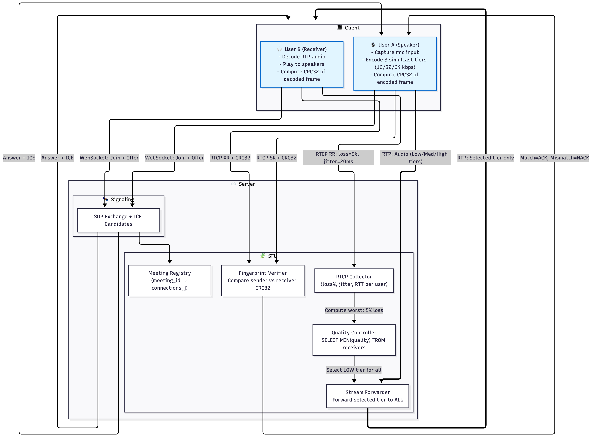

# Architecture Diagram

The architecture below supports **User Stories 11, 3, and 8**, covering:

- **Audio transmission** from User A → SFU → User B  
- **Real-time audio feedback** based on CRC32 fingerprints  
- **Adaptive quality management** based on receiver network constraints  

It traces the full pipeline:  
1. User A captures audio and encodes three simulcast tiers.  
2. The SFU selects the appropriate tier based on real-time RTCP metrics.  
3. CRC32 fingerprints are verified end-to-end to provide delivery feedback.  
4. User B receives, decodes, and validates the audio stream.  

Components are grouped into:

- **Client Side** (Speaker & Receiver)  
- **Signaling** (SDP / ICE WebSocket exchange)  
- **SFU Core** (routing, quality control, fingerprint verification)

---

## 📸 Architecture Diagram



---

## Mermaid Diagram

```mermaid
---
config:
  layout: elk
---
flowchart TB
subgraph CLIENT["💻 Client Side"]
    UA["🎙️ User A (Speaker)<br>- Capture mic input<br>- Encode 3 simulcast tiers (16/32/64 kbps)<br>- Compute CRC32 of encoded frame"]
    UB["🎧 User B (Receiver)<br>- Decode RTP audio<br>- Play to speakers<br>- Compute CRC32 of decoded frame"]
end

subgraph SIGNAL["🛰️ Signaling (WebSocket)"]
    SDP["SDP Exchange + ICE Candidates"]
end

subgraph SFU["🧩 SFU Core"]
    REG["Meeting Registry<br>(meeting_id → connections[])"]
    RTCP["RTCP Collector<br>(loss%, jitter, RTT per user)"]
    CTRL["Quality Controller<br>SELECT MIN(quality) FROM receivers"]
    FWD["Stream Forwarder<br>Forward selected tier to ALL"]
    FPRINT["Fingerprint Verifier<br>Compare sender vs receiver CRC32"]
end

subgraph SERVER["☁️ Server Side"]
    SIGNAL
    SFU
end

UA -- "WebSocket: Join + Offer" --> SDP
UB -- "WebSocket: Join + Offer" --> SDP
SDP -- "Answer + ICE" --> UA & UB
SDP --> REG

UA == "RTP: Audio (Low/Med/High tiers)" ==> FWD
FWD == "RTP: Selected tier only" ==> UB

UB -- "RTCP RR: loss=5%, jitter=20ms" --> RTCP
RTCP -- "Compute worst: 5% loss" --> CTRL
CTRL -- "Select LOW tier for all" --> FWD

UA -- "RTCP SR + CRC32" --> FPRINT
UB -- "RTCP XR + CRC32" --> FPRINT

FPRINT -- "Match=ACK, Mismatch=NACK" --> UA

classDef media fill:#e1f5ff,stroke:#0066cc,stroke-width:2px;
classDef control fill:#fff4e1,stroke:#cc6600,stroke-width:2px;

UA:::media
UB:::media
