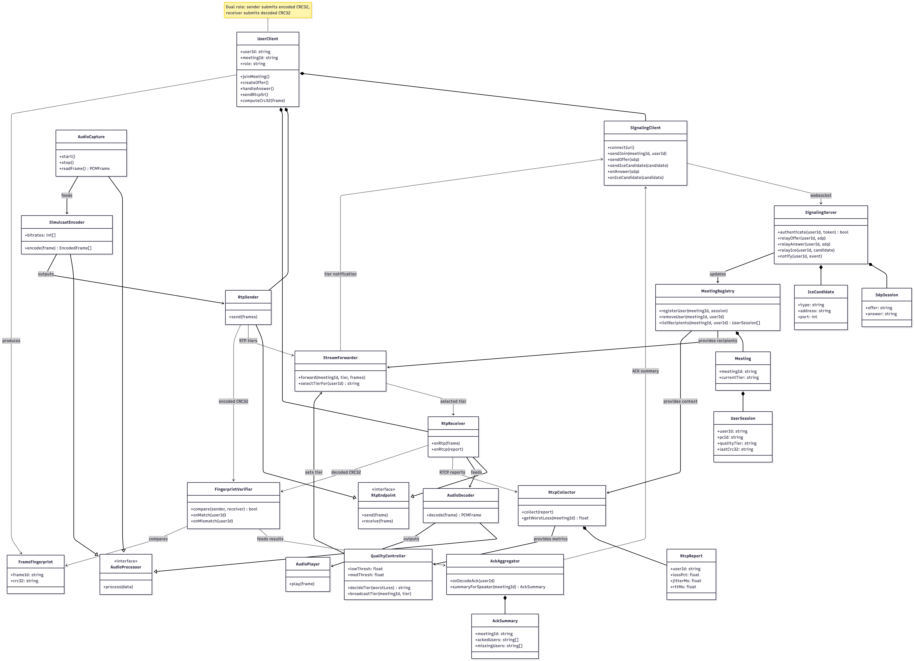
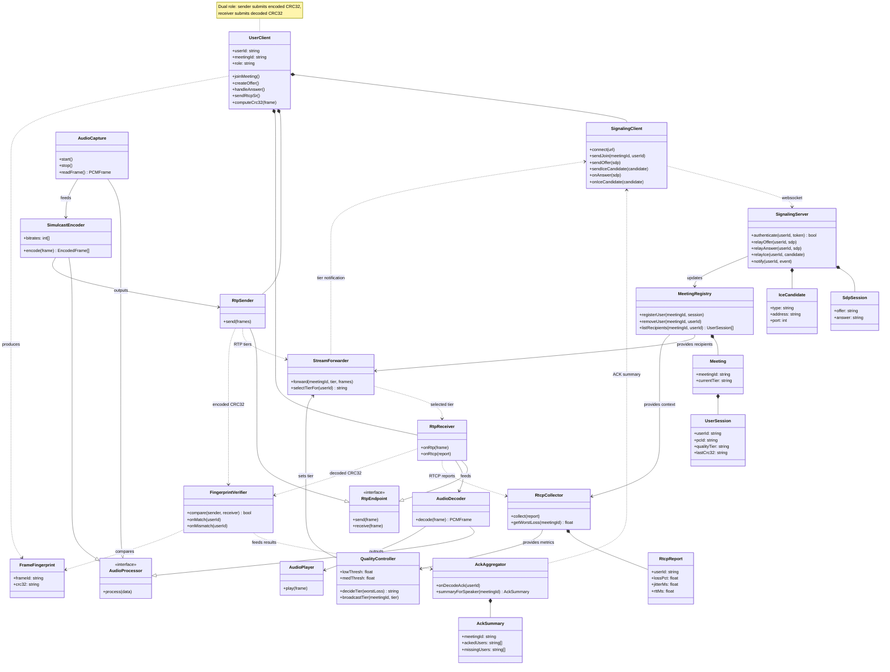

# Class Diagram

The class diagram defines the **software structure** of the audio pipeline and SFU system. It maps:

- **Client-side components** (audio capture → encoding → RTP transport → decoding → playback)
- **Server-side components** (meeting management, stream routing, quality control, CRC32 verification)
- **Core interfaces**, class responsibilities, and communication paths

This diagram shows how components compose together:  
- `UserClient` orchestrates signaling, RTP send/receive, and UI feedback.  
- SFU classes manage meeting state, select the correct simulcast tier, and verify CRC-based delivery.  
- Client and server classes interact via WebSocket (signaling), RTP (media), and RTCP (feedback).

---

## 📸 Class Diagram Image

---

## Mermaid Class Diagram (Source)

# List of Classes

This system is composed of a client-side audio pipeline (capture → encode → send → receive → decode → play) paired with server-side stream routing, quality control, and integrity verification. The client handles media capture, simulcast encoding, RTP transport, playback, and CRC-based fingerprint generation, while the server coordinates signaling, manages meetings, selects the appropriate audio tier based on the worst network receiver, and validates end-to-end delivery through CRC checks.

---

## M1: Client Module

### **M1.1 Media Capture & Encoding**
#### **C1.1.1 AudioCapture**  
*Purpose:* Captures microphone input and provides PCM frames for encoding  
*Implements:* `AudioProcessor`

#### **C1.1.2 SimulcastEncoder**  
*Purpose:* Encodes audio into 3 simulcast tiers (16/32/64 kbps)  
*Implements:* `AudioProcessor`

---

### **M1.2 Network Transport**
#### **C1.2.1 RtpSender**  
*Purpose:* Sends RTP packets with simulcast tiers + CRC32 fingerprints  
*Implements:* `RtpEndpoint`

#### **C1.2.2 RtpReceiver**  
*Purpose:* Receives RTP packets and sends RTCP reports + decoded CRC32  
*Implements:* `RtpEndpoint`

---

### **M1.3 Audio Playback**
#### **C1.3.1 AudioDecoder**  
*Purpose:* Decodes RTP frames into PCM audio  
*Implements:* `AudioProcessor`

#### **C1.3.2 AudioPlayer**  
*Purpose:* Plays decoded PCM audio to speakers  

---

### **M1.4 Signaling**
#### **C1.4.1 SignalingClient**  
*Purpose:* Establishes WebSocket signaling and performs SDP/ICE negotiation  

#### **C1.4.2 UserClient**  
*Purpose:* Orchestrates client operations including joining meetings, sending CRC32, and UI feedback  
*Note:* Dual role — sender submits encoded CRC32, receiver submits decoded CRC32  

---

### **M1.5 Audio Fingerprinting**
#### **C1.5.1 FrameFingerprint**  
*Purpose:* Stores CRC32 fingerprint for audio verification  

---

## M2: Server Module

### **M2.1 Signaling Server**
#### **C2.1.1 SignalingServer**  
*Purpose:* Handles WebSocket connections, user authentication, and relays SDP/ICE  

#### **C2.1.2 SdpSession**  
*Purpose:* Holds SDP offer/answer pairs  

#### **C2.1.3 IceCandidate**  
*Purpose:* Represents ICE information (type, address, port)  

---

### **M2.2 Meeting Management**
#### **C2.2.1 MeetingRegistry**  
*Purpose:* Manages meeting state and active user sessions  

#### **C2.2.2 Meeting**  
*Purpose:* Represents metadata for an active meeting (id, current tier)  

#### **C2.2.3 UserSession**  
*Purpose:* Tracks participant connection state + CRC32 + tier  

---

### **M2.3 Stream Routing**
#### **C2.3.1 StreamForwarder**  
*Purpose:* Routes RTP packets and selects a single quality tier based on worst receiver  

---

### **M2.4 Quality Management**
#### **C2.4.1 RtcpCollector**  
*Purpose:* Collects RTCP reports and computes worst loss/jitter  

#### **C2.4.2 QualityController**  
*Purpose:* Decides which simulcast tier to forward and broadcasts tier updates  

#### **C2.4.3 RtcpReport**  
*Purpose:* Contains network quality metrics (lossPct, jitterMs, rttMs)  

---

### **M2.5 Audio Verification**
#### **C2.5.1 FingerprintVerifier**  
*Purpose:* Compares sender/receiver CRC32 for end-to-end integrity  

#### **C2.5.2 AckAggregator**  
*Purpose:* Aggregates CRC32 match results and produces per-meeting ACK summary  

#### **C2.5.3 AckSummary**  
*Purpose:* Summary listing recipients who successfully decoded audio vs missing ones  

---

