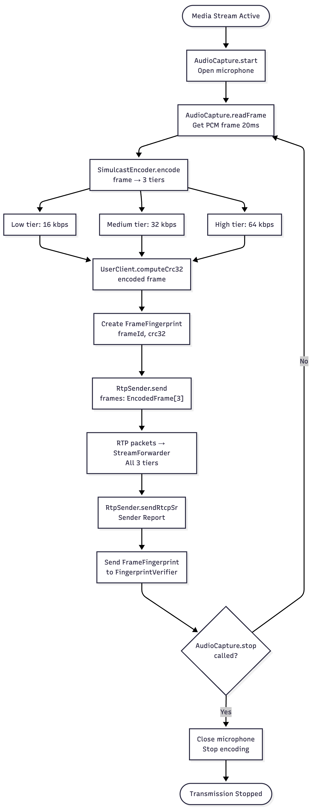
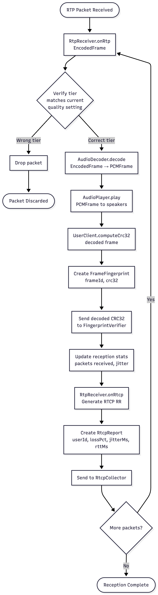
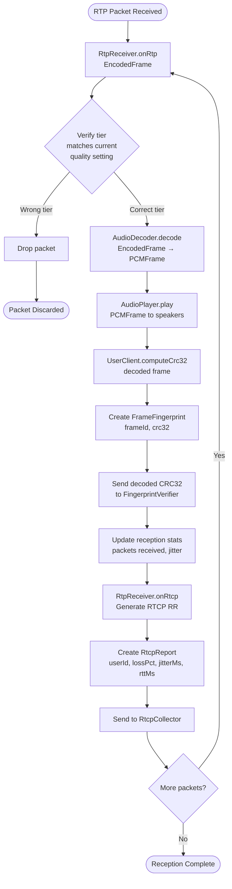
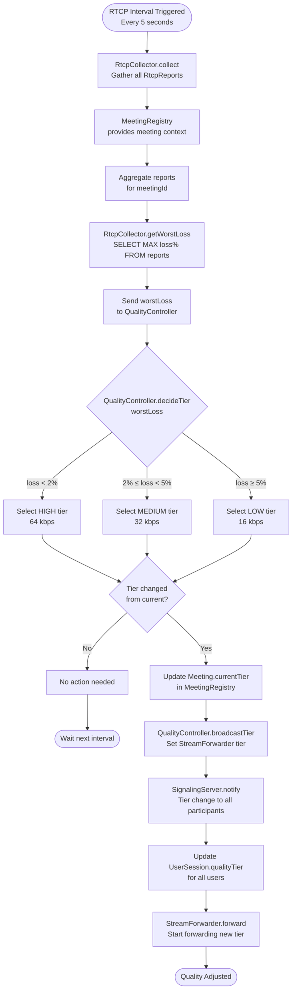
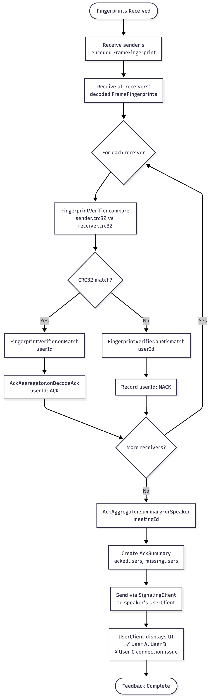
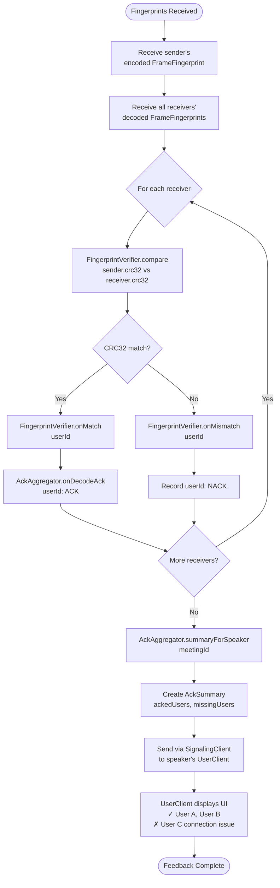
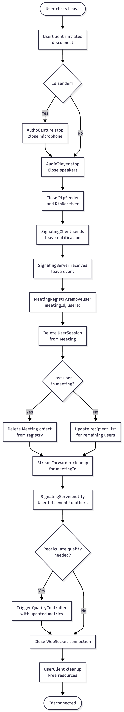
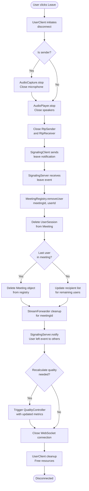

# Flow Charts

The flowcharts illustrate the full lifecycle of a real-time audio session—from joining a meeting, establishing signaling and media paths, and streaming audio, to adaptive quality adjustment, fingerprint-based delivery verification, and meeting teardown.

They also detail:

- media flow from capture → playback  
- reactions to changing network conditions  
- ACK-based integrity verification  
- reliable session setup and teardown  

---

## 1. Meeting Join & Connection Setup

**Image:**  


### Mermaid (Source)

```mermaid
flowchart TD
    Start([User clicks Join Meeting]) --> Init[UserClient.joinMeeting<br>meetingId, userId]
    Init --> WSConnect[SignalingClient.connect<br>WebSocket URL]
    WSConnect --> SendJoin[SignalingClient.sendJoin<br>meetingId, userId]
    SendJoin --> Auth{SignalingServer.authenticate<br>userId, token}
    
    Auth -->|Failed| AuthError[Return 401 Unauthorized]
    AuthError --> End1([Connection Failed])
    
    Auth -->|Success| CreateOffer[UserClient.createOffer<br>Generate SDP]
    CreateOffer --> GatherICE[Gather ICE candidates]
    GatherICE --> SendOffer[SignalingClient.sendOffer<br>SDP + ICE candidates]
    SendOffer --> RelayOffer[SignalingServer.relayOffer<br>to other participants]
    
    RelayOffer --> CreateAnswer[Other participants<br>create SDP answer]
    CreateAnswer --> SendAnswer[SignalingServer.relayAnswer<br>back to sender]
    SendAnswer --> HandleAnswer[UserClient.handleAnswer<br>Set remote description]
    
    HandleAnswer --> RegisterUser[MeetingRegistry.registerUser<br>meetingId, UserSession]
    RegisterUser --> StoreSession[Create UserSession<br>userId, pcId, qualityTier: HIGH]
    StoreSession --> NotifyOthers[SignalingServer.notify<br>User joined event]
    
    NotifyOthers --> Connected([Connection Established<br>Ready for media])
````

---

## 2. Audio Transmission Pipeline (Sender)

**Image:**


### Mermaid (Source)

```mermaid
flowchart TD
    Start([Media Stream Active]) --> Capture[AudioCapture.start<br>Open microphone]
    Capture --> ReadFrame[AudioCapture.readFrame<br>Get PCM frame 20ms]
    
    ReadFrame --> Encode[SimulcastEncoder.encode<br>frame → 3 tiers]
    Encode --> Low[Low tier: 16 kbps]
    Encode --> Med[Medium tier: 32 kbps]
    Encode --> High[High tier: 64 kbps]
    
    Low --> ComputeCRC[UserClient.computeCrc32<br>encoded frame]
    Med --> ComputeCRC
    High --> ComputeCRC
    
    ComputeCRC --> CreateFP[Create FrameFingerprint<br>frameId, crc32]
    CreateFP --> SendRTP["RtpSender.send<br>frames: EncodedFrame[3]"]
    
    SendRTP --> ToSFU[RTP packets → StreamForwarder<br>All 3 tiers]
    ToSFU --> SendSR[RtpSender.sendRtcpSr<br>Sender Report]
    
    SendSR --> SendFingerprint[Send FrameFingerprint<br>to FingerprintVerifier]
    SendFingerprint --> CheckStop{AudioCapture.stop<br>called?}
    
    CheckStop -->|No| ReadFrame
    CheckStop -->|Yes| Cleanup[Close microphone<br>Stop encoding]
    Cleanup --> End([Transmission Stopped])
```

---

## 3. Audio Reception Pipeline (Receiver)

**Image:**


### Mermaid (Source)



---

## 4. Adaptive Quality Control Loop

**Image:**


### Mermaid (Source)



---

## 5. Fingerprint Verification & ACK Flow

**Image:**


### Mermaid (Source)



---

## 6. Meeting Teardown

**Image:**


### Mermaid (Source)


