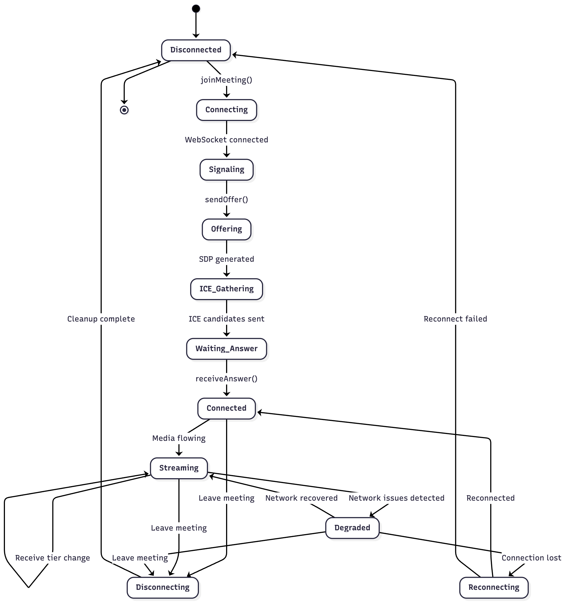
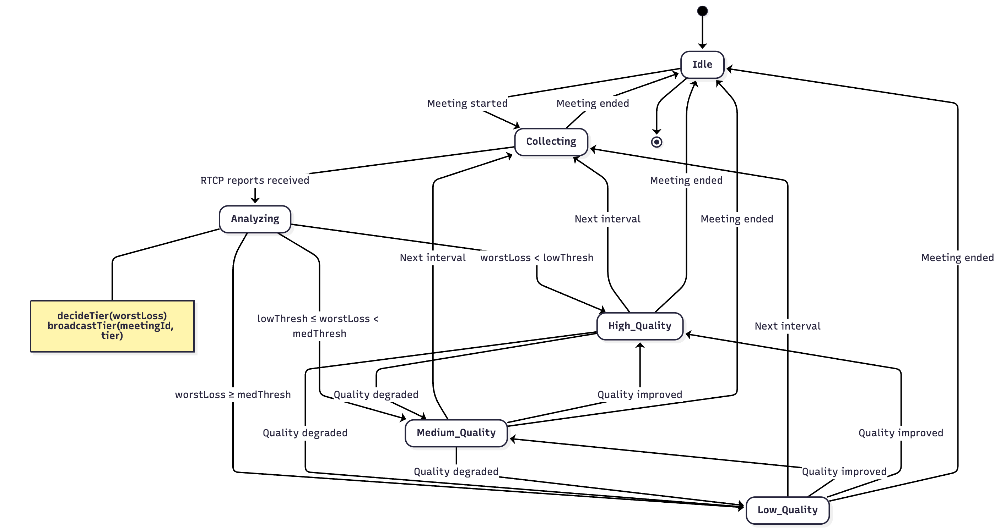
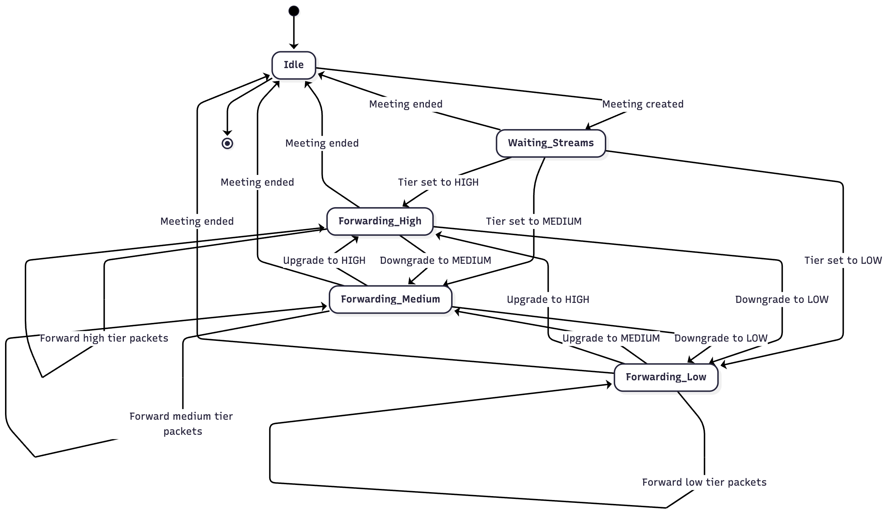
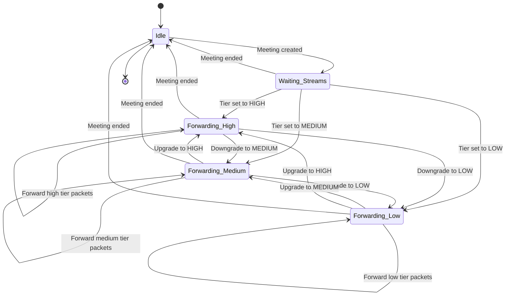
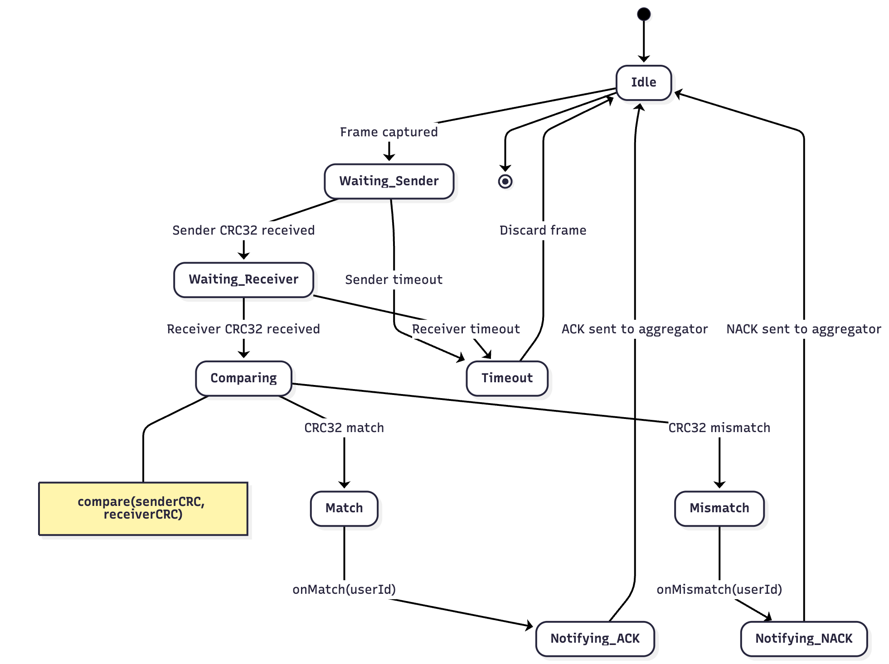
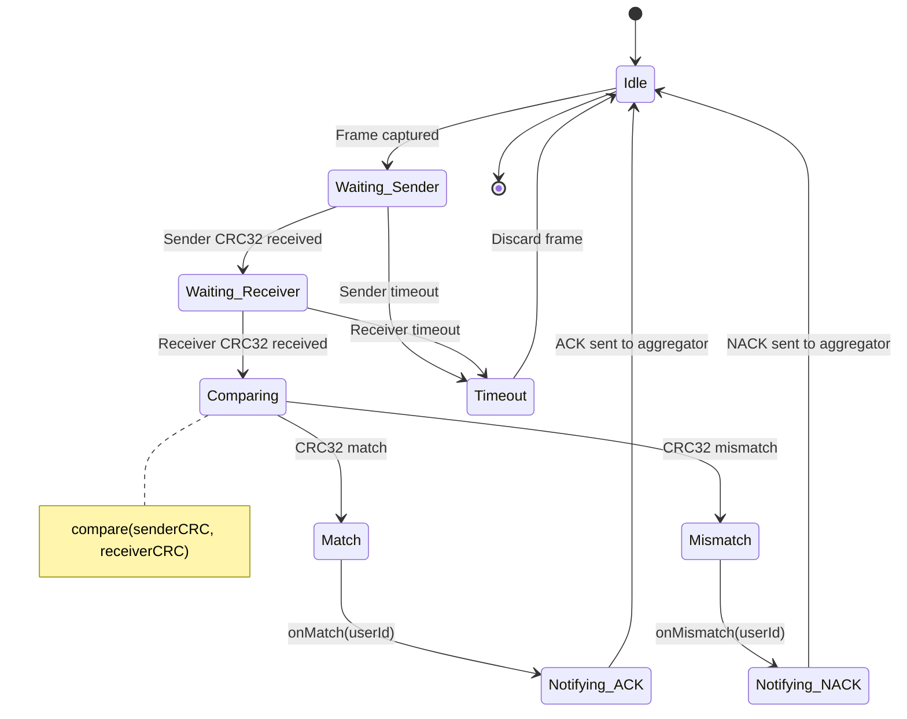
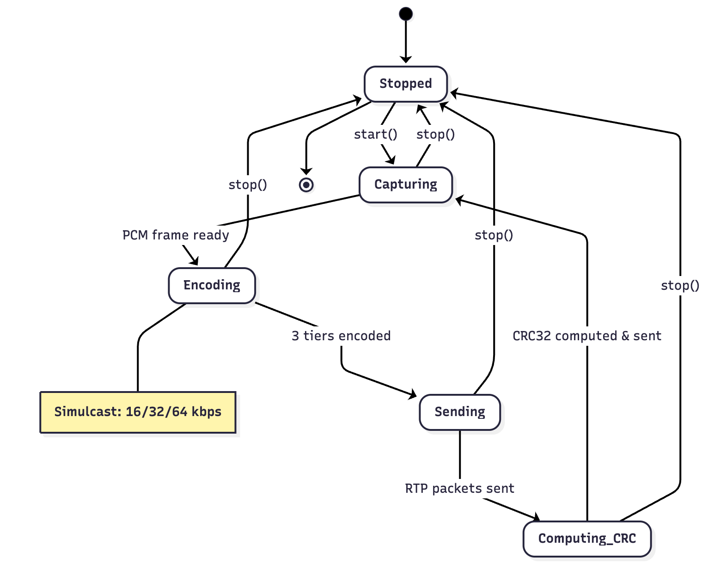
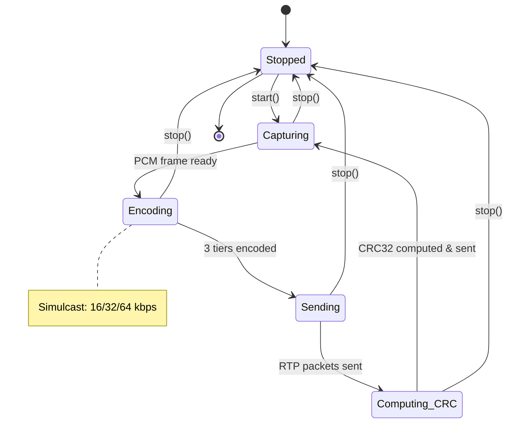
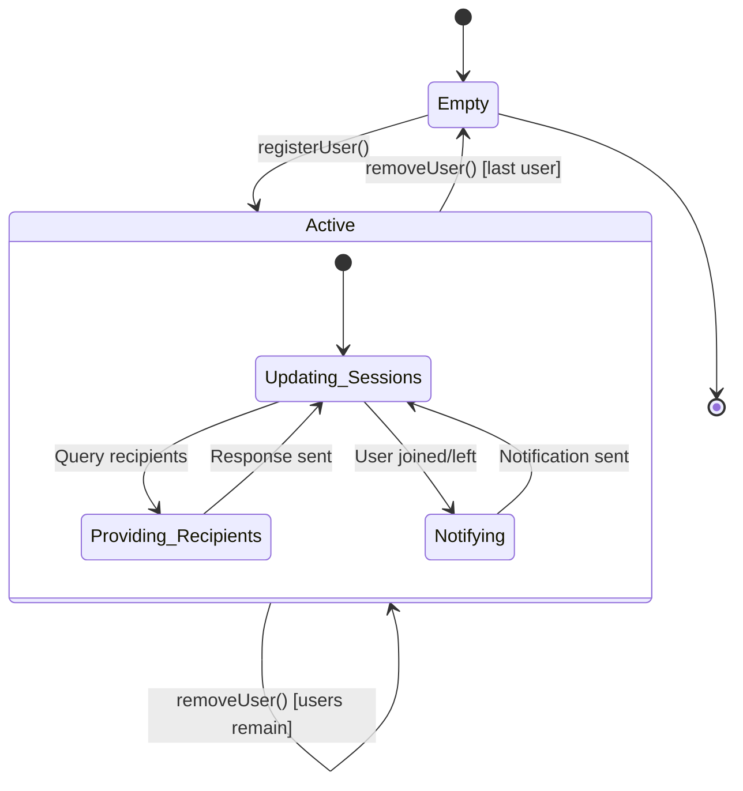

# State Diagrams

These state diagrams describe how the system manages user session lifecycle, tier-based quality control, simulcast stream forwarding, CRC-based audio verification, client-side audio processing, and active meeting membership.

Together, they visualize the end-to-end pipeline of:

- joining a meeting  
- establishing WebRTC signaling  
- streaming simulcast audio  
- adjusting tier quality  
- verifying end-to-end CRC32 delivery  
- maintaining meeting membership and session state  

---

## 1. User Session State Diagram

**Image:**  


### Mermaid (Source)

```mermaid
stateDiagram-v2
    [*] --> Disconnected
    
    Disconnected --> Connecting: joinMeeting()
    Connecting --> Signaling: WebSocket connected
    Signaling --> Offering: sendOffer()
    Offering --> ICE_Gathering: SDP generated
    ICE_Gathering --> Waiting_Answer: ICE candidates sent
    Waiting_Answer --> Connected: receiveAnswer()
    
    Connected --> Streaming: Media flowing
    Streaming --> Streaming: Receive tier change
    Streaming --> Degraded: Network issues detected
    Degraded --> Streaming: Network recovered
    Degraded --> Reconnecting: Connection lost
    
    Connected --> Disconnecting: Leave meeting
    Streaming --> Disconnecting: Leave meeting
    Degraded --> Disconnecting: Leave meeting
    Reconnecting --> Connected: Reconnected
    Reconnecting --> Disconnected: Reconnect failed
    Disconnecting --> Disconnected: Cleanup complete
    
    Disconnected --> [*]
````

---

## 2. Quality Controller State Diagram

**Image:**


### Mermaid (Source)

```mermaid
stateDiagram-v2
    [*] --> Idle
    
    Idle --> Collecting: Meeting started
    Collecting --> Analyzing: RTCP reports received
    Analyzing --> High_Quality: worstLoss < lowThresh
    Analyzing --> Medium_Quality: lowThresh ≤ worstLoss < medThresh
    Analyzing --> Low_Quality: worstLoss ≥ medThresh
    
    High_Quality --> Collecting: Next interval
    Medium_Quality --> Collecting: Next interval
    Low_Quality --> Collecting: Next interval
    
    High_Quality --> Medium_Quality: Quality degraded
    High_Quality --> Low_Quality: Quality degraded
    Medium_Quality --> High_Quality: Quality improved
    Medium_Quality --> Low_Quality: Quality degraded
    Low_Quality --> Medium_Quality: Quality improved
    Low_Quality --> High_Quality: Quality improved
    
    High_Quality --> Idle: Meeting ended
    Medium_Quality --> Idle: Meeting ended
    Low_Quality --> Idle: Meeting ended
    Collecting --> Idle: Meeting ended
    
    Idle --> [*]
    
    note right of Analyzing
        decideTier(worstLoss)
        broadcastTier(meetingId, tier)
    end note
```

---

## 3. Stream Forwarder State Diagram

**Image:**


### Mermaid (Source)



---

## 4. Fingerprint Verification State Diagram

**Image:**


### Mermaid (Source)



---

## 5. Audio Pipeline State Diagram (Client)

**Image:**


### Mermaid (Source)



---

## 6. Meeting Registry State Diagram

**Image:**


### Mermaid (Source)



