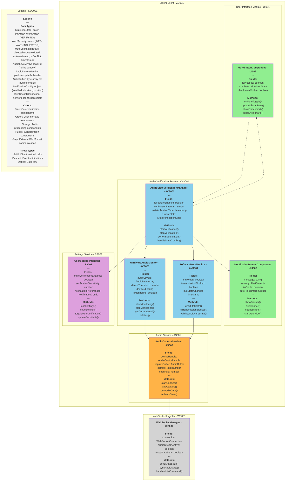

# Development Specification: Microphone Mute Verification Feature

## Document Information

### Version History
| Version | Date | Editor | Changes |
|---

## System Architecture Diagram

---------|------|---------|---------|
| 1.0 | September 24, 2025 | Claude (Senior Network Engineer) | Initial draft |

### Authors and Contributors
- **Claude** - Senior Network Engineer (v1.0)

---

## Feature Overview

**Feature Name:** Microphone Mute Verification  
**User Story:** As a user, I want to easily verify that my microphone is muted so that I can confidently participate in calls without worrying about accidentally sharing private conversations.

**Brief Description:** Client-side verification system that confirms both hardware and software microphone mute states, providing visual feedback to users through UI indicators.

---