# Development Specification: Microphone Mute Verification Feature

## Document Information

### Version History
| Version | Date | Editor | Changes |
|## Class Diagram

```mermaid
classDiagram
    %% Abstract Base Classes (Top Level)
    class BaseComponent_BC001 {
        <<abstract>>
    }
    
    class BaseService_BS001 {
        <<abstract>>
    }

    %% New Feature UI Components (Inherit from BaseComponent)
    class MuteButtonComponent_UI002 {
        <<New Feature Class>>
    }
    
    class NotificationBannerComponent_UI003 {
        <<New Feature Class>>
    }

    %% New Feature Services (Inherit from BaseService)
    class AudioStateVerificationManager_AVS002 {
        <<New Feature Class>>
    }
    
    class HardwareAudioMonitor_AVS003 {
        <<New Feature Class>>
    }
    
    class SoftwareMuteMonitor_AVS004 {
        <<New Feature Class>>
    }
    
    class UserSettingsManager_SS002 {
        <<New Feature Class>>
    }

    %% Original Zoom Components (Inherit from BaseService)
    class AudioCaptureService_AS002 {
        <<Original Zoom Component>>
    }
    
    class WebSocketManager_WS002 {
        <<Original Zoom Component>>
    }

    %% Data Classes (No inheritance)
    class MuteVerificationState_DS001 {
        <<struct>>
        <<New Feature Data>>
    }
    
    class NotificationConfig_DS002 {
        <<struct>>
        <<New Feature Data>>
    }
    
    class AudioLevelArray_DS003 {
        <<struct>>
        <<New Feature Data>>
    }

    %% External Classes (No inheritance)
    class AudioDeviceHandle_EXT001 {
        <<external>>
        <<Platform Interface>>
    }
    
    class WebSocketConnection_EXT002 {
        <<external>>
        <<Network Interface>>
    }

    %% Inheritance Relationships
    BaseComponent_BC001 <|-- MuteButtonComponent_UI002
    BaseComponent_BC001 <|-- NotificationBannerComponent_UI003
    
    BaseService_BS001 <|-- AudioStateVerificationManager_AVS002
    BaseService_BS001 <|-- HardwareAudioMonitor_AVS003
    BaseService_BS001 <|-- SoftwareMuteMonitor_AVS004
    BaseService_BS001 <|-- UserSettingsManager_SS002
    BaseService_BS001 <|-- AudioCaptureService_AS002
    BaseService_BS001 <|-- WebSocketManager_WS002
```



## Class List

### User Interface Module (UI001) - New Feature Classes

**UI002 - MuteButtonComponent**
- Purpose: Provides visual mute toggle control with integrated verification status feedback
- Features: Microphone Mute Verification - Visual State Management and User Interaction
- Design Document Reference: Client-side visual indication system for mute state confirmation

**UI003 - NotificationBannerComponent**
- Purpose: Displays warning banners when mute state conflicts are detected between hardware and software
- Features: Microphone Mute Verification - Conflict Alert System and User Notification
- Design Document Reference: User notification system for mute verification conflicts

### Audio Verification Service (AVS001) - New Feature Classes

**AVS002 - AudioStateVerificationManager**
- Purpose: Orchestrates the complete mute verification process by coordinating hardware and software state checks
- Features: Microphone Mute Verification - Main Verification Engine and State Coordination
- Design Document Reference: Core verification logic that performs 500ms interval checks

**AVS003 - HardwareAudioMonitor**
- Purpose: Monitors physical microphone input levels to detect actual audio silence from hardware
- Features: Microphone Mute Verification - Hardware State Detection and Audio Level Analysis
- Design Document Reference: Hardware verification component that checks for audio input presence

**AVS004 - SoftwareMuteMonitor**
- Purpose: Tracks software-level mute flags and transmission blocking states within the application
- Features: Microphone Mute Verification - Software State Detection and Flag Monitoring
- Design Document Reference: Software verification component that validates mute flag consistency

### Settings Service (SS001) - New Feature Classes

**SS002 - UserSettingsManager**
- Purpose: Manages user preferences and configuration options for the mute verification feature
- Features: Microphone Mute Verification - Configuration Management and User Preferences
- Design Document Reference: Optional feature toggle and sensitivity configuration system

### Audio Service (AS001) - Original Zoom Component

**AS002 - AudioCaptureService**
- Purpose: Handles audio capture from hardware devices and manages audio stream processing
- Features: Original Zoom Audio Pipeline - Audio Input Processing and Stream Management
- Design Document Reference: Existing Zoom component from original system design specification
- **Note: Not related to new Microphone Mute Verification feature - existing system component**

### WebSocket Handler (WS001) - Original Zoom Component

**WS002 - WebSocketManager**
- Purpose: Handles network communication for audio streams and manages WebSocket connections
- Features: Original Zoom Communication - Audio Stream Management and Network Protocol Handling
- Design Document Reference: Existing Zoom component for real-time communication
- **Note: Not related to new Microphone Mute Verification feature - existing system component**

### Data Storage Classes (Structs)

**DS001 - MuteVerificationState**
- Purpose: Data structure that stores a complete snapshot of verification state including hardware status, software status, conflict indicators, and timestamp
- Features: Microphone Mute Verification - State Data Container and Verification Result Storage
- Design Document Reference: State management data structure for verification results

**DS002 - NotificationConfig**
- Purpose: Configuration data structure for notification display preferences including duration, position, and enabled status
- Features: Microphone Mute Verification - Configuration Data Container and UI Preferences
- Design Document Reference: User preference storage for notification system behavior

**DS003 - AudioLevelArray**
- Purpose: Rolling window data structure storing recent audio input level samples for hardware monitoring
- Features: Microphone Mute Verification - Audio Level Storage and Historical Data Management
- Design Document Reference: Hardware monitoring data storage for audio level analysis

### External System Interfaces

**EXT001 - AudioDeviceHandle**
- Purpose: Platform-specific interface handle for accessing operating system audio device APIs
- Features: External OS Audio API Integration - Hardware Device Access
- Design Document Reference: External dependency for hardware audio device interaction
- **Note: Not part of original Zoom design - external system interface dependency**

**EXT002 - WebSocketConnection**
- Purpose: Network connection object provided by external WebSocket library for real-time communication
- Features: External WebSocket Library Integration - Network Connection Management
- Design Document Reference: External dependency from WebSocket communication library
- **Note: Not part of original Zoom design - external library dependency**

## State Diagram

### System State Data Fields
- **featureEnabled**: boolean - Whether mute verification feature is active
- **hardwareMuted**: boolean - Physical microphone input silence detected
- **softwareMuted**: boolean - Application mute flag state
- **verificationActive**: boolean - Verification process currently running
- **conflictDetected**: boolean - Mismatch between hardware and software states
- **lastVerificationTime**: timestamp - When last verification check completed
- **audioLevels**: AudioLevelArray - Recent microphone input level samples
- **checkmarkVisible**: boolean - UI checkmark display state
- **bannerVisible**: boolean - Warning banner display state


### Legend
- **Green with thick border**: Initial state when feature is disabled
- **Light blue**: Normal operational states during verification
- **Orange**: Conflict state when hardware/software mismatch detected  
- **Light green**: Successfully verified mute state with checkmark visible
- **Gray**: Disabled state (feature turned off)
- **Solid arrows**: State transitions triggered by method calls
- **State labels**: Show current values of key state fields
- **Decision labels**: Show predicates used to determine next state transitions
- **Edge labels**: Show predicate values and methods that trigger transitions

## Flow Charts

### Scenario MV001: User Mutes Microphone with Verification Feature Enabled

**Scenario Description:** A user has their microphone unmuted by default and the mute verification feature enabled in settings. When they click the mute button, the system should verify both hardware and software mute states, display visual confirmation with a green checkmark on success, and continuously monitor the mute state. If any conflicts arise between hardware and software states, the system alerts the user.


**Flow Chart Explanation:** This flow chart demonstrates the complete microphone mute verification process. It begins when a user clicks the mute button while in the "Unmuted" state. The system transitions through "Initializing" to "Monitoring" state while setting up verification components. Upon successful verification of both hardware silence and software mute flag, the system enters "VerifiedMuted" state and displays the green checkmark. The continuous monitoring loop checks every 500ms, transitioning between "VerifiedMuted" and "ConflictDetected" states based on verification results. The process can terminate by returning to "Unmuted" state (user unmutes) or "FeatureDisabled" state (user disables feature).

### Scenario MV002: Mute State Conflict Detection and Resolution

**Scenario Description:** During active mute verification monitoring, the system detects a conflict where hardware and software mute states don't match (e.g., external headset mute button used, or software/hardware failure). The system should alert the user with a notification banner and provide guidance for resolution.


**Flow Chart Explanation:** This flow chart handles conflict detection during the verification monitoring process. Starting from either "VerifiedMuted" or "Monitoring" states, the system performs verification checks and branches based on state consistency. When conflicts are detected, the system transitions to "ConflictDetected" state and displays appropriate notifications. The system provides different messaging for external hardware mute versus general conflicts. User interaction can resolve software sync issues, returning the system to normal "Monitoring" state. Unresolved conflicts maintain the "ConflictDetected" state with persistent notifications until resolution or feature disable.

## Development Risks and Failure Modes

### Failure Mode Analysis (Ranked by Likelihood × Impact)

**RANK 1: HIGH LIKELIHOOD, HIGH IMPACT**

**FM001 - Audio Device Driver Failure**
- **Description:** Operating system audio drivers become unresponsive or return invalid data
- **Recovery Procedure:** 
  1. AudioStateVerificationManager.stopVerification()
  2. HardwareAudioMonitor.reinitializeDevice()
  3. If reinitialize fails, disable hardware monitoring and rely on software-only verification
  4. NotificationBannerComponent.showBanner("Audio device unavailable - software verification only")
- **Test Spec Reference:** Diagnostic procedure FM001-DIAG in test specification
- **Business Impact:** Core functionality degraded but feature remains partially operational

**FM002 - Performance Impact on Audio Pipeline**
- **Description:** 500ms verification polling creates audio latency or CPU bottleneck
- **Recovery Procedure:**
  1. AudioStateVerificationManager.increaseVerificationInterval(1000ms)
  2. If performance issues persist, increase to 2000ms intervals
  3. If still problematic, UserSettingsManager.autoDisableFeature()
  4. Log performance metrics for analysis
- **Test Spec Reference:** Diagnostic procedure FM002-DIAG in test specification  
- **Business Impact:** Could degrade core Zoom call quality, unacceptable for user experience

**RANK 2: MEDIUM LIKELIHOOD, HIGH IMPACT**

**FM003 - WebSocket Communication Breakdown**
- **Description:** Network issues prevent proper mute state synchronization with server
- **Recovery Procedure:**
  1. WebSocketManager.attemptReconnection()
  2. Queue local mute state changes in buffer
  3. On reconnection, sync all buffered state changes
  4. If reconnection fails after 30 seconds, continue with local verification only
- **Test Spec Reference:** Diagnostic procedure FM003-DIAG in test specification
- **Business Impact:** Other participants may not see accurate mute status

**FM004 - External Hardware Conflict**
- **Description:** External headset or USB microphone has independent mute controls that conflict with software
- **Recovery Procedure:**
  1. SoftwareMuteMonitor.detectExternalMuteDevice()
  2. NotificationBannerComponent.showBanner("External mute detected - click to sync")
  3. Provide user option to sync software state with hardware state
  4. If user declines, maintain notification and monitor for conflicts
- **Test Spec Reference:** Diagnostic procedure FM004-DIAG in test specification
- **Business Impact:** User confusion and potential privacy concerns if mute state unclear

**RANK 3: LOW LIKELIHOOD, HIGH IMPACT**

**FM005 - Memory Leak in Audio Monitoring**
- **Description:** AudioLevelArray buffer grows indefinitely or monitoring threads not properly cleaned up
- **Recovery Procedure:**
  1. HardwareAudioMonitor.clearBuffers()
  2. Restart monitoring thread with fresh buffer allocation
  3. If memory usage exceeds threshold, disable hardware monitoring
  4. UserSettingsManager.temporaryFeatureDisable()
- **Test Spec Reference:** Diagnostic procedure FM005-DIAG in test specification
- **Business Impact:** Could crash Zoom client application entirely

**FM006 - Race Condition in State Management**
- **Description:** Concurrent access to MuteVerificationState causes inconsistent UI updates
- **Recovery Procedure:**
  1. AudioStateVerificationManager.acquireStateLock()
  2. Reset all UI components to known state
  3. Perform fresh verification cycle
  4. Release lock and resume normal operation
- **Test Spec Reference:** Diagnostic procedure FM006-DIAG in test specification
- **Business Impact:** Incorrect mute indicators could lead to privacy breaches

**RANK 4: MEDIUM LIKELIHOOD, MEDIUM IMPACT**

**FM007 - Settings Persistence Failure**
- **Description:** UserSettingsManager cannot save or load feature preferences
- **Recovery Procedure:**
  1. Use default settings (feature enabled, standard sensitivity)
  2. Attempt to recreate settings file with default values
  3. NotificationBannerComponent.showBanner("Settings reset to default")
  4. Continue operation with in-memory settings only
- **Test Spec Reference:** Diagnostic procedure FM007-DIAG in test specification
- **Business Impact:** User preferences lost but functionality remains

**FM008 - UI Component Rendering Failure**
- **Description:** MuteButtonComponent or NotificationBannerComponent fails to update display
- **Recovery Procedure:**
  1. Force component re-render through parent container
  2. If re-render fails, fall back to basic mute button without verification indicators
  3. Log UI failure for debugging
  4. Feature continues to work but without visual feedback
- **Test Spec Reference:** Diagnostic procedure FM008-DIAG in test specification
- **Business Impact:** Reduced user confidence in mute verification

**RANK 5: LOW LIKELIHOOD, MEDIUM IMPACT**

**FM009 - Timer Service Malfunction**
- **Description:** Verification interval timer stops firing or fires at incorrect intervals
- **Recovery Procedure:**
  1. AudioStateVerificationManager.resetTimer()
  2. If reset fails, switch to alternative timing mechanism (setTimeout fallback)
  3. If all timing fails, disable periodic verification and use event-based verification only
  4. User can still manually trigger verification
- **Test Spec Reference:** Diagnostic procedure FM009-DIAG in test specification
- **Business Impact:** Verification becomes less reliable but basic functionality remains

**FM010 - Cross-Platform Compatibility Issues**
- **Description:** Audio device access APIs behave differently across operating systems
- **Recovery Procedure:**
  1. AudioDeviceHandle.detectPlatform()
  2. Load platform-specific audio handling module
  3. If platform not supported, disable hardware monitoring entirely
  4. Rely on software verification with appropriate user messaging
- **Test Spec Reference:** Diagnostic procedure FM010-DIAG in test specification
- **Business Impact:** Feature degradation on unsupported platforms

**RANK 6: LOW LIKELIHOOD, LOW IMPACT**

**FM011 - Notification Banner Display Overflow**
- **Description:** Multiple simultaneous notifications cause UI layout issues
- **Recovery Procedure:**
  1. NotificationBannerComponent.clearAllNotifications()
  2. Display only highest priority notification
  3. Queue remaining notifications for sequential display
  4. Implement maximum notification limit (3 concurrent)
- **Test Spec Reference:** Diagnostic procedure FM011-DIAG in test specification
- **Business Impact:** Minor UI cosmetic issue, functionality unaffected

### Critical Recovery Dependencies

- **AudioCaptureService (AS002)** must remain operational for any recovery procedures involving hardware
- **WebSocketManager (WS002)** failure requires fallback to local-only operation mode
- All recovery procedures must preserve core Zoom calling functionality as highest priority
- Feature degradation is acceptable; core application failure is not

## External Technologies and Dependencies

### Core Programming Languages

**TECH001 - JavaScript**
- **Version Required:** ECMAScript 2020 (ES11) or higher
- **Author:** Ecma International
- **Source URL:** https://www.ecma-international.org/publications-and-standards/standards/ecma-262/
- **Documentation:** https://developer.mozilla.org/en-US/docs/Web/JavaScript
- **Purpose:** Primary client-side programming language for Zoom desktop application

**TECH002 - TypeScript**
- **Version Required:** 4.9.0 or higher
- **Author:** Microsoft Corporation
- **Source URL:** https://github.com/microsoft/TypeScript
- **Documentation:** https://www.typescriptlang.org/docs/
- **Purpose:** Type-safe development and compile-time error checking

### Audio Processing Libraries

**TECH003 - Web Audio API**
- **Version Required:** Current W3C Standard (2021)
- **Author:** W3C Web Audio Working Group
- **Source URL:** https://www.w3.org/TR/webaudio/
- **Documentation:** https://developer.mozilla.org/en-US/docs/Web/API/Web_Audio_API
- **Purpose:** Low-level audio device access and real-time audio level monitoring

**TECH004 - MediaDevices API**
- **Version Required:** Current W3C Standard
- **Author:** W3C Media Capture and Streams Working Group
- **Source URL:** https://www.w3.org/TR/mediacapture-streams/
- **Documentation:** https://developer.mozilla.org/en-US/docs/Web/API/MediaDevices
- **Purpose:** Microphone device enumeration and access control

### Real-Time Communication

**TECH005 - WebRTC**
- **Version Required:** 1.0 W3C Recommendation or higher
- **Author:** W3C WebRTC Working Group
- **Source URL:** https://www.w3.org/TR/webrtc/
- **Documentation:** https://webrtc.org/getting-started/
- **Purpose:** Peer-to-peer audio streaming and NAT traversal (existing Zoom infrastructure)

**TECH006 - WebSocket API**
- **Version Required:** RFC 6455 compliant
- **Author:** IETF WebSocket Working Group
- **Source URL:** https://tools.ietf.org/html/rfc6455
- **Documentation:** https://developer.mozilla.org/en-US/docs/Web/API/WebSockets_API
- **Purpose:** Real-time bidirectional communication with Zoom servers

### User Interface Framework

**TECH007 - Electron**
- **Version Required:** 22.0.0 or higher
- **Author:** GitHub, Inc.
- **Source URL:** https://github.com/electron/electron
- **Documentation:** https://www.electronjs.org/docs/latest/
- **Purpose:** Cross-platform desktop application framework (assumed for Zoom client)

**TECH008 - React**
- **Version Required:** 18.2.0 or higher
- **Author:** Meta (Facebook)
- **Source URL:** https://github.com/facebook/react
- **Documentation:** https://reactjs.org/docs/getting-started.html
- **Purpose:** Component-based user interface library

### State Management and Utilities

**TECH009 - RxJS**
- **Version Required:** 7.8.0 or higher
- **Author:** Ben Lesh and contributors
- **Source URL:** https://github.com/ReactiveX/rxjs
- **Documentation:** https://rxjs.dev/guide/overview
- **Purpose:** Reactive programming for audio level monitoring and timer management

**TECH010 - Lodash**
- **Version Required:** 4.17.21 or higher
- **Author:** John-David Dalton
- **Source URL:** https://github.com/lodash/lodash
- **Documentation:** https://lodash.com/docs/
- **Purpose:** Utility functions for data manipulation and throttling

### Platform-Specific Audio APIs

**TECH011 - Core Audio (macOS)**
- **Version Required:** macOS 10.15 or higher
- **Author:** Apple Inc.
- **Source URL:** https://developer.apple.com/documentation/coreaudio
- **Documentation:** https://developer.apple.com/documentation/coreaudio
- **Purpose:** Low-level audio device access on macOS platforms

**TECH012 - WASAPI (Windows)**
- **Version Required:** Windows 10 version 1903 or higher
- **Author:** Microsoft Corporation
- **Source URL:** https://docs.microsoft.com/en-us/windows/win32/coreaudio/wasapi
- **Documentation:** https://docs.microsoft.com/en-us/windows/win32/coreaudio/
- **Purpose:** Low-level audio device access on Windows platforms

**TECH013 - ALSA (Linux)**
- **Version Required:** 1.2.0 or higher
- **Author:** Advanced Linux Sound Architecture project
- **Source URL:** https://www.alsa-project.org/wiki/Main_Page
- **Documentation:** https://www.alsa-project.org/alsa-doc/alsa-lib/
- **Purpose:** Audio device access on Linux platforms

### Development and Testing Tools

**TECH014 - Node.js**
- **Version Required:** 18.16.0 LTS or higher
- **Author:** Node.js Foundation
- **Source URL:** https://github.com/nodejs/node
- **Documentation:** https://nodejs.org/en/docs/
- **Purpose:** Development environment and build tooling

**TECH015 - Webpack**
- **Version Required:** 5.88.0 or higher
- **Author:** Tobias Koppers and contributors
- **Source URL:** https://github.com/webpack/webpack
- **Documentation:** https://webpack.js.org/concepts/
- **Purpose:** Module bundling and build optimization

**TECH016 - Jest**
- **Version Required:** 29.5.0 or higher
- **Author:** Meta (Facebook)
- **Source URL:** https://github.com/facebook/jest
- **Documentation:** https://jestjs.io/docs/getting-started
- **Purpose:** JavaScript testing framework for unit tests

### Storage and Persistence

**TECH017 - Electron Store**
- **Version Required:** 8.1.0 or higher
- **Author:** Sindre Sorhus
- **Source URL:** https://github.com/sindresorhus/electron-store
- **Documentation:** https://github.com/sindresorhus/electron-store#readme
- **Purpose:** Persistent user settings storage for desktop application

### Performance Monitoring

**TECH018 - Performance Observer API**
- **Version Required:** Current W3C Standard
- **Author:** W3C Web Performance Working Group
- **Source URL:** https://www.w3.org/TR/performance-timeline-2/
- **Documentation:** https://developer.mozilla.org/en-US/docs/Web/API/PerformanceObserver
- **Purpose:** Monitoring verification performance impact on audio pipeline

### Security and Permissions

**TECH019 - Permissions API**
- **Version Required:** Current W3C Standard
- **Author:** W3C Web Application Security Working Group
- **Source URL:** https://www.w3.org/TR/permissions/
- **Documentation:** https://developer.mozilla.org/en-US/docs/Web/API/Permissions_API
- **Purpose:** Microphone access permission management

## API Specifications

### User Interface Module (UI001)

**MuteButtonComponent (UI002)**

*Public Methods:*
- `onMuteToggle(): void` - Handles mute button click events
- `updateVisualState(state: MuteVerificationState): void` - Updates button appearance
- `showCheckmark(): void` - Displays verification checkmark
- `hideCheckmark(): void` - Hides verification checkmark
- `setIconState(state: MuteIconState): void` - Updates mute icon appearance

*Private Methods:*
- `renderMuteIcon(): HTMLElement` - Creates mute icon element
- `animateStateTransition(): void` - Handles visual transitions

**NotificationBannerComponent (UI003)**

*Public Methods:*
- `showBanner(message: string, severity: AlertSeverity): void` - Displays notification banner
- `hideBanner(): void` - Hides notification banner
- `setMessage(message: string): void` - Updates banner text
- `startAutoHide(duration: number): void` - Sets automatic hide timer

*Private Methods:*
- `createBannerElement(): HTMLElement` - Creates banner DOM element
- `positionBanner(): void` - Calculates banner position

### Audio Verification Service (AVS001)

**AudioStateVerificationManager (AVS002)**

*Public Methods:*
- `startVerification(): Promise<boolean>` - Initializes verification system
- `stopVerification(): void` - Stops verification process
- `performVerification(): Promise<MuteVerificationState>` - Executes single verification
- `handleStateConflict(state: MuteVerificationState): void` - Processes conflict resolution
- `isFeatureEnabled(): boolean` - Returns feature status
- `setVerificationInterval(intervalMs: number): void` - Updates check frequency

*Private Methods:*
- `initializeMonitors(): Promise<void>` - Sets up monitoring components  
- `evaluateStates(hardware: boolean, software: boolean): MuteVerificationState` - Compares states
- `scheduleNextVerification(): void` - Sets up timer for next check

**HardwareAudioMonitor (AVS003)**

*Public Methods:*
- `startMonitoring(): Promise<boolean>` - Begins hardware monitoring
- `stopMonitoring(): void` - Stops hardware monitoring
- `getCurrentLevel(): number` - Returns current audio level
- `isSilent(): boolean` - Checks if audio below threshold
- `setThreshold(threshold: number): void` - Updates silence threshold

*Private Methods:*
- `initializeAudioContext(): Promise<AudioContext>` - Sets up Web Audio API
- `processAudioSamples(samples: Float32Array): void` - Analyzes audio data
- `updateLevelHistory(level: number): void` - Maintains audio level buffer

**SoftwareMuteMonitor (AVS004)**

*Public Methods:*
- `getMuteState(): boolean` - Returns current software mute flag
- `isTransmissionBlocked(): boolean` - Checks if audio transmission disabled
- `validateSoftwareState(): boolean` - Verifies internal consistency
- `onMuteStateChange(callback: (muted: boolean) => void): void` - Registers state listener

*Private Methods:*
- `queryAudioCaptureService(): boolean` - Gets mute state from audio service
- `validateTransmissionPath(): boolean` - Checks audio pipeline status

### Settings Service (SS001)

**UserSettingsManager (SS002)**

*Public Methods:*
- `loadSettings(): Promise<UserSettings>` - Loads user preferences from storage
- `saveSettings(settings: UserSettings): Promise<void>` - Persists settings to storage
- `toggleMuteVerification(): boolean` - Enables/disables feature
- `updateSensitivity(level: number): void` - Sets verification sensitivity
- `getNotificationPreferences(): NotificationConfig` - Returns notification settings
- `setNotificationPreferences(config: NotificationConfig): void` - Updates notifications

*Private Methods:*
- `validateSettings(settings: UserSettings): boolean` - Ensures settings validity
- `applyDefaults(): UserSettings` - Creates default configuration

### Audio Service (AS001) - Original Zoom Component

**AudioCaptureService (AS002)**

*Public Methods:*
- `startCapture(): Promise<boolean>` - Begins audio capture
- `stopCapture(): void` - Stops audio capture  
- `getAudioData(): AudioBuffer` - Returns current audio buffer
- `setMuteState(muted: boolean): void` - Sets software mute flag
- `getMuteState(): boolean` - Returns current mute state
- `getDeviceInfo(): AudioDeviceInfo` - Returns device details

*Private Methods:*
- `initializeDevice(): Promise<MediaStreamAudioSourceNode>` - Sets up audio device
- `processAudioBuffer(): void` - Handles audio data processing

### WebSocket Handler (WS001) - Original Zoom Component

**WebSocketManager (WS002)**

*Public Methods:*
- `sendMuteState(muted: boolean): Promise<void>` - Transmits mute state to server
- `syncAudioState(): Promise<boolean>` - Synchronizes with server state
- `handleMuteCommand(command: MuteCommand): void` - Processes server mute commands
- `isConnected(): boolean` - Returns connection status

*Private Methods:*
- `establishConnection(): Promise<WebSocket>` - Creates WebSocket connection
- `handleConnectionError(error: Error): void` - Processes connection failures

### Data Structure Methods (Read-only properties and constructors)

**MuteVerificationState (DS001)**
- `constructor(hardwareMuted: boolean, softwareMuted: boolean, timestamp: number)`
- `isConflict(): boolean` - Returns true if hardware/software mismatch
- `toJSON(): object` - Serializes state for logging

**NotificationConfig (DS002)**  
- `constructor(enabled: boolean, duration: number, position: string)`
- `isValid(): boolean` - Validates configuration parameters

**AudioLevelArray (DS003)**
- `constructor(windowSize: number)`
- `addLevel(level: number): void` - Adds new audio level sample
- `getAverage(): number` - Returns average level over window
- `isSilent(threshold: number): boolean` - Checks if consistently below threshold

## Public Interface Specifications

### User Interface Module (UI001) - Public Methods

**MuteButtonComponent (UI002)**

*Within Same Component (UI001):*
- None - no inter-component communication within UI001

*Across Components, Same Module:*
- None - UI001 is single component module

*Across Modules:*
- `onMuteToggle(): void` → Called by AVS001.AudioStateVerificationManager
- `updateVisualState(state: MuteVerificationState): void` → Called by AVS001.AudioStateVerificationManager  
- `showCheckmark(): void` → Called by AVS001.AudioStateVerificationManager
- `hideCheckmark(): void` → Called by AVS001.AudioStateVerificationManager

**NotificationBannerComponent (UI003)**

*Within Same Component (UI001):*
- None - no inter-component communication within UI001

*Across Components, Same Module:*
- None - UI001 is single component module

*Across Modules:*
- `showBanner(message: string, severity: AlertSeverity): void` → Called by AVS001.AudioStateVerificationManager
- `hideBanner(): void` → Called by AVS001.AudioStateVerificationManager

### Audio Verification Service (AVS001) - Public Methods

**AudioStateVerificationManager (AVS002)**

*Within Same Component (AVS001):*
- `startVerification(): Promise<boolean>` → Called by HardwareAudioMonitor, SoftwareMuteMonitor
- `handleStateConflict(state: MuteVerificationState): void` → Called by HardwareAudioMonitor, SoftwareMuteMonitor

*Across Components, Same Module:*
- None - AVS001 is single component module

*Across Modules:*
- `performVerification(): Promise<MuteVerificationState>` → Called by UI001.MuteButtonComponent
- `isFeatureEnabled(): boolean` → Called by SS001.UserSettingsManager
- `setVerificationInterval(intervalMs: number): void` → Called by SS001.UserSettingsManager

**HardwareAudioMonitor (AVS003)**

*Within Same Component (AVS001):*
- `getCurrentLevel(): number` → Called by AudioStateVerificationManager
- `isSilent(): boolean` → Called by AudioStateVerificationManager
- `startMonitoring(): Promise<boolean>` → Called by AudioStateVerificationManager
- `stopMonitoring(): void` → Called by AudioStateVerificationManager

*Across Components, Same Module:*
- None - AVS001 is single component module

*Across Modules:*
- `setThreshold(number): void` → Called by SS001.UserSettingsManager

**SoftwareMuteMonitor (AVS004)**

*Within Same Component (AVS001):*
- `getMuteState(): boolean` → Called by AudioStateVerificationManager
- `isTransmissionBlocked(): boolean` → Called by AudioStateVerificationManager
- `validateSoftwareState(): boolean` → Called by AudioStateVerificationManager

*Across Components, Same Module:*
- None - AVS001 is single component module

*Across Modules:*
- `onMuteStateChange(callback: (muted: boolean) => void): void` → Called by AS001.AudioCaptureService

### Settings Service (SS001) - Public Methods

**UserSettingsManager (SS002)**

*Within Same Component (SS001):*
- None - single class component

*Across Components, Same Module:*
- None - SS001 is single component module

*Across Modules:*
- `loadSettings(): Promise<UserSettings>` → Called by AVS001.AudioStateVerificationManager
- `toggleMuteVerification(): boolean` → Called by UI001.MuteButtonComponent
- `getNotificationPreferences(): NotificationConfig` → Called by UI001.NotificationBannerComponent

### External Dependencies (Component Usage)

**User Interface Module (UI001) Dependencies:**

*Uses from Audio Verification Service (AVS001):*
- Component: AudioStateVerificationManager (AVS002)
  - Methods: `performVerification()`, `isFeatureEnabled()`
- Data Structures: MuteVerificationState (DS001), AlertSeverity enum

**Audio Verification Service (AVS001) Dependencies:**

*Uses from Settings Service (SS001):*
- Component: UserSettingsManager (SS002)  
  - Methods: `loadSettings()`, `getNotificationPreferences()`

*Uses from Audio Service (AS001) - Original Zoom:*
- Component: AudioCaptureService (AS002)
  - Methods: `getMuteState()`, `getAudioData()`, `setMuteState()`

*Uses from WebSocket Handler (WS001) - Original Zoom:*
- Component: WebSocketManager (WS002)
  - Methods: `sendMuteState()`, `syncAudioState()`

**Settings Service (SS001) Dependencies:**

*Uses from Audio Verification Service (AVS001):*
- Component: AudioStateVerificationManager (AVS002)
  - Methods: `setVerificationInterval()`
- Component: HardwareAudioMonitor (AVS003)
  - Methods: `setThreshold()`

### Module-Level Interface Summary

**ZoomClient Module (ZC001) External Interfaces:**

*Consumes from External Systems:*
- Platform Audio APIs (TECH011-013): Device enumeration and audio level access
- Web Audio API (TECH003): Real-time audio processing
- Electron Store (TECH017): Settings persistence
- WebSocket API (TECH006): Real-time server communication

*Exposes to External Systems:*
- None - internal feature only

### Interface Languages and Protocols

**JavaScript/TypeScript (Primary Interface):**
```typescript
// Component initialization
const verificationManager = new AudioStateVerificationManager();
await verificationManager.startVerification();

// State monitoring  
const state = await verificationManager.performVerification();
if (state.isConflict()) {
    notificationBanner.showBanner("Mute conflict detected", AlertSeverity.WARNING);
}
```

**Web Audio API (Platform Interface):**
```typescript
// Hardware monitoring setup
const audioContext = new AudioContext();
const analyser = audioContext.createAnalyser();
const dataArray = new Float32Array(analyser.frequencyBinCount);
```

**Electron IPC (Settings Persistence):**
```typescript
// Settings storage
const Store = require('electron-store');
const store = new Store();
store.set('muteVerification.enabled', true);
```

**Note:** This feature operates entirely within the Zoom client application and does not expose external REST APIs or other language bindings. All interfaces are internal JavaScript/TypeScript APIs within the Electron application framework.

## Data Schemas

### Database Storage Requirements

Based on the Zoom system design, the microphone mute verification feature requires minimal persistent storage since it operates primarily as a real-time client-side feature. The following schemas represent the limited database storage needed:

**DB001 - UserMuteVerificationSettings**
- **Runtime Class:** UserSettingsManager (SS002)
- **Storage Location:** Local client database (Electron Store)
- **Purpose:** Persists user preferences for mute verification feature

| Column Name | Database Type | Field Description | Storage Notes |
|## Security and Privacy Analysis

### Personally Identifiable Information (PII) Handling

**PII001 - User Identifier (user_id)**
- **Data Type:** VARCHAR(64) - Zoom user account identifier
- **Storage Justification:** Required to associate verification preferences with specific user accounts
- **Storage Method:** Local encrypted database (Electron Store with encryption enabled)
- **Entry Point:** ZoomClient authentication module during login process
- **Data Flow Path:** 
  1. External authentication system → ZoomClient.AuthenticationService
  2. AuthenticationService → UserSettingsManager (SS002)
  3. UserSettingsManager → Local encrypted storage (DB001)
- **Exit Points:** 
  - UserSettingsManager.loadSettings() for preference retrieval
  - Automatic purging on user account deletion or application uninstall
- **Responsible Parties:**
  - **Data Controller:** Zoom Video Communications (primary account owner)
  - **Data Processor:** Local client application (no third-party processing)
  - **Security Officer:** Zoom Chief Security Officer (as per existing Zoom data governance)

**PII002 - Session Identifier (session_id)**
- **Data Type:** VARCHAR(36) - Meeting/call session UUID
- **Storage Justification:** Optional debugging correlation with specific meetings (development builds only)
- **Storage Method:** Local temporary database with 7-day auto-purge
- **Entry Point:** WebSocketManager (WS002) during call initialization
- **Data Flow Path:**
  1. Zoom server → WebSocketManager (WS002)
  2. WebSocketManager → AudioStateVerificationManager (AVS002)
  3. AudioStateVerificationManager → VerificationAuditLog (DB002)
- **Exit Points:**
  - Automatic purging after 7 days
  - Manual deletion via development tools
- **Responsible Parties:**
  - **Data Controller:** Zoom Video Communications
  - **Data Processor:** Local development environment only
  - **Security Officer:** Development team lead, Zoom Chief Security Officer

### Non-PII Sensitive Data

**SENS001 - Audio Level Measurements**
- **Data Type:** Numeric audio amplitude values
- **Storage Justification:** Required for hardware mute state verification
- **Storage Method:** Memory-only rolling buffer, never persisted
- **Privacy Protection:** Raw audio content never stored, only amplitude measurements
- **Retention:** Maximum 100 samples (~5 seconds at 500ms intervals)

**SENS002 - Device Hardware Information**
- **Data Type:** Audio device capabilities and status
- **Storage Justification:** Required for cross-platform audio device access
- **Storage Method:** Runtime memory only
- **Privacy Protection:** No device serial numbers or identifying information stored

### Privacy Compliance Analysis

**GDPR Compliance:**
- **Lawful Basis:** Legitimate interest (Article 6(1)(f)) - improving user experience and preventing accidental audio transmission
- **Data Minimization:** Only essential identifiers and preferences stored
- **Storage Limitation:** Automatic data purging and user-controlled deletion
- **Right to Erasure:** Full data deletion via existing Zoom account management

**CCPA Compliance:**
- **Personal Information Categories:** Identifiers only (user_id, session_id)
- **Business Purpose:** Service improvement and user preference management
- **Data Sharing:** No third-party sharing beyond existing Zoom infrastructure

**Privacy Risk Assessment:**
- **Risk Level:** LOW - No audio content stored, minimal identifiers, local-only processing
- **Mitigation Measures:** 
  - Local encryption for all stored preferences
  - Memory-only processing for sensitive audio data
  - Automatic data expiration policies
  - Integration with existing Zoom privacy controls

### Security Threat Analysis

**THREAT001 - Local Data Compromise**
- **Risk:** Unauthorized access to stored user preferences
- **Mitigation:** Electron Store encryption, OS-level file permissions
- **Responsible Party:** Local device security, user account controls

**THREAT002 - Audio Level Data Interception**
- **Risk:** Malicious software accessing audio level measurements
- **Mitigation:** Memory-only storage, process isolation, no network transmission
- **Responsible Party:** OS security sandbox, Electron security model

**THREAT003 - Configuration Tampering**
- **Risk:** Malware modifying verification settings to hide mute state
- **Mitigation:** Settings validation, checksum verification, user notification of changes
- **Responsible Party:** Application integrity checking, user awareness

## Implementation Risk Analysis

### Module-Level Risk Assessment

**User Interface Module (UI001) - Risk Level: LOW**

*Learning Difficulty:* LOW - Standard React component patterns and Electron UI development
*Design Complexity:* LOW - Simple visual indicators and notification banners  
*Implementation Risk:* LOW - Well-established UI patterns with existing Zoom UI framework
*Verification Challenge:* MEDIUM - UI state synchronization with multiple backend services
*Maintenance Risk:* LOW - Minimal UI components with clear responsibilities
*Update Risk:* LOW - UI changes typically backward compatible

**Audio Verification Service (AVS001) - Risk Level: HIGH**

*Learning Difficulty:* HIGH - Requires deep understanding of Web Audio API, real-time audio processing, and cross-platform audio device access
*Design Complexity:* HIGH - Complex state management with timing-sensitive verification loops and conflict resolution
*Implementation Risk:* HIGH - Platform-specific audio APIs, hardware compatibility issues, performance optimization
*Verification Challenge:* HIGH - Real-time testing with various hardware configurations and network conditions  
*Maintenance Risk:* HIGH - Audio driver updates, OS changes, and hardware compatibility require ongoing attention
*Update Risk:* HIGH - Changes to audio processing could impact core Zoom functionality

**Settings Service (SS001) - Risk Level: LOW**

*Learning Difficulty:* LOW - Standard configuration management patterns
*Design Complexity:* LOW - Simple key-value storage with validation
*Implementation Risk:* LOW - Well-established Electron Store patterns
*Verification Challenge:* LOW - Straightforward unit testing for CRUD operations
*Maintenance Risk:* LOW - Settings schemas rarely change
*Update Risk:* LOW - Backward compatibility straightforward with configuration versioning

### Technology Risk Assessment

**TECH003 - Web Audio API - Risk Level: HIGH**
- **Learning Curve:** 2-3 weeks for audio processing concepts and API mastery
- **Browser Compatibility:** Requires fallbacks for older Electron versions
- **Performance Impact:** Real-time audio analysis could affect call quality
- **Maintenance:** Frequent browser engine updates may break audio contexts

**TECH007 - Electron Framework - Risk Level: MEDIUM**
- **Learning Curve:** 1-2 weeks for desktop app patterns  
- **Security Updates:** Frequent security patches required
- **Performance Overhead:** Additional memory usage for audio monitoring
- **Cross-Platform Issues:** Platform-specific audio device access variations

**TECH011-013 - Platform Audio APIs - Risk Level: VERY HIGH**
- **Learning Curve:** 4-6 weeks per platform (Core Audio, WASAPI, ALSA)
- **Hardware Compatibility:** Extensive testing across device manufacturers
- **Driver Dependencies:** Audio driver bugs and updates create ongoing issues
- **Platform Fragmentation:** Different behavior across OS versions

### Critical Path Dependencies

**Highest Risk Items Requiring Immediate Attention:**
1. **HardwareAudioMonitor (AVS003)** - Core functionality depends on reliable audio level detection
2. **AudioStateVerificationManager (AVS002)** - Complex timing and state management logic
3. **Cross-platform audio device access** - Fundamental requirement with high compatibility risk

**Development Sequence Recommendations:**
1. Implement basic software-only verification first (lower risk)
2. Add hardware monitoring incrementally per platform  
3. Extensive hardware compatibility testing before feature release
4. Gradual rollout with feature flags for risk mitigation

**Resource Requirements:**
- **Senior Audio Developer:** 6+ months for platform-specific implementations
- **QA Engineer:** 3+ months for cross-platform hardware testing
- **DevOps Support:** 2+ months for build pipeline and platform-specific packaging

The microphone mute verification feature presents significant implementation challenges primarily around real-time audio processing and cross-platform hardware compatibility, while maintaining relatively low privacy and security risks due to its local-only processing approach.

-------------|---------------|-------------------|---------------|
| user_id | VARCHAR(64) | Unique user identifier | Primary key, maps to Zoom user ID |
| feature_enabled | BOOLEAN | Whether verification is active | 1 byte |
| verification_interval | INTEGER | Check frequency in milliseconds | 4 bytes, default 500 |
| silence_threshold | FLOAT | Audio level threshold for silence | 4 bytes, range 0.0-1.0 |
| notification_enabled | BOOLEAN | Show conflict notifications | 1 byte |
| notification_duration | INTEGER | Banner display time in milliseconds | 4 bytes, default 5000 |
| notification_position | VARCHAR(16) | Banner screen position | "top", "bottom", "center" |
| created_at | TIMESTAMP | Record creation time | 8 bytes |
| updated_at | TIMESTAMP | Last modification time | 8 bytes |

**Storage Estimate:** ~105 bytes per user record

**DB002 - VerificationAuditLog**
- **Runtime Class:** AudioStateVerificationManager (AVS002)  
- **Storage Location:** Local client database (optional logging)
- **Purpose:** Debugging and performance analysis (development/testing only)

| Column Name | Database Type | Field Description | Storage Notes |
|-------------|---------------|-------------------|---------------|
| log_id | INTEGER | Auto-increment primary key | 8 bytes |
| user_id | VARCHAR(64) | User identifier | Foreign key to user settings |
| session_id | VARCHAR(36) | Call/meeting session UUID | 36 bytes |
| timestamp | TIMESTAMP | Verification check time | 8 bytes |
| hardware_muted | BOOLEAN | Hardware silence detected | 1 byte |
| software_muted | BOOLEAN | Software mute flag state | 1 byte |
| audio_level | FLOAT | Measured audio input level | 4 bytes |
| conflict_detected | BOOLEAN | State mismatch occurred | 1 byte |
| verification_duration_ms | INTEGER | Check processing time | 4 bytes |

**Storage Estimate:** ~127 bytes per log entry
**Retention Policy:** 7 days maximum, auto-purge older records
**Growth Rate:** ~1 entry per 500ms during active calls = ~7,200 entries per hour per user

### Runtime-Only Data Structures

The following data types exist only in memory during application runtime and are not persisted to database:

**RT001 - MuteVerificationState (DS001)**
- **Runtime Class:** All verification components
- **Storage:** In-memory only, no database persistence
- **Estimated Size:** 32 bytes per instance

**RT002 - NotificationConfig (DS002)**
- **Runtime Class:** NotificationBannerComponent (UI003)
- **Storage:** Loaded from DB001 at startup, cached in memory
- **Estimated Size:** 24 bytes per instance

**RT003 - AudioLevelArray (DS003)**
- **Runtime Class:** HardwareAudioMonitor (AVS003)
- **Storage:** Rolling buffer in memory, not persisted
- **Estimated Size:** 40 bytes + (4 bytes × window_size)
- **Typical Size:** 440 bytes (100-sample window)

### Storage Requirements Analysis

**Per-User Database Storage:**
- UserMuteVerificationSettings: 105 bytes
- VerificationAuditLog (7 days): ~127 bytes × 7,200 entries/hour × 168 hours = ~153 MB per user
- **Recommendation:** Audit logging should be disabled in production builds

**Memory Usage During Runtime:**
- MuteVerificationState: 32 bytes (1 active instance)
- NotificationConfig: 24 bytes (1 instance per user)
- AudioLevelArray: 440 bytes (1 per audio input device)
- **Total Runtime Memory:** ~496 bytes per active user

### Database Implementation Notes

**Local Storage (Electron Store):**
```typescript
// Settings persistence example
const settingsSchema = {
  user_id: { type: 'string', maxLength: 64 },
  feature_enabled: { type: 'boolean', default: true },
  verification_interval: { type: 'number', default: 500, minimum: 100 },
  silence_threshold: { type: 'number', default: 0.01, minimum: 0.0, maximum: 1.0 }
};
```

**No Server-Side Storage Required:**
The microphone mute verification feature operates entirely client-side and does not require server database modifications to the existing Zoom infrastructure. All state synchronization uses existing WebSocket communication channels.

**Data Retention:**
- User settings: Persist until user uninstalls or resets preferences
- Audit logs: Development/testing only, 7-day automatic cleanup
- Runtime state: Cleared on application restart

**Privacy Considerations:**
- No audio data is stored, only numeric level measurements
- All verification data remains local to user's device
- No transmission of verification state to Zoom servers beyond existing mute status

---

---

## System Architecture Diagram


---------|------|---------|---------|
| 1.0 | September 24, 2025 | Claude (Senior Network Engineer) | Initial draft |

### Authors and Contributors
- **Claude** - Senior Network Engineer (v1.0)

---

## Feature Overview

**Feature Name:** Microphone Mute Verification  
**User Story:** As a user, I want to easily verify that my microphone is muted so that I can confidently participate in calls without worrying about accidentally sharing private conversations.

**Brief Description:** Client-side verification system that confirms both hardware and software microphone mute states, providing visual feedback to users through UI indicators.

---